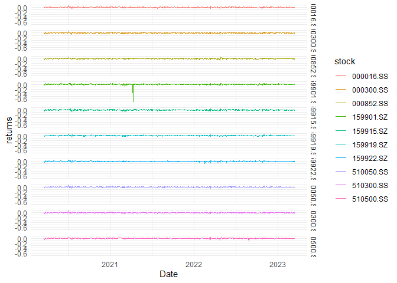

Untitled
================
roywei

# 调用要使用的R包

``` r
require(pedquant)
require(tidytable)
require(purrr)
require(ggplot2)
```

    ## Warning: 程辑包'ggplot2'是用R版本4.2.2 来建造的

\#获取数据整理数据

    ##  1/10 510050.ss
    ##  2/10 510300.ss
    ##  3/10 159919.sz
    ##  4/10 000300.ss
    ##  5/10 000852.ss
    ##  6/10 510500.ss
    ##  7/10 159915.sz
    ##  8/10 159922.sz
    ##  9/10 159901.sz
    ## 10/10 000016.ss

    ## Warning: `select.()` was deprecated in tidytable v0.10.0.
    ## ℹ Please use `select()` instead.
    ## ℹ Please note that all `verb.()` syntax has now been deprecated.
    ## This warning is displayed once every 8 hours.
    ## Call `lifecycle::last_lifecycle_warnings()` to see where this warning was
    ## generated.

    ## Registered S3 method overwritten by 'quantmod':
    ##   method            from
    ##   as.zoo.data.frame zoo

|       Period       | 510050.SS | 510300.SS | 159919.SZ | 000300.SS | 000852.SS | 510500.SS | 159915.SZ | 159922.SZ | 159901.SZ | 000016.SS |
|:------------------:|:---------:|:---------:|:---------:|:---------:|:---------:|:---------:|:---------:|:---------:|:---------:|:---------:|
| 2020/03/23 0:00:00 |     0     |     0     |     0     |     0     |     0     |     0     |     0     |     0     |     0     |     0     |
| 2020/03/24 0:00:00 |  0.02857  |  0.02382  |  0.02122  |  0.0265   |  0.01842  |  0.0141   |  0.02523  |  0.0161   |  0.02581  |  0.03069  |
| 2020/03/25 0:00:00 |  0.02258  |  0.02597  |  0.02557  |  0.02652  |  0.02318  |  0.02389  |  0.02946  |  0.02294  |  0.0377   |  0.02278  |
| 2020/03/26 0:00:00 | -0.003729 | -0.006225 | -0.004528 | -0.006595 | -0.009109 | -0.009633 | -0.003771 | -0.007467 | -0.007873 | -0.004049 |
| 2020/03/27 0:00:00 | 0.005588  | 0.004605  | 0.003996  | 0.003242  | -0.007502 | -0.004311 | -0.01249  | -0.005132 | -0.002232 | 0.004511  |
| 2020/03/30 0:00:00 | -0.004468 | -0.009232 | -0.00935  | -0.009737 |  -0.0252  | -0.01945  | -0.02154  | -0.02267  | -0.01597  | -0.004229 |

数据整理宽数据变长数据，并绘制图 \## 数据描述统计

``` r
ret1 %>% 
  psych::describe()
```

    ##           vars   n mean   sd median trimmed  mad   min  max range   skew
    ## 510050.SS    1 727    0 0.01      0       0 0.01 -0.05 0.08  0.14   0.30
    ## 510300.SS    2 727    0 0.01      0       0 0.01 -0.05 0.07  0.12   0.01
    ## 159919.SZ    3 727    0 0.01      0       0 0.01 -0.05 0.07  0.12   0.09
    ## 000300.SS    4 727    0 0.01      0       0 0.01 -0.05 0.06  0.11  -0.16
    ## 000852.SS    5 727    0 0.01      0       0 0.01 -0.08 0.05  0.13  -0.57
    ## 510500.SS    6 727    0 0.01      0       0 0.01 -0.14 0.05  0.18  -2.03
    ## 159915.SZ    7 726    0 0.02      0       0 0.02 -0.06 0.05  0.12  -0.10
    ## 159922.SZ    8 727    0 0.01      0       0 0.01 -0.10 0.05  0.15  -1.24
    ## 159901.SZ    9 726    0 0.03      0       0 0.01 -0.71 0.05  0.76 -17.96
    ## 000016.SS   10 727    0 0.01      0       0 0.01 -0.05 0.07  0.12   0.04
    ##           kurtosis se
    ## 510050.SS     4.04  0
    ## 510300.SS     2.80  0
    ## 159919.SZ     3.04  0
    ## 000300.SS     1.79  0
    ## 000852.SS     2.19  0
    ## 510500.SS    18.29  0
    ## 159915.SZ     0.64  0
    ## 159922.SZ     8.41  0
    ## 159901.SZ   419.83  0
    ## 000016.SS     2.48  0

``` r
ret1 %>% 
  summarytools::descr()
```

    ## Descriptive Statistics  
    ## 
    ##                     000016.SS   000300.SS   000852.SS   159901.SZ   159915.SZ   159919.SZ
    ## ----------------- ----------- ----------- ----------- ----------- ----------- -----------
    ##              Mean        0.00        0.00        0.00        0.00        0.00        0.00
    ##           Std.Dev        0.01        0.01        0.01        0.03        0.02        0.01
    ##               Min       -0.05       -0.05       -0.08       -0.71       -0.06       -0.05
    ##                Q1       -0.01       -0.01       -0.01       -0.01       -0.01       -0.01
    ##            Median        0.00        0.00        0.00        0.00        0.00        0.00
    ##                Q3        0.01        0.01        0.01        0.01        0.01        0.01
    ##               Max        0.07        0.06        0.05        0.05        0.05        0.07
    ##               MAD        0.01        0.01        0.01        0.01        0.02        0.01
    ##               IQR        0.01        0.01        0.02        0.02        0.02        0.01
    ##                CV      407.79       80.56       47.38      -47.06       53.46       80.91
    ##          Skewness        0.04       -0.16       -0.57      -17.96       -0.10        0.09
    ##       SE.Skewness        0.09        0.09        0.09        0.09        0.09        0.09
    ##          Kurtosis        2.48        1.79        2.19      419.83        0.64        3.04
    ##           N.Valid      727.00      727.00      727.00      726.00      726.00      727.00
    ##         Pct.Valid      100.00      100.00      100.00       99.86       99.86      100.00
    ## 
    ## Table: Table continues below
    ## 
    ##  
    ## 
    ##                     159922.SZ   510050.SS   510300.SS   510500.SS
    ## ----------------- ----------- ----------- ----------- -----------
    ##              Mean        0.00        0.00        0.00        0.00
    ##           Std.Dev        0.01        0.01        0.01        0.01
    ##               Min       -0.10       -0.05       -0.05       -0.14
    ##                Q1       -0.01       -0.01       -0.01       -0.01
    ##            Median        0.00        0.00        0.00        0.00
    ##                Q3        0.01        0.01        0.01        0.01
    ##               Max        0.05        0.08        0.07        0.05
    ##               MAD        0.01        0.01        0.01        0.01
    ##               IQR        0.01        0.01        0.01        0.01
    ##                CV       52.24      351.04       81.22       72.07
    ##          Skewness       -1.24        0.30        0.01       -2.03
    ##       SE.Skewness        0.09        0.09        0.09        0.09
    ##          Kurtosis        8.41        4.04        2.80       18.29
    ##           N.Valid      727.00      727.00      727.00      727.00
    ##         Pct.Valid      100.00      100.00      100.00      100.00

``` r
ret1 %>% 
  summarytools::dfSummary()
```

    ## . was converted to a data frame

    ## Data Frame Summary  
    ## .  
    ## Dimensions: 727 x 10  
    ## Duplicates: 0  
    ## 
    ## --------------------------------------------------------------------------------------------------------
    ## No   Variable    Stats / Values         Freqs (% of Valid)    Graph                 Valid      Missing  
    ## ---- ----------- ---------------------- --------------------- --------------------- ---------- ---------
    ## 1    510050.SS   Mean (sd) : 0 (0)      715 distinct values         :               727        0        
    ##      [numeric]   min < med < max:                                   : .             (100.0%)   (0.0%)   
    ##                  -0.1 < 0 < 0.1                                     : :                                 
    ##                  IQR (CV) : 0 (351)                                 : :                                 
    ##                                                                   : : : :                               
    ## 
    ## 2    510300.SS   Mean (sd) : 0 (0)      722 distinct values         . :             727        0        
    ##      [numeric]   min < med < max:                                   : :             (100.0%)   (0.0%)   
    ##                  0 < 0 < 0.1                                        : :                                 
    ##                  IQR (CV) : 0 (81.2)                                : : .                               
    ##                                                                   : : : : .                             
    ## 
    ## 3    159919.SZ   Mean (sd) : 0 (0)      715 distinct values         : :             727        0        
    ##      [numeric]   min < med < max:                                   : :             (100.0%)   (0.0%)   
    ##                  0 < 0 < 0.1                                        : :                                 
    ##                  IQR (CV) : 0 (80.9)                                : : .                               
    ##                                                                   : : : :                               
    ## 
    ## 4    000300.SS   Mean (sd) : 0 (0)      727 distinct values           :             727        0        
    ##      [numeric]   min < med < max:                                     : .           (100.0%)   (0.0%)   
    ##                  -0.1 < 0 < 0.1                                       : :                               
    ##                  IQR (CV) : 0 (80.6)                                : : : .                             
    ##                                                                   . : : : : .                           
    ## 
    ## 5    000852.SS   Mean (sd) : 0 (0)      727 distinct values               :         727        0        
    ##      [numeric]   min < med < max:                                         :         (100.0%)   (0.0%)   
    ##                  -0.1 < 0 < 0.1                                         : :                             
    ##                  IQR (CV) : 0 (47.4)                                    : : :                           
    ##                                                                     . : : : : .                         
    ## 
    ## 6    510500.SS   Mean (sd) : 0 (0)      721 distinct values                 :       727        0        
    ##      [numeric]   min < med < max:                                           :       (100.0%)   (0.0%)   
    ##                  -0.1 < 0 < 0                                               :                           
    ##                  IQR (CV) : 0 (72.1)                                        :                           
    ##                                                                           : : :                         
    ## 
    ## 7    159915.SZ   Mean (sd) : 0 (0)      719 distinct values             :           726        1        
    ##      [numeric]   min < med < max:                                     : : .         (99.9%)    (0.1%)   
    ##                  -0.1 < 0 < 0.1                                       : : :                             
    ##                  IQR (CV) : 0 (53.5)                                . : : : :                           
    ##                                                                   . : : : : : .                         
    ## 
    ## 8    159922.SZ   Mean (sd) : 0 (0)      718 distinct values               . :       727        0        
    ##      [numeric]   min < med < max:                                         : :       (100.0%)   (0.0%)   
    ##                  -0.1 < 0 < 0                                             : :                           
    ##                  IQR (CV) : 0 (52.2)                                      : :                           
    ##                                                                         : : : :                         
    ## 
    ## 9    159901.SZ   Mean (sd) : 0 (0)      719 distinct values                     :   726        1        
    ##      [numeric]   min < med < max:                                               :   (99.9%)    (0.1%)   
    ##                  -0.7 < 0 < 0                                                   :                       
    ##                  IQR (CV) : 0 (-47.1)                                           :                       
    ##                                                                                 :                       
    ## 
    ## 10   000016.SS   Mean (sd) : 0 (0)      727 distinct values           :             727        0        
    ##      [numeric]   min < med < max:                                     :             (100.0%)   (0.0%)   
    ##                  -0.1 < 0 < 0.1                                     . : .                               
    ##                  IQR (CV) : 0 (407.8)                               : : :                               
    ##                                                                   . : : : .                             
    ## --------------------------------------------------------------------------------------------------------

``` r
ret1 %>% 
  skimr::skim()
```

|                                                  |            |
|:-------------------------------------------------|:-----------|
| Name                                             | Piped data |
| Number of rows                                   | 727        |
| Number of columns                                | 10         |
| \_\_\_\_\_\_\_\_\_\_\_\_\_\_\_\_\_\_\_\_\_\_\_   |            |
| Column type frequency:                           |            |
| numeric                                          | 10         |
| \_\_\_\_\_\_\_\_\_\_\_\_\_\_\_\_\_\_\_\_\_\_\_\_ |            |
| Group variables                                  | None       |

Data summary

**Variable type: numeric**

| skim_variable | n_missing | complete_rate | mean |   sd |    p0 |   p25 | p50 |  p75 | p100 | hist  |
|:--------------|----------:|--------------:|-----:|-----:|------:|------:|----:|-----:|-----:|:------|
| 510050.SS     |         0 |             1 |    0 | 0.01 | -0.05 | -0.01 |   0 | 0.01 | 0.08 | ▁▇▆▁▁ |
| 510300.SS     |         0 |             1 |    0 | 0.01 | -0.05 | -0.01 |   0 | 0.01 | 0.07 | ▁▆▇▁▁ |
| 159919.SZ     |         0 |             1 |    0 | 0.01 | -0.05 | -0.01 |   0 | 0.01 | 0.07 | ▁▇▇▁▁ |
| 000300.SS     |         0 |             1 |    0 | 0.01 | -0.05 | -0.01 |   0 | 0.01 | 0.06 | ▁▂▇▂▁ |
| 000852.SS     |         0 |             1 |    0 | 0.01 | -0.08 | -0.01 |   0 | 0.01 | 0.05 | ▁▁▅▇▁ |
| 510500.SS     |         0 |             1 |    0 | 0.01 | -0.14 | -0.01 |   0 | 0.01 | 0.05 | ▁▁▁▇▂ |
| 159915.SZ     |         1 |             1 |    0 | 0.02 | -0.06 | -0.01 |   0 | 0.01 | 0.05 | ▁▂▇▅▁ |
| 159922.SZ     |         0 |             1 |    0 | 0.01 | -0.10 | -0.01 |   0 | 0.01 | 0.05 | ▁▁▁▇▁ |
| 159901.SZ     |         1 |             1 |    0 | 0.03 | -0.71 | -0.01 |   0 | 0.01 | 0.05 | ▁▁▁▁▇ |
| 000016.SS     |         0 |             1 |    0 | 0.01 | -0.05 | -0.01 |   0 | 0.01 | 0.07 | ▁▃▇▁▁ |

``` r
ret1 %>% 
  pastecs::stat.desc(norm = T)
```

    ##                  510050.SS     510300.SS     159919.SZ     000300.SS
    ## nbr.val       7.270000e+02  7.270000e+02  7.270000e+02  7.270000e+02
    ## nbr.null      1.000000e+01  6.000000e+00  1.000000e+01  1.000000e+00
    ## nbr.na        0.000000e+00  0.000000e+00  0.000000e+00  0.000000e+00
    ## min          -5.255785e-02 -4.937696e-02 -4.978692e-02 -5.068431e-02
    ## max           8.478633e-02  7.080112e-02  7.448666e-02  5.512915e-02
    ## range         1.373442e-01  1.201781e-01  1.242736e-01  1.058135e-01
    ## sum           2.590518e-02  1.089841e-01  1.086134e-01  1.095615e-01
    ## median        0.000000e+00  0.000000e+00  0.000000e+00  1.933695e-04
    ## mean          3.563298e-05  1.499094e-04  1.493994e-04  1.507036e-04
    ## SE.mean       4.639205e-04  4.515635e-04  4.482949e-04  4.502988e-04
    ## CI.mean.0.95  9.107858e-04  8.865262e-04  8.801092e-04  8.840431e-04
    ## var           1.564666e-04  1.482423e-04  1.461040e-04  1.474130e-04
    ## std.dev       1.250866e-02  1.217548e-02  1.208735e-02  1.214138e-02
    ## coef.var      3.510416e+02  8.121893e+01  8.090627e+01  8.056462e+01
    ## skewness      3.009546e-01  1.294629e-02  8.829834e-02 -1.634921e-01
    ## skew.2SE      1.659801e+00  7.140033e-02  4.869760e-01 -9.016785e-01
    ## kurtosis      4.039678e+00  2.804285e+00  3.042179e+00  1.788671e+00
    ## kurt.2SE      1.115482e+01  7.743512e+00  8.400412e+00  4.939081e+00
    ## normtest.W    9.638203e-01  9.711592e-01  9.711269e-01  9.815011e-01
    ## normtest.p    2.043766e-12  8.846976e-11  8.690445e-11  5.952467e-08
    ##                  000852.SS     510500.SS     159915.SZ     159922.SZ
    ## nbr.val       7.270000e+02  7.270000e+02  7.260000e+02  7.270000e+02
    ## nbr.null      1.000000e+00  6.000000e+00  5.000000e+00  9.000000e+00
    ## nbr.na        0.000000e+00  0.000000e+00  1.000000e+00  0.000000e+00
    ## min          -8.132766e-02 -1.363053e-01 -6.448925e-02 -1.023826e-01
    ## max           5.074896e-02  4.644455e-02  5.352141e-02  4.506149e-02
    ## range         1.320766e-01  1.827499e-01  1.180107e-01  1.474441e-01
    ## sum           2.158411e-01  1.309927e-01  2.343244e-01  1.722077e-01
    ## median        1.136615e-03  7.935879e-04 -4.179155e-04  9.168905e-04
    ## mean          2.968929e-04  1.801825e-04  3.227609e-04  2.368744e-04
    ## SE.mean       5.216901e-04  4.816057e-04  6.403818e-04  4.589785e-04
    ## CI.mean.0.95  1.024201e-03  9.455060e-04  1.257224e-03  9.010836e-04
    ## var           1.978608e-04  1.686233e-04  2.977245e-04  1.531508e-04
    ## std.dev       1.406630e-02  1.298550e-02  1.725469e-02  1.237541e-02
    ## coef.var      4.737836e+01  7.206862e+01  5.345968e+01  5.224460e+01
    ## skewness     -5.657262e-01 -2.025719e+00 -9.997766e-02 -1.240531e+00
    ## skew.2SE     -3.120048e+00 -1.117208e+01 -5.510110e-01 -6.841680e+00
    ## kurtosis      2.192550e+00  1.829129e+01  6.387202e-01  8.412876e+00
    ## kurt.2SE      6.054318e+00  5.050799e+01  1.762502e+00  2.323059e+01
    ## normtest.W    9.760459e-01  8.876260e-01  9.937337e-01  9.274701e-01
    ## normtest.p    1.547661e-09  1.455339e-22  4.067335e-03  2.970473e-18
    ##                  159901.SZ     000016.SS
    ## nbr.val       7.260000e+02  7.270000e+02
    ## nbr.null      7.000000e+00  1.000000e+00
    ## nbr.na        1.000000e+00  0.000000e+00
    ## min          -7.140083e-01 -5.367165e-02
    ## max           4.599049e-02  6.583431e-02
    ## range         7.599987e-01  1.195060e-01
    ## sum          -4.675639e-01  2.207428e-02
    ## median       -3.336164e-04  0.000000e+00
    ## mean         -6.440274e-04  3.036352e-05
    ## SE.mean       1.124939e-03  4.592161e-04
    ## CI.mean.0.95  2.208527e-03  9.015501e-04
    ## var           9.187446e-04  1.533094e-04
    ## std.dev       3.031080e-02  1.238182e-02
    ## coef.var     -4.706445e+01  4.077859e+02
    ## skewness     -1.796138e+01  4.313160e-02
    ## skew.2SE     -9.899130e+01  2.378760e-01
    ## kurtosis      4.198289e+02  2.477054e+00
    ## kurt.2SE      1.158487e+03  6.839923e+00
    ## normtest.W    3.428435e-01  9.749132e-01
    ## normtest.p    6.272653e-45  7.736552e-10

## 数据变化及展示

### 宽变长

``` r
ret1 %>%timetk::tk_tbl(rename_index = 'Date') %>% 
    tidytable::pivot_longer(cols = -Date,names_to = 'stock',values_to = 'return')->ret_long
ggplot2::ggplot(ret_long,mapping = aes(x=Date,y=return,color=stock))+geom_path(stat = "identity") +
    facet_grid(stock ~ .) + theme_minimal() + labs(x = "Date", y = "returns")
```

<!-- -->

## GitHub Documents

This is an R Markdown format used for publishing markdown documents to
GitHub. When you click the **Knit** button all R code chunks are run and
a markdown file (.md) suitable for publishing to GitHub is generated.

## Including Code

You can include R code in the document as follows:

``` r
summary(cars)
```

    ##      speed           dist       
    ##  Min.   : 4.0   Min.   :  2.00  
    ##  1st Qu.:12.0   1st Qu.: 26.00  
    ##  Median :15.0   Median : 36.00  
    ##  Mean   :15.4   Mean   : 42.98  
    ##  3rd Qu.:19.0   3rd Qu.: 56.00  
    ##  Max.   :25.0   Max.   :120.00

## Including Plots

You can also embed plots, for example:

<!-- -->

Note that the `echo = FALSE` parameter was added to the code chunk to
prevent printing of the R code that generated the plot.

以下调用akshare获取更广泛数据

``` r
require(reticulate)
```

    ## 载入需要的程辑包：reticulate

``` r
conda_python(envname = "akshare")
```

    ## [1] "D:\\anaconda3\\envs\\akshare/python.exe"

``` r
use_python("D:/anaconda3/envs/akshare/python.exe")
ak <- import("akshare")
ak$option_risk_analysis_em() %>%
  as_tidytable() %>%
  mutate(到期日 = lubridate::ymd(purrr::map_vec(.$到期日, lubridate::ymd))) %>%
  # head() %>%
  kableExtra::kable()
```

<table>
<thead>
<tr>
<th style="text-align:left;">
期权代码
</th>
<th style="text-align:left;">
期权名称
</th>
<th style="text-align:right;">
最新价
</th>
<th style="text-align:right;">
涨跌幅
</th>
<th style="text-align:right;">
杠杆比率
</th>
<th style="text-align:right;">
实际杠杆比率
</th>
<th style="text-align:right;">
Delta
</th>
<th style="text-align:right;">
Gamma
</th>
<th style="text-align:right;">
Vega
</th>
<th style="text-align:right;">
Rho
</th>
<th style="text-align:right;">
Theta
</th>
<th style="text-align:left;">
到期日
</th>
</tr>
</thead>
<tbody>
<tr>
<td style="text-align:left;">
10004594
</td>
<td style="text-align:left;">
500ETF沽3月4900
</td>
<td style="text-align:right;">
0.0003
</td>
<td style="text-align:right;">
50.00
</td>
<td style="text-align:right;">
20606.67
</td>
<td style="text-align:right;">
0.00
</td>
<td style="text-align:right;">
0.0000
</td>
<td style="text-align:right;">
0.0000
</td>
<td style="text-align:right;">
0.0000
</td>
<td style="text-align:right;">
0.0000
</td>
<td style="text-align:right;">
0.0000
</td>
<td style="text-align:left;">
2023-03-22
</td>
</tr>
<tr>
<td style="text-align:left;">
10004891
</td>
<td style="text-align:left;">
50ETF沽3月2650
</td>
<td style="text-align:right;">
0.0366
</td>
<td style="text-align:right;">
41.31
</td>
<td style="text-align:right;">
71.58
</td>
<td style="text-align:right;">
52.96
</td>
<td style="text-align:right;">
-0.7398
</td>
<td style="text-align:right;">
7.1833
</td>
<td style="text-align:right;">
0.0771
</td>
<td style="text-align:right;">
-0.0161
</td>
<td style="text-align:right;">
-0.8546
</td>
<td style="text-align:left;">
2023-03-22
</td>
</tr>
<tr>
<td style="text-align:left;">
10004748
</td>
<td style="text-align:left;">
50ETF沽6月2120A
</td>
<td style="text-align:right;">
0.0024
</td>
<td style="text-align:right;">
41.18
</td>
<td style="text-align:right;">
1091.67
</td>
<td style="text-align:right;">
14.41
</td>
<td style="text-align:right;">
-0.0132
</td>
<td style="text-align:right;">
0.1299
</td>
<td style="text-align:right;">
0.0469
</td>
<td style="text-align:right;">
-0.0099
</td>
<td style="text-align:right;">
-0.0154
</td>
<td style="text-align:left;">
2023-06-28
</td>
</tr>
<tr>
<td style="text-align:left;">
10004433
</td>
<td style="text-align:left;">
300ETF沽3月3938A
</td>
<td style="text-align:right;">
0.0288
</td>
<td style="text-align:right;">
41.18
</td>
<td style="text-align:right;">
136.53
</td>
<td style="text-align:right;">
72.28
</td>
<td style="text-align:right;">
-0.5294
</td>
<td style="text-align:right;">
6.0714
</td>
<td style="text-align:right;">
0.1418
</td>
<td style="text-align:right;">
-0.0172
</td>
<td style="text-align:right;">
-1.5466
</td>
<td style="text-align:left;">
2023-03-22
</td>
</tr>
<tr>
<td style="text-align:left;">
10004415
</td>
<td style="text-align:left;">
50ETF沽3月2662A
</td>
<td style="text-align:right;">
0.0464
</td>
<td style="text-align:right;">
37.28
</td>
<td style="text-align:right;">
56.47
</td>
<td style="text-align:right;">
46.14
</td>
<td style="text-align:right;">
-0.8172
</td>
<td style="text-align:right;">
5.8646
</td>
<td style="text-align:right;">
0.0629
</td>
<td style="text-align:right;">
-0.0179
</td>
<td style="text-align:right;">
-0.6870
</td>
<td style="text-align:left;">
2023-03-22
</td>
</tr>
<tr>
<td style="text-align:left;">
10004414
</td>
<td style="text-align:left;">
50ETF沽3月2613A
</td>
<td style="text-align:right;">
0.0153
</td>
<td style="text-align:right;">
36.61
</td>
<td style="text-align:right;">
171.24
</td>
<td style="text-align:right;">
73.86
</td>
<td style="text-align:right;">
-0.4313
</td>
<td style="text-align:right;">
8.7017
</td>
<td style="text-align:right;">
0.0934
</td>
<td style="text-align:right;">
-0.0093
</td>
<td style="text-align:right;">
-1.0585
</td>
<td style="text-align:left;">
2023-03-22
</td>
</tr>
<tr>
<td style="text-align:left;">
10004706
</td>
<td style="text-align:left;">
300ETF沽6月3249A
</td>
<td style="text-align:right;">
0.0057
</td>
<td style="text-align:right;">
32.56
</td>
<td style="text-align:right;">
689.82
</td>
<td style="text-align:right;">
13.04
</td>
<td style="text-align:right;">
-0.0189
</td>
<td style="text-align:right;">
0.1219
</td>
<td style="text-align:right;">
0.0959
</td>
<td style="text-align:right;">
-0.0213
</td>
<td style="text-align:right;">
-0.0303
</td>
<td style="text-align:left;">
2023-06-28
</td>
</tr>
<tr>
<td style="text-align:left;">
10004707
</td>
<td style="text-align:left;">
300ETF沽6月3347A
</td>
<td style="text-align:right;">
0.0094
</td>
<td style="text-align:right;">
32.39
</td>
<td style="text-align:right;">
418.30
</td>
<td style="text-align:right;">
16.10
</td>
<td style="text-align:right;">
-0.0385
</td>
<td style="text-align:right;">
0.2200
</td>
<td style="text-align:right;">
0.1730
</td>
<td style="text-align:right;">
-0.0436
</td>
<td style="text-align:right;">
-0.0544
</td>
<td style="text-align:left;">
2023-06-28
</td>
</tr>
<tr>
<td style="text-align:left;">
10005063
</td>
<td style="text-align:left;">
300ETF沽3月4000
</td>
<td style="text-align:right;">
0.0725
</td>
<td style="text-align:right;">
31.34
</td>
<td style="text-align:right;">
54.23
</td>
<td style="text-align:right;">
45.77
</td>
<td style="text-align:right;">
-0.8440
</td>
<td style="text-align:right;">
3.6508
</td>
<td style="text-align:right;">
0.0853
</td>
<td style="text-align:right;">
-0.0278
</td>
<td style="text-align:right;">
-0.8904
</td>
<td style="text-align:left;">
2023-03-22
</td>
</tr>
<tr>
<td style="text-align:left;">
10004708
</td>
<td style="text-align:left;">
300ETF沽6月3446A
</td>
<td style="text-align:right;">
0.0156
</td>
<td style="text-align:right;">
31.09
</td>
<td style="text-align:right;">
252.05
</td>
<td style="text-align:right;">
17.95
</td>
<td style="text-align:right;">
-0.0712
</td>
<td style="text-align:right;">
0.3582
</td>
<td style="text-align:right;">
0.2817
</td>
<td style="text-align:right;">
-0.0810
</td>
<td style="text-align:right;">
-0.0880
</td>
<td style="text-align:left;">
2023-06-28
</td>
</tr>
<tr>
<td style="text-align:left;">
10004890
</td>
<td style="text-align:left;">
50ETF沽3月2600
</td>
<td style="text-align:right;">
0.0110
</td>
<td style="text-align:right;">
29.41
</td>
<td style="text-align:right;">
238.18
</td>
<td style="text-align:right;">
76.67
</td>
<td style="text-align:right;">
-0.3219
</td>
<td style="text-align:right;">
7.9384
</td>
<td style="text-align:right;">
0.0852
</td>
<td style="text-align:right;">
-0.0069
</td>
<td style="text-align:right;">
-0.9692
</td>
<td style="text-align:left;">
2023-03-22
</td>
</tr>
<tr>
<td style="text-align:left;">
10004758
</td>
<td style="text-align:left;">
500ETF沽6月4900
</td>
<td style="text-align:right;">
0.0080
</td>
<td style="text-align:right;">
29.03
</td>
<td style="text-align:right;">
772.75
</td>
<td style="text-align:right;">
6.57
</td>
<td style="text-align:right;">
-0.0085
</td>
<td style="text-align:right;">
0.0371
</td>
<td style="text-align:right;">
0.0760
</td>
<td style="text-align:right;">
-0.0151
</td>
<td style="text-align:right;">
-0.0255
</td>
<td style="text-align:left;">
2023-06-28
</td>
</tr>
<tr>
<td style="text-align:left;">
10005254
</td>
<td style="text-align:left;">
300ETF沽6月3500
</td>
<td style="text-align:right;">
0.0201
</td>
<td style="text-align:right;">
28.03
</td>
<td style="text-align:right;">
195.62
</td>
<td style="text-align:right;">
18.74
</td>
<td style="text-align:right;">
-0.0958
</td>
<td style="text-align:right;">
0.4476
</td>
<td style="text-align:right;">
0.3520
</td>
<td style="text-align:right;">
-0.1092
</td>
<td style="text-align:right;">
-0.1095
</td>
<td style="text-align:left;">
2023-06-28
</td>
</tr>
<tr>
<td style="text-align:left;">
10004709
</td>
<td style="text-align:left;">
300ETF沽6月3544A
</td>
<td style="text-align:right;">
0.0248
</td>
<td style="text-align:right;">
27.18
</td>
<td style="text-align:right;">
158.55
</td>
<td style="text-align:right;">
18.98
</td>
<td style="text-align:right;">
-0.1197
</td>
<td style="text-align:right;">
0.5255
</td>
<td style="text-align:right;">
0.4132
</td>
<td style="text-align:right;">
-0.1367
</td>
<td style="text-align:right;">
-0.1280
</td>
<td style="text-align:left;">
2023-06-28
</td>
</tr>
<tr>
<td style="text-align:left;">
10004756
</td>
<td style="text-align:left;">
300ETF沽6月3151A
</td>
<td style="text-align:right;">
0.0034
</td>
<td style="text-align:right;">
25.93
</td>
<td style="text-align:right;">
1156.47
</td>
<td style="text-align:right;">
9.60
</td>
<td style="text-align:right;">
-0.0083
</td>
<td style="text-align:right;">
0.0601
</td>
<td style="text-align:right;">
0.0473
</td>
<td style="text-align:right;">
-0.0093
</td>
<td style="text-align:right;">
-0.0150
</td>
<td style="text-align:left;">
2023-06-28
</td>
</tr>
<tr>
<td style="text-align:left;">
10005061
</td>
<td style="text-align:left;">
300ETF沽3月3800
</td>
<td style="text-align:right;">
0.0015
</td>
<td style="text-align:right;">
25.00
</td>
<td style="text-align:right;">
2621.33
</td>
<td style="text-align:right;">
50.59
</td>
<td style="text-align:right;">
-0.0193
</td>
<td style="text-align:right;">
0.7197
</td>
<td style="text-align:right;">
0.0168
</td>
<td style="text-align:right;">
-0.0005
</td>
<td style="text-align:right;">
-0.1865
</td>
<td style="text-align:left;">
2023-03-22
</td>
</tr>
<tr>
<td style="text-align:left;">
10004892
</td>
<td style="text-align:left;">
50ETF沽3月2700
</td>
<td style="text-align:right;">
0.0810
</td>
<td style="text-align:right;">
25.00
</td>
<td style="text-align:right;">
32.35
</td>
<td style="text-align:right;">
30.98
</td>
<td style="text-align:right;">
-0.9578
</td>
<td style="text-align:right;">
1.9875
</td>
<td style="text-align:right;">
0.0213
</td>
<td style="text-align:right;">
-0.0212
</td>
<td style="text-align:right;">
-0.1983
</td>
<td style="text-align:left;">
2023-03-22
</td>
</tr>
<tr>
<td style="text-align:left;">
10005180
</td>
<td style="text-align:left;">
300ETF沽6月3600
</td>
<td style="text-align:right;">
0.0323
</td>
<td style="text-align:right;">
24.71
</td>
<td style="text-align:right;">
121.73
</td>
<td style="text-align:right;">
18.89
</td>
<td style="text-align:right;">
-0.1552
</td>
<td style="text-align:right;">
0.6275
</td>
<td style="text-align:right;">
0.4935
</td>
<td style="text-align:right;">
-0.1778
</td>
<td style="text-align:right;">
-0.1519
</td>
<td style="text-align:left;">
2023-06-28
</td>
</tr>
<tr>
<td style="text-align:left;">
10004724
</td>
<td style="text-align:left;">
500ETF沽6月5000
</td>
<td style="text-align:right;">
0.0106
</td>
<td style="text-align:right;">
24.71
</td>
<td style="text-align:right;">
583.21
</td>
<td style="text-align:right;">
8.40
</td>
<td style="text-align:right;">
-0.0144
</td>
<td style="text-align:right;">
0.0583
</td>
<td style="text-align:right;">
0.1195
</td>
<td style="text-align:right;">
-0.0256
</td>
<td style="text-align:right;">
-0.0400
</td>
<td style="text-align:left;">
2023-06-28
</td>
</tr>
<tr>
<td style="text-align:left;">
10004710
</td>
<td style="text-align:left;">
300ETF沽6月3643A
</td>
<td style="text-align:right;">
0.0402
</td>
<td style="text-align:right;">
24.46
</td>
<td style="text-align:right;">
97.81
</td>
<td style="text-align:right;">
18.22
</td>
<td style="text-align:right;">
-0.1863
</td>
<td style="text-align:right;">
0.7054
</td>
<td style="text-align:right;">
0.5548
</td>
<td style="text-align:right;">
-0.2140
</td>
<td style="text-align:right;">
-0.1698
</td>
<td style="text-align:left;">
2023-06-28
</td>
</tr>
<tr>
<td style="text-align:left;">
10004688
</td>
<td style="text-align:left;">
50ETF沽6月2218A
</td>
<td style="text-align:right;">
0.0046
</td>
<td style="text-align:right;">
24.32
</td>
<td style="text-align:right;">
569.57
</td>
<td style="text-align:right;">
21.93
</td>
<td style="text-align:right;">
-0.0385
</td>
<td style="text-align:right;">
0.3197
</td>
<td style="text-align:right;">
0.1155
</td>
<td style="text-align:right;">
-0.0291
</td>
<td style="text-align:right;">
-0.0376
</td>
<td style="text-align:left;">
2023-06-28
</td>
</tr>
<tr>
<td style="text-align:left;">
10004434
</td>
<td style="text-align:left;">
300ETF沽3月4037A
</td>
<td style="text-align:right;">
0.1052
</td>
<td style="text-align:right;">
24.06
</td>
<td style="text-align:right;">
37.38
</td>
<td style="text-align:right;">
35.17
</td>
<td style="text-align:right;">
-0.9410
</td>
<td style="text-align:right;">
1.7924
</td>
<td style="text-align:right;">
0.0419
</td>
<td style="text-align:right;">
-0.0312
</td>
<td style="text-align:right;">
-0.3972
</td>
<td style="text-align:left;">
2023-03-22
</td>
</tr>
<tr>
<td style="text-align:left;">
10004740
</td>
<td style="text-align:left;">
50ETF沽6月2169A
</td>
<td style="text-align:right;">
0.0031
</td>
<td style="text-align:right;">
24.00
</td>
<td style="text-align:right;">
845.16
</td>
<td style="text-align:right;">
19.61
</td>
<td style="text-align:right;">
-0.0232
</td>
<td style="text-align:right;">
0.2101
</td>
<td style="text-align:right;">
0.0759
</td>
<td style="text-align:right;">
-0.0174
</td>
<td style="text-align:right;">
-0.0248
</td>
<td style="text-align:left;">
2023-06-28
</td>
</tr>
<tr>
<td style="text-align:left;">
10004690
</td>
<td style="text-align:left;">
50ETF沽6月2317A
</td>
<td style="text-align:right;">
0.0110
</td>
<td style="text-align:right;">
23.60
</td>
<td style="text-align:right;">
238.18
</td>
<td style="text-align:right;">
21.82
</td>
<td style="text-align:right;">
-0.0916
</td>
<td style="text-align:right;">
0.6284
</td>
<td style="text-align:right;">
0.2270
</td>
<td style="text-align:right;">
-0.0696
</td>
<td style="text-align:right;">
-0.0732
</td>
<td style="text-align:left;">
2023-06-28
</td>
</tr>
<tr>
<td style="text-align:left;">
10004416
</td>
<td style="text-align:left;">
50ETF沽3月2711A
</td>
<td style="text-align:right;">
0.0908
</td>
<td style="text-align:right;">
22.70
</td>
<td style="text-align:right;">
28.85
</td>
<td style="text-align:right;">
28.14
</td>
<td style="text-align:right;">
-0.9751
</td>
<td style="text-align:right;">
1.2863
</td>
<td style="text-align:right;">
0.0138
</td>
<td style="text-align:right;">
-0.0216
</td>
<td style="text-align:right;">
-0.1102
</td>
<td style="text-align:left;">
2023-03-22
</td>
</tr>
<tr>
<td style="text-align:left;">
10005246
</td>
<td style="text-align:left;">
50ETF沽4月2450
</td>
<td style="text-align:right;">
0.0103
</td>
<td style="text-align:right;">
22.62
</td>
<td style="text-align:right;">
254.37
</td>
<td style="text-align:right;">
31.49
</td>
<td style="text-align:right;">
-0.1238
</td>
<td style="text-align:right;">
1.2727
</td>
<td style="text-align:right;">
0.1730
</td>
<td style="text-align:right;">
-0.0348
</td>
<td style="text-align:right;">
-0.1516
</td>
<td style="text-align:left;">
2023-04-26
</td>
</tr>
<tr>
<td style="text-align:left;">
10005238
</td>
<td style="text-align:left;">
50ETF沽4月2550
</td>
<td style="text-align:right;">
0.0285
</td>
<td style="text-align:right;">
21.79
</td>
<td style="text-align:right;">
91.93
</td>
<td style="text-align:right;">
28.24
</td>
<td style="text-align:right;">
-0.3072
</td>
<td style="text-align:right;">
2.1861
</td>
<td style="text-align:right;">
0.2971
</td>
<td style="text-align:right;">
-0.0871
</td>
<td style="text-align:right;">
-0.2556
</td>
<td style="text-align:left;">
2023-04-26
</td>
</tr>
<tr>
<td style="text-align:left;">
10004689
</td>
<td style="text-align:left;">
50ETF沽6月2268A
</td>
<td style="text-align:right;">
0.0074
</td>
<td style="text-align:right;">
21.31
</td>
<td style="text-align:right;">
354.05
</td>
<td style="text-align:right;">
21.67
</td>
<td style="text-align:right;">
-0.0612
</td>
<td style="text-align:right;">
0.4623
</td>
<td style="text-align:right;">
0.1670
</td>
<td style="text-align:right;">
-0.0463
</td>
<td style="text-align:right;">
-0.0541
</td>
<td style="text-align:left;">
2023-06-28
</td>
</tr>
<tr>
<td style="text-align:left;">
10004725
</td>
<td style="text-align:left;">
500ETF沽6月5250
</td>
<td style="text-align:right;">
0.0184
</td>
<td style="text-align:right;">
21.05
</td>
<td style="text-align:right;">
335.98
</td>
<td style="text-align:right;">
14.78
</td>
<td style="text-align:right;">
-0.0440
</td>
<td style="text-align:right;">
0.1480
</td>
<td style="text-align:right;">
0.3032
</td>
<td style="text-align:right;">
-0.0786
</td>
<td style="text-align:right;">
-0.1008
</td>
<td style="text-align:left;">
2023-06-28
</td>
</tr>
<tr>
<td style="text-align:left;">
10005078
</td>
<td style="text-align:left;">
300ETF沽6月3700
</td>
<td style="text-align:right;">
0.0508
</td>
<td style="text-align:right;">
20.95
</td>
<td style="text-align:right;">
77.40
</td>
<td style="text-align:right;">
17.99
</td>
<td style="text-align:right;">
-0.2324
</td>
<td style="text-align:right;">
0.8035
</td>
<td style="text-align:right;">
0.6319
</td>
<td style="text-align:right;">
-0.2679
</td>
<td style="text-align:right;">
-0.1917
</td>
<td style="text-align:left;">
2023-06-28
</td>
</tr>
<tr>
<td style="text-align:left;">
10004694
</td>
<td style="text-align:left;">
50ETF沽6月2514A
</td>
<td style="text-align:right;">
0.0460
</td>
<td style="text-align:right;">
20.73
</td>
<td style="text-align:right;">
56.96
</td>
<td style="text-align:right;">
17.28
</td>
<td style="text-align:right;">
-0.3034
</td>
<td style="text-align:right;">
1.3336
</td>
<td style="text-align:right;">
0.4817
</td>
<td style="text-align:right;">
-0.2347
</td>
<td style="text-align:right;">
-0.1496
</td>
<td style="text-align:left;">
2023-06-28
</td>
</tr>
<tr>
<td style="text-align:left;">
10004711
</td>
<td style="text-align:left;">
300ETF沽6月3741A
</td>
<td style="text-align:right;">
0.0613
</td>
<td style="text-align:right;">
20.67
</td>
<td style="text-align:right;">
64.14
</td>
<td style="text-align:right;">
17.23
</td>
<td style="text-align:right;">
-0.2686
</td>
<td style="text-align:right;">
0.8676
</td>
<td style="text-align:right;">
0.6823
</td>
<td style="text-align:right;">
-0.3105
</td>
<td style="text-align:right;">
-0.2056
</td>
<td style="text-align:left;">
2023-06-28
</td>
</tr>
<tr>
<td style="text-align:left;">
10004904
</td>
<td style="text-align:left;">
50ETF沽6月2400
</td>
<td style="text-align:right;">
0.0208
</td>
<td style="text-align:right;">
20.23
</td>
<td style="text-align:right;">
125.96
</td>
<td style="text-align:right;">
20.65
</td>
<td style="text-align:right;">
-0.1639
</td>
<td style="text-align:right;">
0.9433
</td>
<td style="text-align:right;">
0.3407
</td>
<td style="text-align:right;">
-0.1254
</td>
<td style="text-align:right;">
-0.1085
</td>
<td style="text-align:left;">
2023-06-28
</td>
</tr>
<tr>
<td style="text-align:left;">
10004693
</td>
<td style="text-align:left;">
50ETF沽6月2465A
</td>
<td style="text-align:right;">
0.0335
</td>
<td style="text-align:right;">
20.07
</td>
<td style="text-align:right;">
78.21
</td>
<td style="text-align:right;">
18.65
</td>
<td style="text-align:right;">
-0.2384
</td>
<td style="text-align:right;">
1.1821
</td>
<td style="text-align:right;">
0.4270
</td>
<td style="text-align:right;">
-0.1835
</td>
<td style="text-align:right;">
-0.1342
</td>
<td style="text-align:left;">
2023-06-28
</td>
</tr>
<tr>
<td style="text-align:left;">
10004691
</td>
<td style="text-align:left;">
50ETF沽6月2366A
</td>
<td style="text-align:right;">
0.0162
</td>
<td style="text-align:right;">
20.00
</td>
<td style="text-align:right;">
161.73
</td>
<td style="text-align:right;">
21.19
</td>
<td style="text-align:right;">
-0.1310
</td>
<td style="text-align:right;">
0.8121
</td>
<td style="text-align:right;">
0.2933
</td>
<td style="text-align:right;">
-0.1000
</td>
<td style="text-align:right;">
-0.0940
</td>
<td style="text-align:left;">
2023-06-28
</td>
</tr>
<tr>
<td style="text-align:left;">
10004692
</td>
<td style="text-align:left;">
50ETF沽6月2416A
</td>
<td style="text-align:right;">
0.0235
</td>
<td style="text-align:right;">
19.90
</td>
<td style="text-align:right;">
111.49
</td>
<td style="text-align:right;">
20.16
</td>
<td style="text-align:right;">
-0.1808
</td>
<td style="text-align:right;">
1.0044
</td>
<td style="text-align:right;">
0.3628
</td>
<td style="text-align:right;">
-0.1385
</td>
<td style="text-align:right;">
-0.1152
</td>
<td style="text-align:left;">
2023-06-28
</td>
</tr>
<tr>
<td style="text-align:left;">
10004726
</td>
<td style="text-align:left;">
500ETF沽6月5500
</td>
<td style="text-align:right;">
0.0364
</td>
<td style="text-align:right;">
19.34
</td>
<td style="text-align:right;">
169.84
</td>
<td style="text-align:right;">
17.97
</td>
<td style="text-align:right;">
-0.1058
</td>
<td style="text-align:right;">
0.2904
</td>
<td style="text-align:right;">
0.5951
</td>
<td style="text-align:right;">
-0.1903
</td>
<td style="text-align:right;">
-0.1954
</td>
<td style="text-align:left;">
2023-06-28
</td>
</tr>
<tr>
<td style="text-align:left;">
10004906
</td>
<td style="text-align:left;">
50ETF沽6月2500
</td>
<td style="text-align:right;">
0.0418
</td>
<td style="text-align:right;">
18.41
</td>
<td style="text-align:right;">
62.68
</td>
<td style="text-align:right;">
17.81
</td>
<td style="text-align:right;">
-0.2842
</td>
<td style="text-align:right;">
1.2938
</td>
<td style="text-align:right;">
0.4673
</td>
<td style="text-align:right;">
-0.2195
</td>
<td style="text-align:right;">
-0.1457
</td>
<td style="text-align:left;">
2023-06-28
</td>
</tr>
<tr>
<td style="text-align:left;">
10004905
</td>
<td style="text-align:left;">
50ETF沽6月2450
</td>
<td style="text-align:right;">
0.0298
</td>
<td style="text-align:right;">
18.25
</td>
<td style="text-align:right;">
87.92
</td>
<td style="text-align:right;">
19.33
</td>
<td style="text-align:right;">
-0.2199
</td>
<td style="text-align:right;">
1.1298
</td>
<td style="text-align:right;">
0.4081
</td>
<td style="text-align:right;">
-0.1690
</td>
<td style="text-align:right;">
-0.1287
</td>
<td style="text-align:left;">
2023-06-28
</td>
</tr>
<tr>
<td style="text-align:left;">
10004907
</td>
<td style="text-align:left;">
50ETF沽6月2550
</td>
<td style="text-align:right;">
0.0573
</td>
<td style="text-align:right;">
18.14
</td>
<td style="text-align:right;">
45.72
</td>
<td style="text-align:right;">
16.22
</td>
<td style="text-align:right;">
-0.3547
</td>
<td style="text-align:right;">
1.4203
</td>
<td style="text-align:right;">
0.5130
</td>
<td style="text-align:right;">
-0.2756
</td>
<td style="text-align:right;">
-0.1576
</td>
<td style="text-align:left;">
2023-06-28
</td>
</tr>
<tr>
<td style="text-align:left;">
10005192
</td>
<td style="text-align:left;">
50ETF沽4月2600
</td>
<td style="text-align:right;">
0.0447
</td>
<td style="text-align:right;">
17.63
</td>
<td style="text-align:right;">
58.61
</td>
<td style="text-align:right;">
24.95
</td>
<td style="text-align:right;">
-0.4257
</td>
<td style="text-align:right;">
2.4386
</td>
<td style="text-align:right;">
0.3314
</td>
<td style="text-align:right;">
-0.1215
</td>
<td style="text-align:right;">
-0.2808
</td>
<td style="text-align:left;">
2023-04-26
</td>
</tr>
<tr>
<td style="text-align:left;">
10005062
</td>
<td style="text-align:left;">
300ETF沽3月3900
</td>
<td style="text-align:right;">
0.0135
</td>
<td style="text-align:right;">
17.39
</td>
<td style="text-align:right;">
291.26
</td>
<td style="text-align:right;">
89.04
</td>
<td style="text-align:right;">
-0.3057
</td>
<td style="text-align:right;">
5.3515
</td>
<td style="text-align:right;">
0.1250
</td>
<td style="text-align:right;">
-0.0099
</td>
<td style="text-align:right;">
-1.3752
</td>
<td style="text-align:left;">
2023-03-22
</td>
</tr>
<tr>
<td style="text-align:left;">
10005079
</td>
<td style="text-align:left;">
300ETF沽6月3800
</td>
<td style="text-align:right;">
0.0780
</td>
<td style="text-align:right;">
16.42
</td>
<td style="text-align:right;">
50.41
</td>
<td style="text-align:right;">
16.36
</td>
<td style="text-align:right;">
-0.3245
</td>
<td style="text-align:right;">
0.9462
</td>
<td style="text-align:right;">
0.7441
</td>
<td style="text-align:right;">
-0.3766
</td>
<td style="text-align:right;">
-0.2217
</td>
<td style="text-align:left;">
2023-06-28
</td>
</tr>
<tr>
<td style="text-align:left;">
10004695
</td>
<td style="text-align:left;">
50ETF沽6月2564A
</td>
<td style="text-align:right;">
0.0626
</td>
<td style="text-align:right;">
15.50
</td>
<td style="text-align:right;">
41.85
</td>
<td style="text-align:right;">
15.71
</td>
<td style="text-align:right;">
-0.3753
</td>
<td style="text-align:right;">
1.4474
</td>
<td style="text-align:right;">
0.5228
</td>
<td style="text-align:right;">
-0.2921
</td>
<td style="text-align:right;">
-0.1599
</td>
<td style="text-align:left;">
2023-06-28
</td>
</tr>
<tr>
<td style="text-align:left;">
10005193
</td>
<td style="text-align:left;">
50ETF沽4月2650
</td>
<td style="text-align:right;">
0.0692
</td>
<td style="text-align:right;">
14.95
</td>
<td style="text-align:right;">
37.86
</td>
<td style="text-align:right;">
20.79
</td>
<td style="text-align:right;">
-0.5490
</td>
<td style="text-align:right;">
2.4629
</td>
<td style="text-align:right;">
0.3347
</td>
<td style="text-align:right;">
-0.1577
</td>
<td style="text-align:right;">
-0.2773
</td>
<td style="text-align:left;">
2023-04-26
</td>
</tr>
<tr>
<td style="text-align:left;">
10004909
</td>
<td style="text-align:left;">
50ETF沽6月2650
</td>
<td style="text-align:right;">
0.1007
</td>
<td style="text-align:right;">
14.69
</td>
<td style="text-align:right;">
26.02
</td>
<td style="text-align:right;">
13.13
</td>
<td style="text-align:right;">
-0.5048
</td>
<td style="text-align:right;">
1.5221
</td>
<td style="text-align:right;">
0.5498
</td>
<td style="text-align:right;">
-0.3973
</td>
<td style="text-align:right;">
-0.1621
</td>
<td style="text-align:left;">
2023-06-28
</td>
</tr>
<tr>
<td style="text-align:left;">
10005211
</td>
<td style="text-align:left;">
300ETF沽4月3800
</td>
<td style="text-align:right;">
0.0336
</td>
<td style="text-align:right;">
14.68
</td>
<td style="text-align:right;">
117.02
</td>
<td style="text-align:right;">
30.61
</td>
<td style="text-align:right;">
-0.2616
</td>
<td style="text-align:right;">
1.3955
</td>
<td style="text-align:right;">
0.4129
</td>
<td style="text-align:right;">
-0.1110
</td>
<td style="text-align:right;">
-0.3446
</td>
<td style="text-align:left;">
2023-04-26
</td>
</tr>
<tr>
<td style="text-align:left;">
10004908
</td>
<td style="text-align:left;">
50ETF沽6月2600
</td>
<td style="text-align:right;">
0.0770
</td>
<td style="text-align:right;">
14.58
</td>
<td style="text-align:right;">
34.03
</td>
<td style="text-align:right;">
14.60
</td>
<td style="text-align:right;">
-0.4292
</td>
<td style="text-align:right;">
1.4983
</td>
<td style="text-align:right;">
0.5412
</td>
<td style="text-align:right;">
-0.3355
</td>
<td style="text-align:right;">
-0.1633
</td>
<td style="text-align:left;">
2023-06-28
</td>
</tr>
<tr>
<td style="text-align:left;">
10004713
</td>
<td style="text-align:left;">
300ETF沽6月3938A
</td>
<td style="text-align:right;">
0.1333
</td>
<td style="text-align:right;">
14.42
</td>
<td style="text-align:right;">
29.50
</td>
<td style="text-align:right;">
13.74
</td>
<td style="text-align:right;">
-0.4657
</td>
<td style="text-align:right;">
1.0454
</td>
<td style="text-align:right;">
0.8221
</td>
<td style="text-align:right;">
-0.5466
</td>
<td style="text-align:right;">
-0.2362
</td>
<td style="text-align:left;">
2023-06-28
</td>
</tr>
<tr>
<td style="text-align:left;">
10004712
</td>
<td style="text-align:left;">
300ETF沽6月3840A
</td>
<td style="text-align:right;">
0.0905
</td>
<td style="text-align:right;">
14.41
</td>
<td style="text-align:right;">
43.45
</td>
<td style="text-align:right;">
15.83
</td>
<td style="text-align:right;">
-0.3644
</td>
<td style="text-align:right;">
0.9881
</td>
<td style="text-align:right;">
0.7771
</td>
<td style="text-align:right;">
-0.4242
</td>
<td style="text-align:right;">
-0.2295
</td>
<td style="text-align:left;">
2023-06-28
</td>
</tr>
<tr>
<td style="text-align:left;">
10005064
</td>
<td style="text-align:left;">
300ETF沽3月4100
</td>
<td style="text-align:right;">
0.1665
</td>
<td style="text-align:right;">
14.04
</td>
<td style="text-align:right;">
23.62
</td>
<td style="text-align:right;">
23.46
</td>
<td style="text-align:right;">
-0.9936
</td>
<td style="text-align:right;">
0.2722
</td>
<td style="text-align:right;">
0.0064
</td>
<td style="text-align:right;">
-0.0334
</td>
<td style="text-align:right;">
0.0048
</td>
<td style="text-align:left;">
2023-03-22
</td>
</tr>
<tr>
<td style="text-align:left;">
10004893
</td>
<td style="text-align:left;">
50ETF沽3月2750
</td>
<td style="text-align:right;">
0.1287
</td>
<td style="text-align:right;">
13.89
</td>
<td style="text-align:right;">
20.36
</td>
<td style="text-align:right;">
20.30
</td>
<td style="text-align:right;">
-0.9973
</td>
<td style="text-align:right;">
0.1794
</td>
<td style="text-align:right;">
0.0019
</td>
<td style="text-align:right;">
-0.0224
</td>
<td style="text-align:right;">
0.0288
</td>
<td style="text-align:left;">
2023-03-22
</td>
</tr>
<tr>
<td style="text-align:left;">
10004727
</td>
<td style="text-align:left;">
500ETF沽6月5750
</td>
<td style="text-align:right;">
0.0724
</td>
<td style="text-align:right;">
13.84
</td>
<td style="text-align:right;">
85.39
</td>
<td style="text-align:right;">
17.78
</td>
<td style="text-align:right;">
-0.2082
</td>
<td style="text-align:right;">
0.4553
</td>
<td style="text-align:right;">
0.9327
</td>
<td style="text-align:right;">
-0.3778
</td>
<td style="text-align:right;">
-0.3010
</td>
<td style="text-align:left;">
2023-06-28
</td>
</tr>
<tr>
<td style="text-align:left;">
10004417
</td>
<td style="text-align:left;">
50ETF沽3月2761A
</td>
<td style="text-align:right;">
0.1411
</td>
<td style="text-align:right;">
13.79
</td>
<td style="text-align:right;">
18.57
</td>
<td style="text-align:right;">
18.54
</td>
<td style="text-align:right;">
-0.9986
</td>
<td style="text-align:right;">
0.0915
</td>
<td style="text-align:right;">
0.0010
</td>
<td style="text-align:right;">
-0.0226
</td>
<td style="text-align:right;">
0.0400
</td>
<td style="text-align:left;">
2023-03-22
</td>
</tr>
<tr>
<td style="text-align:left;">
10005194
</td>
<td style="text-align:left;">
50ETF沽4月2700
</td>
<td style="text-align:right;">
0.1010
</td>
<td style="text-align:right;">
13.36
</td>
<td style="text-align:right;">
25.94
</td>
<td style="text-align:right;">
17.26
</td>
<td style="text-align:right;">
-0.6655
</td>
<td style="text-align:right;">
2.2646
</td>
<td style="text-align:right;">
0.3077
</td>
<td style="text-align:right;">
-0.1928
</td>
<td style="text-align:right;">
-0.2464
</td>
<td style="text-align:left;">
2023-04-26
</td>
</tr>
<tr>
<td style="text-align:left;">
10005213
</td>
<td style="text-align:left;">
300ETF沽4月4000
</td>
<td style="text-align:right;">
0.1140
</td>
<td style="text-align:right;">
12.87
</td>
<td style="text-align:right;">
34.49
</td>
<td style="text-align:right;">
20.34
</td>
<td style="text-align:right;">
-0.5896
</td>
<td style="text-align:right;">
1.6672
</td>
<td style="text-align:right;">
0.4933
</td>
<td style="text-align:right;">
-0.2545
</td>
<td style="text-align:right;">
-0.3898
</td>
<td style="text-align:left;">
2023-04-26
</td>
</tr>
<tr>
<td style="text-align:left;">
10005210
</td>
<td style="text-align:left;">
300ETF沽4月3700
</td>
<td style="text-align:right;">
0.0170
</td>
<td style="text-align:right;">
12.58
</td>
<td style="text-align:right;">
231.29
</td>
<td style="text-align:right;">
31.99
</td>
<td style="text-align:right;">
-0.1383
</td>
<td style="text-align:right;">
0.9468
</td>
<td style="text-align:right;">
0.2801
</td>
<td style="text-align:right;">
-0.0583
</td>
<td style="text-align:right;">
-0.2368
</td>
<td style="text-align:left;">
2023-04-26
</td>
</tr>
<tr>
<td style="text-align:left;">
10004696
</td>
<td style="text-align:left;">
50ETF沽6月2613A
</td>
<td style="text-align:right;">
0.0828
</td>
<td style="text-align:right;">
12.50
</td>
<td style="text-align:right;">
31.64
</td>
<td style="text-align:right;">
14.20
</td>
<td style="text-align:right;">
-0.4489
</td>
<td style="text-align:right;">
1.5098
</td>
<td style="text-align:right;">
0.5453
</td>
<td style="text-align:right;">
-0.3515
</td>
<td style="text-align:right;">
-0.1636
</td>
<td style="text-align:left;">
2023-06-28
</td>
</tr>
<tr>
<td style="text-align:left;">
10004435
</td>
<td style="text-align:left;">
300ETF沽3月4135A
</td>
<td style="text-align:right;">
0.2033
</td>
<td style="text-align:right;">
12.32
</td>
<td style="text-align:right;">
19.34
</td>
<td style="text-align:right;">
19.31
</td>
<td style="text-align:right;">
-0.9986
</td>
<td style="text-align:right;">
0.0670
</td>
<td style="text-align:right;">
0.0016
</td>
<td style="text-align:right;">
-0.0338
</td>
<td style="text-align:right;">
0.0594
</td>
<td style="text-align:left;">
2023-03-22
</td>
</tr>
<tr>
<td style="text-align:left;">
10005256
</td>
<td style="text-align:left;">
300ETF沽9月3500
</td>
<td style="text-align:right;">
0.0463
</td>
<td style="text-align:right;">
12.11
</td>
<td style="text-align:right;">
84.92
</td>
<td style="text-align:right;">
13.20
</td>
<td style="text-align:right;">
-0.1554
</td>
<td style="text-align:right;">
0.4555
</td>
<td style="text-align:right;">
0.6810
</td>
<td style="text-align:right;">
-0.3454
</td>
<td style="text-align:right;">
-0.1067
</td>
<td style="text-align:left;">
2023-09-27
</td>
</tr>
<tr>
<td style="text-align:left;">
10005080
</td>
<td style="text-align:left;">
300ETF沽6月3900
</td>
<td style="text-align:right;">
0.1141
</td>
<td style="text-align:right;">
12.08
</td>
<td style="text-align:right;">
34.46
</td>
<td style="text-align:right;">
14.68
</td>
<td style="text-align:right;">
-0.4261
</td>
<td style="text-align:right;">
1.0312
</td>
<td style="text-align:right;">
0.8110
</td>
<td style="text-align:right;">
-0.4984
</td>
<td style="text-align:right;">
-0.2357
</td>
<td style="text-align:left;">
2023-06-28
</td>
</tr>
<tr>
<td style="text-align:left;">
10004760
</td>
<td style="text-align:left;">
50ETF沽6月2662A
</td>
<td style="text-align:right;">
0.1070
</td>
<td style="text-align:right;">
11.46
</td>
<td style="text-align:right;">
24.49
</td>
<td style="text-align:right;">
12.80
</td>
<td style="text-align:right;">
-0.5228
</td>
<td style="text-align:right;">
1.5197
</td>
<td style="text-align:right;">
0.5489
</td>
<td style="text-align:right;">
-0.4122
</td>
<td style="text-align:right;">
-0.1608
</td>
<td style="text-align:left;">
2023-06-28
</td>
</tr>
<tr>
<td style="text-align:left;">
10005182
</td>
<td style="text-align:left;">
300ETF沽9月3600
</td>
<td style="text-align:right;">
0.0660
</td>
<td style="text-align:right;">
11.11
</td>
<td style="text-align:right;">
59.58
</td>
<td style="text-align:right;">
12.58
</td>
<td style="text-align:right;">
-0.2112
</td>
<td style="text-align:right;">
0.5518
</td>
<td style="text-align:right;">
0.8249
</td>
<td style="text-align:right;">
-0.4723
</td>
<td style="text-align:right;">
-0.1273
</td>
<td style="text-align:left;">
2023-09-27
</td>
</tr>
<tr>
<td style="text-align:left;">
10005081
</td>
<td style="text-align:left;">
300ETF沽6月4000
</td>
<td style="text-align:right;">
0.1627
</td>
<td style="text-align:right;">
10.68
</td>
<td style="text-align:right;">
24.17
</td>
<td style="text-align:right;">
12.81
</td>
<td style="text-align:right;">
-0.5301
</td>
<td style="text-align:right;">
1.0462
</td>
<td style="text-align:right;">
0.8228
</td>
<td style="text-align:right;">
-0.6258
</td>
<td style="text-align:right;">
-0.2311
</td>
<td style="text-align:left;">
2023-06-28
</td>
</tr>
<tr>
<td style="text-align:left;">
10004772
</td>
<td style="text-align:left;">
50ETF沽6月2711A
</td>
<td style="text-align:right;">
0.1351
</td>
<td style="text-align:right;">
10.65
</td>
<td style="text-align:right;">
19.39
</td>
<td style="text-align:right;">
11.53
</td>
<td style="text-align:right;">
-0.5947
</td>
<td style="text-align:right;">
1.4791
</td>
<td style="text-align:right;">
0.5342
</td>
<td style="text-align:right;">
-0.4723
</td>
<td style="text-align:right;">
-0.1517
</td>
<td style="text-align:left;">
2023-06-28
</td>
</tr>
<tr>
<td style="text-align:left;">
10004565
</td>
<td style="text-align:left;">
500ETF沽3月6250
</td>
<td style="text-align:right;">
0.0807
</td>
<td style="text-align:right;">
10.55
</td>
<td style="text-align:right;">
76.60
</td>
<td style="text-align:right;">
55.72
</td>
<td style="text-align:right;">
-0.7274
</td>
<td style="text-align:right;">
3.0590
</td>
<td style="text-align:right;">
0.1862
</td>
<td style="text-align:right;">
-0.0376
</td>
<td style="text-align:right;">
-2.1085
</td>
<td style="text-align:left;">
2023-03-22
</td>
</tr>
<tr>
<td style="text-align:left;">
10004418
</td>
<td style="text-align:left;">
50ETF沽3月2810A
</td>
<td style="text-align:right;">
0.1912
</td>
<td style="text-align:right;">
10.52
</td>
<td style="text-align:right;">
13.70
</td>
<td style="text-align:right;">
13.70
</td>
<td style="text-align:right;">
-0.9999
</td>
<td style="text-align:right;">
0.0025
</td>
<td style="text-align:right;">
0.0000
</td>
<td style="text-align:right;">
-0.0230
</td>
<td style="text-align:right;">
0.0520
</td>
<td style="text-align:left;">
2023-03-22
</td>
</tr>
<tr>
<td style="text-align:left;">
10005195
</td>
<td style="text-align:left;">
50ETF沽4月2750
</td>
<td style="text-align:right;">
0.1381
</td>
<td style="text-align:right;">
10.48
</td>
<td style="text-align:right;">
18.97
</td>
<td style="text-align:right;">
14.54
</td>
<td style="text-align:right;">
-0.7663
</td>
<td style="text-align:right;">
1.9054
</td>
<td style="text-align:right;">
0.2589
</td>
<td style="text-align:right;">
-0.2241
</td>
<td style="text-align:right;">
-0.1963
</td>
<td style="text-align:left;">
2023-04-26
</td>
</tr>
<tr>
<td style="text-align:left;">
10005212
</td>
<td style="text-align:left;">
300ETF沽4月3900
</td>
<td style="text-align:right;">
0.0624
</td>
<td style="text-align:right;">
10.44
</td>
<td style="text-align:right;">
63.01
</td>
<td style="text-align:right;">
26.50
</td>
<td style="text-align:right;">
-0.4206
</td>
<td style="text-align:right;">
1.6767
</td>
<td style="text-align:right;">
0.4961
</td>
<td style="text-align:right;">
-0.1798
</td>
<td style="text-align:right;">
-0.4057
</td>
<td style="text-align:left;">
2023-04-26
</td>
</tr>
<tr>
<td style="text-align:left;">
10004774
</td>
<td style="text-align:left;">
50ETF沽6月2761A
</td>
<td style="text-align:right;">
0.1687
</td>
<td style="text-align:right;">
9.97
</td>
<td style="text-align:right;">
15.53
</td>
<td style="text-align:right;">
10.31
</td>
<td style="text-align:right;">
-0.6636
</td>
<td style="text-align:right;">
1.3923
</td>
<td style="text-align:right;">
0.5029
</td>
<td style="text-align:right;">
-0.5315
</td>
<td style="text-align:right;">
-0.1369
</td>
<td style="text-align:left;">
2023-06-28
</td>
</tr>
<tr>
<td style="text-align:left;">
10004894
</td>
<td style="text-align:left;">
50ETF沽3月2800
</td>
<td style="text-align:right;">
0.1800
</td>
<td style="text-align:right;">
9.76
</td>
<td style="text-align:right;">
14.56
</td>
<td style="text-align:right;">
14.55
</td>
<td style="text-align:right;">
-0.9998
</td>
<td style="text-align:right;">
0.0056
</td>
<td style="text-align:right;">
0.0001
</td>
<td style="text-align:right;">
-0.0229
</td>
<td style="text-align:right;">
0.0514
</td>
<td style="text-align:left;">
2023-03-22
</td>
</tr>
<tr>
<td style="text-align:left;">
10004728
</td>
<td style="text-align:left;">
500ETF沽6月6000
</td>
<td style="text-align:right;">
0.1396
</td>
<td style="text-align:right;">
9.75
</td>
<td style="text-align:right;">
44.28
</td>
<td style="text-align:right;">
15.34
</td>
<td style="text-align:right;">
-0.3464
</td>
<td style="text-align:right;">
0.5858
</td>
<td style="text-align:right;">
1.2001
</td>
<td style="text-align:right;">
-0.6355
</td>
<td style="text-align:right;">
-0.3772
</td>
<td style="text-align:left;">
2023-06-28
</td>
</tr>
<tr>
<td style="text-align:left;">
10005214
</td>
<td style="text-align:left;">
300ETF沽4月4100
</td>
<td style="text-align:right;">
0.1817
</td>
<td style="text-align:right;">
9.59
</td>
<td style="text-align:right;">
21.64
</td>
<td style="text-align:right;">
16.01
</td>
<td style="text-align:right;">
-0.7398
</td>
<td style="text-align:right;">
1.3911
</td>
<td style="text-align:right;">
0.4116
</td>
<td style="text-align:right;">
-0.3232
</td>
<td style="text-align:right;">
-0.3054
</td>
<td style="text-align:left;">
2023-04-26
</td>
</tr>
<tr>
<td style="text-align:left;">
10004714
</td>
<td style="text-align:left;">
300ETF沽6月4037A
</td>
<td style="text-align:right;">
0.1838
</td>
<td style="text-align:right;">
9.47
</td>
<td style="text-align:right;">
21.39
</td>
<td style="text-align:right;">
12.14
</td>
<td style="text-align:right;">
-0.5677
</td>
<td style="text-align:right;">
1.0340
</td>
<td style="text-align:right;">
0.8132
</td>
<td style="text-align:right;">
-0.6728
</td>
<td style="text-align:right;">
-0.2247
</td>
<td style="text-align:left;">
2023-06-28
</td>
</tr>
<tr>
<td style="text-align:left;">
10005244
</td>
<td style="text-align:left;">
50ETF沽4月2500
</td>
<td style="text-align:right;">
0.0162
</td>
<td style="text-align:right;">
9.46
</td>
<td style="text-align:right;">
161.73
</td>
<td style="text-align:right;">
33.02
</td>
<td style="text-align:right;">
-0.2042
</td>
<td style="text-align:right;">
1.7638
</td>
<td style="text-align:right;">
0.2397
</td>
<td style="text-align:right;">
-0.0576
</td>
<td style="text-align:right;">
-0.2085
</td>
<td style="text-align:left;">
2023-04-26
</td>
</tr>
<tr>
<td style="text-align:left;">
10004911
</td>
<td style="text-align:left;">
50ETF沽6月2750
</td>
<td style="text-align:right;">
0.1598
</td>
<td style="text-align:right;">
9.45
</td>
<td style="text-align:right;">
16.40
</td>
<td style="text-align:right;">
10.64
</td>
<td style="text-align:right;">
-0.6489
</td>
<td style="text-align:right;">
1.4148
</td>
<td style="text-align:right;">
0.5110
</td>
<td style="text-align:right;">
-0.5187
</td>
<td style="text-align:right;">
-0.1406
</td>
<td style="text-align:left;">
2023-06-28
</td>
</tr>
<tr>
<td style="text-align:left;">
10005170
</td>
<td style="text-align:left;">
300ETF沽9月3700
</td>
<td style="text-align:right;">
0.0915
</td>
<td style="text-align:right;">
9.45
</td>
<td style="text-align:right;">
42.97
</td>
<td style="text-align:right;">
11.83
</td>
<td style="text-align:right;">
-0.2754
</td>
<td style="text-align:right;">
0.6371
</td>
<td style="text-align:right;">
0.9524
</td>
<td style="text-align:right;">
-0.6199
</td>
<td style="text-align:right;">
-0.1444
</td>
<td style="text-align:left;">
2023-09-27
</td>
</tr>
<tr>
<td style="text-align:left;">
10005174
</td>
<td style="text-align:left;">
50ETF沽9月2500
</td>
<td style="text-align:right;">
0.0720
</td>
<td style="text-align:right;">
9.42
</td>
<td style="text-align:right;">
36.39
</td>
<td style="text-align:right;">
11.48
</td>
<td style="text-align:right;">
-0.3155
</td>
<td style="text-align:right;">
0.9839
</td>
<td style="text-align:right;">
0.6756
</td>
<td style="text-align:right;">
-0.4767
</td>
<td style="text-align:right;">
-0.1051
</td>
<td style="text-align:left;">
2023-09-27
</td>
</tr>
<tr>
<td style="text-align:left;">
10005065
</td>
<td style="text-align:left;">
300ETF沽3月4200
</td>
<td style="text-align:right;">
0.2691
</td>
<td style="text-align:right;">
9.39
</td>
<td style="text-align:right;">
14.61
</td>
<td style="text-align:right;">
14.61
</td>
<td style="text-align:right;">
-0.9999
</td>
<td style="text-align:right;">
0.0026
</td>
<td style="text-align:right;">
0.0001
</td>
<td style="text-align:right;">
-0.0344
</td>
<td style="text-align:right;">
0.0775
</td>
<td style="text-align:left;">
2023-03-22
</td>
</tr>
<tr>
<td style="text-align:left;">
10005172
</td>
<td style="text-align:left;">
50ETF沽9月2550
</td>
<td style="text-align:right;">
0.0895
</td>
<td style="text-align:right;">
8.88
</td>
<td style="text-align:right;">
29.27
</td>
<td style="text-align:right;">
10.78
</td>
<td style="text-align:right;">
-0.3682
</td>
<td style="text-align:right;">
1.0433
</td>
<td style="text-align:right;">
0.7164
</td>
<td style="text-align:right;">
-0.5596
</td>
<td style="text-align:right;">
-0.1096
</td>
<td style="text-align:left;">
2023-09-27
</td>
</tr>
<tr>
<td style="text-align:left;">
10005196
</td>
<td style="text-align:left;">
50ETF沽4月2800
</td>
<td style="text-align:right;">
0.1837
</td>
<td style="text-align:right;">
8.70
</td>
<td style="text-align:right;">
14.26
</td>
<td style="text-align:right;">
12.07
</td>
<td style="text-align:right;">
-0.8462
</td>
<td style="text-align:right;">
1.4741
</td>
<td style="text-align:right;">
0.2003
</td>
<td style="text-align:right;">
-0.2502
</td>
<td style="text-align:right;">
-0.1381
</td>
<td style="text-align:left;">
2023-04-26
</td>
</tr>
<tr>
<td style="text-align:left;">
10005132
</td>
<td style="text-align:left;">
300ETF沽9月3800
</td>
<td style="text-align:right;">
0.1238
</td>
<td style="text-align:right;">
8.69
</td>
<td style="text-align:right;">
31.76
</td>
<td style="text-align:right;">
10.99
</td>
<td style="text-align:right;">
-0.3459
</td>
<td style="text-align:right;">
0.7035
</td>
<td style="text-align:right;">
1.0518
</td>
<td style="text-align:right;">
-0.7843
</td>
<td style="text-align:right;">
-0.1559
</td>
<td style="text-align:left;">
2023-09-27
</td>
</tr>
<tr>
<td style="text-align:left;">
10005082
</td>
<td style="text-align:left;">
300ETF沽6月4100
</td>
<td style="text-align:right;">
0.2226
</td>
<td style="text-align:right;">
8.64
</td>
<td style="text-align:right;">
17.66
</td>
<td style="text-align:right;">
11.12
</td>
<td style="text-align:right;">
-0.6296
</td>
<td style="text-align:right;">
0.9933
</td>
<td style="text-align:right;">
0.7812
</td>
<td style="text-align:right;">
-0.7511
</td>
<td style="text-align:right;">
-0.2088
</td>
<td style="text-align:left;">
2023-06-28
</td>
</tr>
<tr>
<td style="text-align:left;">
10004778
</td>
<td style="text-align:left;">
50ETF沽6月2810A
</td>
<td style="text-align:right;">
0.2040
</td>
<td style="text-align:right;">
8.51
</td>
<td style="text-align:right;">
12.84
</td>
<td style="text-align:right;">
9.31
</td>
<td style="text-align:right;">
-0.7251
</td>
<td style="text-align:right;">
1.2727
</td>
<td style="text-align:right;">
0.4597
</td>
<td style="text-align:right;">
-0.5859
</td>
<td style="text-align:right;">
-0.1184
</td>
<td style="text-align:left;">
2023-06-28
</td>
</tr>
<tr>
<td style="text-align:left;">
10004910
</td>
<td style="text-align:left;">
50ETF沽6月2700
</td>
<td style="text-align:right;">
0.1280
</td>
<td style="text-align:right;">
8.47
</td>
<td style="text-align:right;">
20.47
</td>
<td style="text-align:right;">
11.85
</td>
<td style="text-align:right;">
-0.5788
</td>
<td style="text-align:right;">
1.4923
</td>
<td style="text-align:right;">
0.5390
</td>
<td style="text-align:right;">
-0.4589
</td>
<td style="text-align:right;">
-0.1542
</td>
<td style="text-align:left;">
2023-06-28
</td>
</tr>
<tr>
<td style="text-align:left;">
10005248
</td>
<td style="text-align:left;">
50ETF沽9月2450
</td>
<td style="text-align:right;">
0.0539
</td>
<td style="text-align:right;">
8.45
</td>
<td style="text-align:right;">
48.61
</td>
<td style="text-align:right;">
12.90
</td>
<td style="text-align:right;">
-0.2654
</td>
<td style="text-align:right;">
0.9074
</td>
<td style="text-align:right;">
0.6230
</td>
<td style="text-align:right;">
-0.3988
</td>
<td style="text-align:right;">
-0.0984
</td>
<td style="text-align:left;">
2023-09-27
</td>
</tr>
<tr>
<td style="text-align:left;">
10004762
</td>
<td style="text-align:left;">
300ETF沽6月4135A
</td>
<td style="text-align:right;">
0.2477
</td>
<td style="text-align:right;">
8.21
</td>
<td style="text-align:right;">
15.87
</td>
<td style="text-align:right;">
10.51
</td>
<td style="text-align:right;">
-0.6623
</td>
<td style="text-align:right;">
0.9611
</td>
<td style="text-align:right;">
0.7558
</td>
<td style="text-align:right;">
-0.7932
</td>
<td style="text-align:right;">
-0.1976
</td>
<td style="text-align:left;">
2023-06-28
</td>
</tr>
<tr>
<td style="text-align:left;">
10005114
</td>
<td style="text-align:left;">
50ETF沽9月2650
</td>
<td style="text-align:right;">
0.1328
</td>
<td style="text-align:right;">
8.14
</td>
<td style="text-align:right;">
19.73
</td>
<td style="text-align:right;">
9.41
</td>
<td style="text-align:right;">
-0.4770
</td>
<td style="text-align:right;">
1.1022
</td>
<td style="text-align:right;">
0.7568
</td>
<td style="text-align:right;">
-0.7344
</td>
<td style="text-align:right;">
-0.1107
</td>
<td style="text-align:left;">
2023-09-27
</td>
</tr>
<tr>
<td style="text-align:left;">
10005229
</td>
<td style="text-align:left;">
500ETF沽4月5750
</td>
<td style="text-align:right;">
0.0214
</td>
<td style="text-align:right;">
8.08
</td>
<td style="text-align:right;">
288.88
</td>
<td style="text-align:right;">
32.04
</td>
<td style="text-align:right;">
-0.1109
</td>
<td style="text-align:right;">
0.4898
</td>
<td style="text-align:right;">
0.3776
</td>
<td style="text-align:right;">
-0.0736
</td>
<td style="text-align:right;">
-0.3380
</td>
<td style="text-align:left;">
2023-04-26
</td>
</tr>
<tr>
<td style="text-align:left;">
10004436
</td>
<td style="text-align:left;">
300ETF沽3月4234A
</td>
<td style="text-align:right;">
0.3026
</td>
<td style="text-align:right;">
8.07
</td>
<td style="text-align:right;">
12.99
</td>
<td style="text-align:right;">
12.99
</td>
<td style="text-align:right;">
-0.9999
</td>
<td style="text-align:right;">
0.0003
</td>
<td style="text-align:right;">
0.0000
</td>
<td style="text-align:right;">
-0.0347
</td>
<td style="text-align:right;">
0.0788
</td>
<td style="text-align:left;">
2023-03-22
</td>
</tr>
<tr>
<td style="text-align:left;">
10004918
</td>
<td style="text-align:left;">
50ETF沽3月2850
</td>
<td style="text-align:right;">
0.2301
</td>
<td style="text-align:right;">
8.03
</td>
<td style="text-align:right;">
11.39
</td>
<td style="text-align:right;">
11.39
</td>
<td style="text-align:right;">
-0.9999
</td>
<td style="text-align:right;">
0.0001
</td>
<td style="text-align:right;">
0.0000
</td>
<td style="text-align:right;">
-0.0233
</td>
<td style="text-align:right;">
0.0531
</td>
<td style="text-align:left;">
2023-03-22
</td>
</tr>
<tr>
<td style="text-align:left;">
10004419
</td>
<td style="text-align:left;">
50ETF沽3月2859A
</td>
<td style="text-align:right;">
0.2395
</td>
<td style="text-align:right;">
7.88
</td>
<td style="text-align:right;">
10.94
</td>
<td style="text-align:right;">
10.94
</td>
<td style="text-align:right;">
-0.9999
</td>
<td style="text-align:right;">
0.0000
</td>
<td style="text-align:right;">
0.0000
</td>
<td style="text-align:right;">
-0.0234
</td>
<td style="text-align:right;">
0.0532
</td>
<td style="text-align:left;">
2023-03-22
</td>
</tr>
<tr>
<td style="text-align:left;">
10005133
</td>
<td style="text-align:left;">
300ETF沽9月3900
</td>
<td style="text-align:right;">
0.1641
</td>
<td style="text-align:right;">
7.61
</td>
<td style="text-align:right;">
23.96
</td>
<td style="text-align:right;">
10.07
</td>
<td style="text-align:right;">
-0.4201
</td>
<td style="text-align:right;">
0.7457
</td>
<td style="text-align:right;">
1.1148
</td>
<td style="text-align:right;">
-0.9605
</td>
<td style="text-align:right;">
-0.1607
</td>
<td style="text-align:left;">
2023-09-27
</td>
</tr>
<tr>
<td style="text-align:left;">
10004912
</td>
<td style="text-align:left;">
50ETF沽6月2800
</td>
<td style="text-align:right;">
0.1956
</td>
<td style="text-align:right;">
7.47
</td>
<td style="text-align:right;">
13.39
</td>
<td style="text-align:right;">
9.55
</td>
<td style="text-align:right;">
-0.7131
</td>
<td style="text-align:right;">
1.2993
</td>
<td style="text-align:right;">
0.4693
</td>
<td style="text-align:right;">
-0.5751
</td>
<td style="text-align:right;">
-0.1224
</td>
<td style="text-align:left;">
2023-06-28
</td>
</tr>
<tr>
<td style="text-align:left;">
10005215
</td>
<td style="text-align:left;">
300ETF沽4月4200
</td>
<td style="text-align:right;">
0.2672
</td>
<td style="text-align:right;">
7.44
</td>
<td style="text-align:right;">
14.72
</td>
<td style="text-align:right;">
12.55
</td>
<td style="text-align:right;">
-0.8529
</td>
<td style="text-align:right;">
0.9864
</td>
<td style="text-align:right;">
0.2919
</td>
<td style="text-align:right;">
-0.3779
</td>
<td style="text-align:right;">
-0.1899
</td>
<td style="text-align:left;">
2023-04-26
</td>
</tr>
<tr>
<td style="text-align:left;">
10005150
</td>
<td style="text-align:left;">
500ETF沽9月5250
</td>
<td style="text-align:right;">
0.0479
</td>
<td style="text-align:right;">
7.40
</td>
<td style="text-align:right;">
129.06
</td>
<td style="text-align:right;">
12.42
</td>
<td style="text-align:right;">
-0.0962
</td>
<td style="text-align:right;">
0.1965
</td>
<td style="text-align:right;">
0.7654
</td>
<td style="text-align:right;">
-0.3350
</td>
<td style="text-align:right;">
-0.1290
</td>
<td style="text-align:left;">
2023-09-27
</td>
</tr>
<tr>
<td style="text-align:left;">
10005230
</td>
<td style="text-align:left;">
500ETF沽4月6000
</td>
<td style="text-align:right;">
0.0642
</td>
<td style="text-align:right;">
7.18
</td>
<td style="text-align:right;">
96.29
</td>
<td style="text-align:right;">
28.35
</td>
<td style="text-align:right;">
-0.2944
</td>
<td style="text-align:right;">
0.8921
</td>
<td style="text-align:right;">
0.6877
</td>
<td style="text-align:right;">
-0.1972
</td>
<td style="text-align:right;">
-0.6045
</td>
<td style="text-align:left;">
2023-04-26
</td>
</tr>
<tr>
<td style="text-align:left;">
10005197
</td>
<td style="text-align:left;">
50ETF沽4月2850
</td>
<td style="text-align:right;">
0.2279
</td>
<td style="text-align:right;">
7.00
</td>
<td style="text-align:right;">
11.50
</td>
<td style="text-align:right;">
10.40
</td>
<td style="text-align:right;">
-0.9047
</td>
<td style="text-align:right;">
1.0534
</td>
<td style="text-align:right;">
0.1432
</td>
<td style="text-align:right;">
-0.2708
</td>
<td style="text-align:right;">
-0.0822
</td>
<td style="text-align:left;">
2023-04-26
</td>
</tr>
<tr>
<td style="text-align:left;">
10004920
</td>
<td style="text-align:left;">
50ETF沽6月2850
</td>
<td style="text-align:right;">
0.2350
</td>
<td style="text-align:right;">
6.87
</td>
<td style="text-align:right;">
11.15
</td>
<td style="text-align:right;">
8.59
</td>
<td style="text-align:right;">
-0.7701
</td>
<td style="text-align:right;">
1.1579
</td>
<td style="text-align:right;">
0.4182
</td>
<td style="text-align:right;">
-0.6271
</td>
<td style="text-align:right;">
-0.1014
</td>
<td style="text-align:left;">
2023-06-28
</td>
</tr>
<tr>
<td style="text-align:left;">
10005117
</td>
<td style="text-align:left;">
50ETF沽9月2800
</td>
<td style="text-align:right;">
0.2216
</td>
<td style="text-align:right;">
6.85
</td>
<td style="text-align:right;">
11.82
</td>
<td style="text-align:right;">
7.49
</td>
<td style="text-align:right;">
-0.6336
</td>
<td style="text-align:right;">
1.0414
</td>
<td style="text-align:right;">
0.7151
</td>
<td style="text-align:right;">
-0.9979
</td>
<td style="text-align:right;">
-0.0938
</td>
<td style="text-align:left;">
2023-09-27
</td>
</tr>
<tr>
<td style="text-align:left;">
10005160
</td>
<td style="text-align:left;">
50ETF沽9月2600
</td>
<td style="text-align:right;">
0.1097
</td>
<td style="text-align:right;">
6.82
</td>
<td style="text-align:right;">
23.88
</td>
<td style="text-align:right;">
10.09
</td>
<td style="text-align:right;">
-0.4224
</td>
<td style="text-align:right;">
1.0831
</td>
<td style="text-align:right;">
0.7437
</td>
<td style="text-align:right;">
-0.6459
</td>
<td style="text-align:right;">
-0.1115
</td>
<td style="text-align:left;">
2023-09-27
</td>
</tr>
<tr>
<td style="text-align:left;">
10005116
</td>
<td style="text-align:left;">
50ETF沽9月2750
</td>
<td style="text-align:right;">
0.1893
</td>
<td style="text-align:right;">
6.65
</td>
<td style="text-align:right;">
13.84
</td>
<td style="text-align:right;">
8.08
</td>
<td style="text-align:right;">
-0.5835
</td>
<td style="text-align:right;">
1.0797
</td>
<td style="text-align:right;">
0.7414
</td>
<td style="text-align:right;">
-0.9116
</td>
<td style="text-align:right;">
-0.1016
</td>
<td style="text-align:left;">
2023-09-27
</td>
</tr>
<tr>
<td style="text-align:left;">
10004566
</td>
<td style="text-align:left;">
500ETF沽3月6500
</td>
<td style="text-align:right;">
0.3194
</td>
<td style="text-align:right;">
6.61
</td>
<td style="text-align:right;">
19.36
</td>
<td style="text-align:right;">
19.31
</td>
<td style="text-align:right;">
-0.9976
</td>
<td style="text-align:right;">
0.0654
</td>
<td style="text-align:right;">
0.0040
</td>
<td style="text-align:right;">
-0.0532
</td>
<td style="text-align:right;">
0.0739
</td>
<td style="text-align:left;">
2023-03-22
</td>
</tr>
<tr>
<td style="text-align:left;">
10005115
</td>
<td style="text-align:left;">
50ETF沽9月2700
</td>
<td style="text-align:right;">
0.1590
</td>
<td style="text-align:right;">
6.57
</td>
<td style="text-align:right;">
16.48
</td>
<td style="text-align:right;">
8.75
</td>
<td style="text-align:right;">
-0.5310
</td>
<td style="text-align:right;">
1.1007
</td>
<td style="text-align:right;">
0.7558
</td>
<td style="text-align:right;">
-0.8234
</td>
<td style="text-align:right;">
-0.1073
</td>
<td style="text-align:left;">
2023-09-27
</td>
</tr>
<tr>
<td style="text-align:left;">
10005084
</td>
<td style="text-align:left;">
300ETF沽6月4300
</td>
<td style="text-align:right;">
0.3750
</td>
<td style="text-align:right;">
6.56
</td>
<td style="text-align:right;">
10.49
</td>
<td style="text-align:right;">
8.33
</td>
<td style="text-align:right;">
-0.7948
</td>
<td style="text-align:right;">
0.7475
</td>
<td style="text-align:right;">
0.5878
</td>
<td style="text-align:right;">
-0.9721
</td>
<td style="text-align:right;">
-0.1297
</td>
<td style="text-align:left;">
2023-06-28
</td>
</tr>
<tr>
<td style="text-align:left;">
10005231
</td>
<td style="text-align:left;">
500ETF沽4月6250
</td>
<td style="text-align:right;">
0.1694
</td>
<td style="text-align:right;">
6.41
</td>
<td style="text-align:right;">
36.49
</td>
<td style="text-align:right;">
19.88
</td>
<td style="text-align:right;">
-0.5448
</td>
<td style="text-align:right;">
1.0258
</td>
<td style="text-align:right;">
0.7907
</td>
<td style="text-align:right;">
-0.3698
</td>
<td style="text-align:right;">
-0.6694
</td>
<td style="text-align:left;">
2023-04-26
</td>
</tr>
<tr>
<td style="text-align:left;">
10004930
</td>
<td style="text-align:left;">
50ETF沽3月2900
</td>
<td style="text-align:right;">
0.2798
</td>
<td style="text-align:right;">
6.39
</td>
<td style="text-align:right;">
9.36
</td>
<td style="text-align:right;">
9.36
</td>
<td style="text-align:right;">
-0.9999
</td>
<td style="text-align:right;">
0.0000
</td>
<td style="text-align:right;">
0.0000
</td>
<td style="text-align:right;">
-0.0237
</td>
<td style="text-align:right;">
0.0540
</td>
<td style="text-align:left;">
2023-03-22
</td>
</tr>
<tr>
<td style="text-align:left;">
10005134
</td>
<td style="text-align:left;">
300ETF沽9月4000
</td>
<td style="text-align:right;">
0.2127
</td>
<td style="text-align:right;">
6.30
</td>
<td style="text-align:right;">
18.49
</td>
<td style="text-align:right;">
9.16
</td>
<td style="text-align:right;">
-0.4953
</td>
<td style="text-align:right;">
0.7610
</td>
<td style="text-align:right;">
1.1376
</td>
<td style="text-align:right;">
-1.1427
</td>
<td style="text-align:right;">
-0.1582
</td>
<td style="text-align:left;">
2023-09-27
</td>
</tr>
<tr>
<td style="text-align:left;">
10005083
</td>
<td style="text-align:left;">
300ETF沽6月4200
</td>
<td style="text-align:right;">
0.2932
</td>
<td style="text-align:right;">
6.15
</td>
<td style="text-align:right;">
13.41
</td>
<td style="text-align:right;">
9.64
</td>
<td style="text-align:right;">
-0.7190
</td>
<td style="text-align:right;">
0.8867
</td>
<td style="text-align:right;">
0.6973
</td>
<td style="text-align:right;">
-0.8680
</td>
<td style="text-align:right;">
-0.1731
</td>
<td style="text-align:left;">
2023-06-28
</td>
</tr>
<tr>
<td style="text-align:left;">
10004420
</td>
<td style="text-align:left;">
50ETF沽3月2909A
</td>
<td style="text-align:right;">
0.2886
</td>
<td style="text-align:right;">
6.10
</td>
<td style="text-align:right;">
9.08
</td>
<td style="text-align:right;">
9.08
</td>
<td style="text-align:right;">
-0.9999
</td>
<td style="text-align:right;">
0.0000
</td>
<td style="text-align:right;">
0.0000
</td>
<td style="text-align:right;">
-0.0238
</td>
<td style="text-align:right;">
0.0542
</td>
<td style="text-align:left;">
2023-03-22
</td>
</tr>
<tr>
<td style="text-align:left;">
10004437
</td>
<td style="text-align:left;">
300ETF沽3月4332A
</td>
<td style="text-align:right;">
0.4010
</td>
<td style="text-align:right;">
6.08
</td>
<td style="text-align:right;">
9.81
</td>
<td style="text-align:right;">
9.80
</td>
<td style="text-align:right;">
-0.9999
</td>
<td style="text-align:right;">
0.0000
</td>
<td style="text-align:right;">
0.0000
</td>
<td style="text-align:right;">
-0.0355
</td>
<td style="text-align:right;">
0.0807
</td>
<td style="text-align:left;">
2023-03-22
</td>
</tr>
<tr>
<td style="text-align:left;">
10005066
</td>
<td style="text-align:left;">
300ETF沽3月4300
</td>
<td style="text-align:right;">
0.3668
</td>
<td style="text-align:right;">
6.01
</td>
<td style="text-align:right;">
10.72
</td>
<td style="text-align:right;">
10.72
</td>
<td style="text-align:right;">
-0.9999
</td>
<td style="text-align:right;">
0.0000
</td>
<td style="text-align:right;">
0.0000
</td>
<td style="text-align:right;">
-0.0352
</td>
<td style="text-align:right;">
0.0801
</td>
<td style="text-align:left;">
2023-03-22
</td>
</tr>
<tr>
<td style="text-align:left;">
10004432
</td>
<td style="text-align:left;">
300ETF沽3月3840A
</td>
<td style="text-align:right;">
0.0036
</td>
<td style="text-align:right;">
5.88
</td>
<td style="text-align:right;">
1092.22
</td>
<td style="text-align:right;">
82.03
</td>
<td style="text-align:right;">
-0.0751
</td>
<td style="text-align:right;">
2.1644
</td>
<td style="text-align:right;">
0.0506
</td>
<td style="text-align:right;">
-0.0023
</td>
<td style="text-align:right;">
-0.5597
</td>
<td style="text-align:left;">
2023-03-22
</td>
</tr>
<tr>
<td style="text-align:left;">
10004421
</td>
<td style="text-align:left;">
50ETF沽3月2958A
</td>
<td style="text-align:right;">
0.3393
</td>
<td style="text-align:right;">
5.70
</td>
<td style="text-align:right;">
7.72
</td>
<td style="text-align:right;">
7.72
</td>
<td style="text-align:right;">
-0.9999
</td>
<td style="text-align:right;">
0.0000
</td>
<td style="text-align:right;">
0.0000
</td>
<td style="text-align:right;">
-0.0242
</td>
<td style="text-align:right;">
0.0551
</td>
<td style="text-align:left;">
2023-03-22
</td>
</tr>
<tr>
<td style="text-align:left;">
10005002
</td>
<td style="text-align:left;">
50ETF沽3月2950
</td>
<td style="text-align:right;">
0.3307
</td>
<td style="text-align:right;">
5.65
</td>
<td style="text-align:right;">
7.92
</td>
<td style="text-align:right;">
7.92
</td>
<td style="text-align:right;">
-0.9999
</td>
<td style="text-align:right;">
0.0000
</td>
<td style="text-align:right;">
0.0000
</td>
<td style="text-align:right;">
-0.0241
</td>
<td style="text-align:right;">
0.0549
</td>
<td style="text-align:left;">
2023-03-22
</td>
</tr>
<tr>
<td style="text-align:left;">
10005232
</td>
<td style="text-align:left;">
500ETF沽4月6500
</td>
<td style="text-align:right;">
0.3481
</td>
<td style="text-align:right;">
5.42
</td>
<td style="text-align:right;">
17.76
</td>
<td style="text-align:right;">
13.68
</td>
<td style="text-align:right;">
-0.7703
</td>
<td style="text-align:right;">
0.7850
</td>
<td style="text-align:right;">
0.6051
</td>
<td style="text-align:right;">
-0.5327
</td>
<td style="text-align:right;">
-0.4676
</td>
<td style="text-align:left;">
2023-04-26
</td>
</tr>
<tr>
<td style="text-align:left;">
10005118
</td>
<td style="text-align:left;">
50ETF沽9月2850
</td>
<td style="text-align:right;">
0.2555
</td>
<td style="text-align:right;">
5.32
</td>
<td style="text-align:right;">
10.25
</td>
<td style="text-align:right;">
6.98
</td>
<td style="text-align:right;">
-0.6808
</td>
<td style="text-align:right;">
0.9886
</td>
<td style="text-align:right;">
0.6788
</td>
<td style="text-align:right;">
-1.0813
</td>
<td style="text-align:right;">
-0.0843
</td>
<td style="text-align:left;">
2023-09-27
</td>
</tr>
<tr>
<td style="text-align:left;">
10004932
</td>
<td style="text-align:left;">
50ETF沽6月2900
</td>
<td style="text-align:right;">
0.2769
</td>
<td style="text-align:right;">
5.29
</td>
<td style="text-align:right;">
9.46
</td>
<td style="text-align:right;">
7.75
</td>
<td style="text-align:right;">
-0.8194
</td>
<td style="text-align:right;">
1.0029
</td>
<td style="text-align:right;">
0.3623
</td>
<td style="text-align:right;">
-0.6742
</td>
<td style="text-align:right;">
-0.0790
</td>
<td style="text-align:left;">
2023-06-28
</td>
</tr>
<tr>
<td style="text-align:left;">
10005067
</td>
<td style="text-align:left;">
300ETF沽3月4400
</td>
<td style="text-align:right;">
0.4695
</td>
<td style="text-align:right;">
5.27
</td>
<td style="text-align:right;">
8.37
</td>
<td style="text-align:right;">
8.37
</td>
<td style="text-align:right;">
-0.9999
</td>
<td style="text-align:right;">
0.0000
</td>
<td style="text-align:right;">
0.0000
</td>
<td style="text-align:right;">
-0.0361
</td>
<td style="text-align:right;">
0.0819
</td>
<td style="text-align:left;">
2023-03-22
</td>
</tr>
<tr>
<td style="text-align:left;">
10004729
</td>
<td style="text-align:left;">
500ETF沽6月6250
</td>
<td style="text-align:right;">
0.2489
</td>
<td style="text-align:right;">
5.20
</td>
<td style="text-align:right;">
24.84
</td>
<td style="text-align:right;">
12.47
</td>
<td style="text-align:right;">
-0.5022
</td>
<td style="text-align:right;">
0.6332
</td>
<td style="text-align:right;">
1.2973
</td>
<td style="text-align:right;">
-0.9340
</td>
<td style="text-align:right;">
-0.3912
</td>
<td style="text-align:left;">
2023-06-28
</td>
</tr>
<tr>
<td style="text-align:left;">
10004924
</td>
<td style="text-align:left;">
300ETF沽6月4332A
</td>
<td style="text-align:right;">
0.3975
</td>
<td style="text-align:right;">
5.16
</td>
<td style="text-align:right;">
9.89
</td>
<td style="text-align:right;">
8.07
</td>
<td style="text-align:right;">
-0.8159
</td>
<td style="text-align:right;">
0.6997
</td>
<td style="text-align:right;">
0.5502
</td>
<td style="text-align:right;">
-1.0024
</td>
<td style="text-align:right;">
-0.1152
</td>
<td style="text-align:left;">
2023-06-28
</td>
</tr>
<tr>
<td style="text-align:left;">
10005135
</td>
<td style="text-align:left;">
300ETF沽9月4100
</td>
<td style="text-align:right;">
0.2677
</td>
<td style="text-align:right;">
5.10
</td>
<td style="text-align:right;">
14.69
</td>
<td style="text-align:right;">
8.35
</td>
<td style="text-align:right;">
-0.5688
</td>
<td style="text-align:right;">
0.7496
</td>
<td style="text-align:right;">
1.1207
</td>
<td style="text-align:right;">
-1.3252
</td>
<td style="text-align:right;">
-0.1488
</td>
<td style="text-align:left;">
2023-09-27
</td>
</tr>
<tr>
<td style="text-align:left;">
10005012
</td>
<td style="text-align:left;">
50ETF沽3月3000
</td>
<td style="text-align:right;">
0.3806
</td>
<td style="text-align:right;">
4.85
</td>
<td style="text-align:right;">
6.88
</td>
<td style="text-align:right;">
6.88
</td>
<td style="text-align:right;">
-0.9999
</td>
<td style="text-align:right;">
0.0000
</td>
<td style="text-align:right;">
0.0000
</td>
<td style="text-align:right;">
-0.0246
</td>
<td style="text-align:right;">
0.0559
</td>
<td style="text-align:left;">
2023-03-22
</td>
</tr>
<tr>
<td style="text-align:left;">
10005216
</td>
<td style="text-align:left;">
300ETF沽4月4300
</td>
<td style="text-align:right;">
0.3626
</td>
<td style="text-align:right;">
4.80
</td>
<td style="text-align:right;">
10.84
</td>
<td style="text-align:right;">
10.04
</td>
<td style="text-align:right;">
-0.9258
</td>
<td style="text-align:right;">
0.6013
</td>
<td style="text-align:right;">
0.1779
</td>
<td style="text-align:right;">
-0.4172
</td>
<td style="text-align:right;">
-0.0823
</td>
<td style="text-align:left;">
2023-04-26
</td>
</tr>
<tr>
<td style="text-align:left;">
10005153
</td>
<td style="text-align:left;">
500ETF沽9月6000
</td>
<td style="text-align:right;">
0.2308
</td>
<td style="text-align:right;">
4.62
</td>
<td style="text-align:right;">
26.79
</td>
<td style="text-align:right;">
9.70
</td>
<td style="text-align:right;">
-0.3621
</td>
<td style="text-align:right;">
0.4316
</td>
<td style="text-align:right;">
1.6809
</td>
<td style="text-align:right;">
-1.3001
</td>
<td style="text-align:right;">
-0.2634
</td>
<td style="text-align:left;">
2023-09-27
</td>
</tr>
<tr>
<td style="text-align:left;">
10004438
</td>
<td style="text-align:left;">
300ETF沽3月4430A
</td>
<td style="text-align:right;">
0.4980
</td>
<td style="text-align:right;">
4.62
</td>
<td style="text-align:right;">
7.90
</td>
<td style="text-align:right;">
7.89
</td>
<td style="text-align:right;">
-0.9999
</td>
<td style="text-align:right;">
0.0000
</td>
<td style="text-align:right;">
0.0000
</td>
<td style="text-align:right;">
-0.0363
</td>
<td style="text-align:right;">
0.0825
</td>
<td style="text-align:left;">
2023-03-22
</td>
</tr>
<tr>
<td style="text-align:left;">
10005151
</td>
<td style="text-align:left;">
500ETF沽9月5500
</td>
<td style="text-align:right;">
0.0827
</td>
<td style="text-align:right;">
4.29
</td>
<td style="text-align:right;">
74.75
</td>
<td style="text-align:right;">
12.37
</td>
<td style="text-align:right;">
-0.1655
</td>
<td style="text-align:right;">
0.2864
</td>
<td style="text-align:right;">
1.1154
</td>
<td style="text-align:right;">
-0.5811
</td>
<td style="text-align:right;">
-0.1847
</td>
<td style="text-align:left;">
2023-09-27
</td>
</tr>
<tr>
<td style="text-align:left;">
10004731
</td>
<td style="text-align:left;">
500ETF沽6月6750
</td>
<td style="text-align:right;">
0.6178
</td>
<td style="text-align:right;">
4.01
</td>
<td style="text-align:right;">
10.01
</td>
<td style="text-align:right;">
7.77
</td>
<td style="text-align:right;">
-0.7766
</td>
<td style="text-align:right;">
0.4740
</td>
<td style="text-align:right;">
0.9712
</td>
<td style="text-align:right;">
-1.4974
</td>
<td style="text-align:right;">
-0.2391
</td>
<td style="text-align:left;">
2023-06-28
</td>
</tr>
<tr>
<td style="text-align:left;">
10005198
</td>
<td style="text-align:left;">
50ETF沽4月2900
</td>
<td style="text-align:right;">
0.2735
</td>
<td style="text-align:right;">
3.99
</td>
<td style="text-align:right;">
9.58
</td>
<td style="text-align:right;">
9.05
</td>
<td style="text-align:right;">
-0.9443
</td>
<td style="text-align:right;">
0.6982
</td>
<td style="text-align:right;">
0.0949
</td>
<td style="text-align:right;">
-0.2864
</td>
<td style="text-align:right;">
-0.0353
</td>
<td style="text-align:left;">
2023-04-26
</td>
</tr>
<tr>
<td style="text-align:left;">
10005068
</td>
<td style="text-align:left;">
300ETF沽3月4500
</td>
<td style="text-align:right;">
0.5674
</td>
<td style="text-align:right;">
3.92
</td>
<td style="text-align:right;">
6.93
</td>
<td style="text-align:right;">
6.93
</td>
<td style="text-align:right;">
-0.9999
</td>
<td style="text-align:right;">
0.0000
</td>
<td style="text-align:right;">
0.0000
</td>
<td style="text-align:right;">
-0.0369
</td>
<td style="text-align:right;">
0.0838
</td>
<td style="text-align:left;">
2023-03-22
</td>
</tr>
<tr>
<td style="text-align:left;">
10004439
</td>
<td style="text-align:left;">
300ETF沽3月4529A
</td>
<td style="text-align:right;">
0.5970
</td>
<td style="text-align:right;">
3.83
</td>
<td style="text-align:right;">
6.59
</td>
<td style="text-align:right;">
6.59
</td>
<td style="text-align:right;">
-0.9999
</td>
<td style="text-align:right;">
0.0000
</td>
<td style="text-align:right;">
0.0000
</td>
<td style="text-align:right;">
-0.0371
</td>
<td style="text-align:right;">
0.0843
</td>
<td style="text-align:left;">
2023-03-22
</td>
</tr>
<tr>
<td style="text-align:left;">
10005136
</td>
<td style="text-align:left;">
300ETF沽9月4200
</td>
<td style="text-align:right;">
0.3305
</td>
<td style="text-align:right;">
3.64
</td>
<td style="text-align:right;">
11.90
</td>
<td style="text-align:right;">
7.60
</td>
<td style="text-align:right;">
-0.6384
</td>
<td style="text-align:right;">
0.7147
</td>
<td style="text-align:right;">
1.0684
</td>
<td style="text-align:right;">
-1.5032
</td>
<td style="text-align:right;">
-0.1334
</td>
<td style="text-align:left;">
2023-09-27
</td>
</tr>
<tr>
<td style="text-align:left;">
10005217
</td>
<td style="text-align:left;">
300ETF沽4月4400
</td>
<td style="text-align:right;">
0.4621
</td>
<td style="text-align:right;">
3.61
</td>
<td style="text-align:right;">
8.51
</td>
<td style="text-align:right;">
8.22
</td>
<td style="text-align:right;">
-0.9665
</td>
<td style="text-align:right;">
0.3185
</td>
<td style="text-align:right;">
0.0942
</td>
<td style="text-align:right;">
-0.4438
</td>
<td style="text-align:right;">
-0.0037
</td>
<td style="text-align:left;">
2023-04-26
</td>
</tr>
<tr>
<td style="text-align:left;">
10005152
</td>
<td style="text-align:left;">
500ETF沽9月5750
</td>
<td style="text-align:right;">
0.1407
</td>
<td style="text-align:right;">
3.53
</td>
<td style="text-align:right;">
43.94
</td>
<td style="text-align:right;">
11.25
</td>
<td style="text-align:right;">
-0.2560
</td>
<td style="text-align:right;">
0.3705
</td>
<td style="text-align:right;">
1.4429
</td>
<td style="text-align:right;">
-0.9082
</td>
<td style="text-align:right;">
-0.2334
</td>
<td style="text-align:left;">
2023-09-27
</td>
</tr>
<tr>
<td style="text-align:left;">
10005092
</td>
<td style="text-align:left;">
50ETF沽3月3100
</td>
<td style="text-align:right;">
0.4790
</td>
<td style="text-align:right;">
3.46
</td>
<td style="text-align:right;">
5.47
</td>
<td style="text-align:right;">
5.47
</td>
<td style="text-align:right;">
-0.9999
</td>
<td style="text-align:right;">
0.0000
</td>
<td style="text-align:right;">
0.0000
</td>
<td style="text-align:right;">
-0.0254
</td>
<td style="text-align:right;">
0.0577
</td>
<td style="text-align:left;">
2023-03-22
</td>
</tr>
<tr>
<td style="text-align:left;">
10004422
</td>
<td style="text-align:left;">
50ETF沽3月3057A
</td>
<td style="text-align:right;">
0.4345
</td>
<td style="text-align:right;">
3.45
</td>
<td style="text-align:right;">
6.03
</td>
<td style="text-align:right;">
6.03
</td>
<td style="text-align:right;">
-0.9999
</td>
<td style="text-align:right;">
0.0000
</td>
<td style="text-align:right;">
0.0000
</td>
<td style="text-align:right;">
-0.0250
</td>
<td style="text-align:right;">
0.0569
</td>
<td style="text-align:left;">
2023-03-22
</td>
</tr>
<tr>
<td style="text-align:left;">
10004440
</td>
<td style="text-align:left;">
300ETF沽3月4627A
</td>
<td style="text-align:right;">
0.6948
</td>
<td style="text-align:right;">
3.24
</td>
<td style="text-align:right;">
5.66
</td>
<td style="text-align:right;">
5.66
</td>
<td style="text-align:right;">
-0.9999
</td>
<td style="text-align:right;">
0.0000
</td>
<td style="text-align:right;">
0.0000
</td>
<td style="text-align:right;">
-0.0379
</td>
<td style="text-align:right;">
0.0862
</td>
<td style="text-align:left;">
2023-03-22
</td>
</tr>
<tr>
<td style="text-align:left;">
10005138
</td>
<td style="text-align:left;">
300ETF沽9月4400
</td>
<td style="text-align:right;">
0.4750
</td>
<td style="text-align:right;">
3.19
</td>
<td style="text-align:right;">
8.28
</td>
<td style="text-align:right;">
6.28
</td>
<td style="text-align:right;">
-0.7590
</td>
<td style="text-align:right;">
0.5943
</td>
<td style="text-align:right;">
0.8884
</td>
<td style="text-align:right;">
-1.8303
</td>
<td style="text-align:right;">
-0.0903
</td>
<td style="text-align:left;">
2023-09-27
</td>
</tr>
<tr>
<td style="text-align:left;">
10005119
</td>
<td style="text-align:left;">
50ETF沽9月2900
</td>
<td style="text-align:right;">
0.2846
</td>
<td style="text-align:right;">
3.19
</td>
<td style="text-align:right;">
9.21
</td>
<td style="text-align:right;">
6.67
</td>
<td style="text-align:right;">
-0.7244
</td>
<td style="text-align:right;">
0.9243
</td>
<td style="text-align:right;">
0.6346
</td>
<td style="text-align:right;">
-1.1609
</td>
<td style="text-align:right;">
-0.0735
</td>
<td style="text-align:left;">
2023-09-27
</td>
</tr>
<tr>
<td style="text-align:left;">
10005228
</td>
<td style="text-align:left;">
500ETF沽4月5500
</td>
<td style="text-align:right;">
0.0066
</td>
<td style="text-align:right;">
3.13
</td>
<td style="text-align:right;">
936.67
</td>
<td style="text-align:right;">
24.92
</td>
<td style="text-align:right;">
-0.0266
</td>
<td style="text-align:right;">
0.1596
</td>
<td style="text-align:right;">
0.1230
</td>
<td style="text-align:right;">
-0.0175
</td>
<td style="text-align:right;">
-0.1112
</td>
<td style="text-align:left;">
2023-04-26
</td>
</tr>
<tr>
<td style="text-align:left;">
10005137
</td>
<td style="text-align:left;">
300ETF沽9月4300
</td>
<td style="text-align:right;">
0.3998
</td>
<td style="text-align:right;">
2.96
</td>
<td style="text-align:right;">
9.83
</td>
<td style="text-align:right;">
6.91
</td>
<td style="text-align:right;">
-0.7022
</td>
<td style="text-align:right;">
0.6610
</td>
<td style="text-align:right;">
0.9882
</td>
<td style="text-align:right;">
-1.6725
</td>
<td style="text-align:right;">
-0.1133
</td>
<td style="text-align:left;">
2023-09-27
</td>
</tr>
<tr>
<td style="text-align:left;">
10005085
</td>
<td style="text-align:left;">
300ETF沽6月4400
</td>
<td style="text-align:right;">
0.4592
</td>
<td style="text-align:right;">
2.96
</td>
<td style="text-align:right;">
8.56
</td>
<td style="text-align:right;">
7.33
</td>
<td style="text-align:right;">
-0.8556
</td>
<td style="text-align:right;">
0.5974
</td>
<td style="text-align:right;">
0.4698
</td>
<td style="text-align:right;">
-1.0617
</td>
<td style="text-align:right;">
-0.0845
</td>
<td style="text-align:left;">
2023-06-28
</td>
</tr>
<tr>
<td style="text-align:left;">
10004567
</td>
<td style="text-align:left;">
500ETF沽3月6750
</td>
<td style="text-align:right;">
0.5662
</td>
<td style="text-align:right;">
2.95
</td>
<td style="text-align:right;">
10.92
</td>
<td style="text-align:right;">
10.92
</td>
<td style="text-align:right;">
-0.9999
</td>
<td style="text-align:right;">
0.0000
</td>
<td style="text-align:right;">
0.0000
</td>
<td style="text-align:right;">
-0.0554
</td>
<td style="text-align:right;">
0.1257
</td>
<td style="text-align:left;">
2023-03-22
</td>
</tr>
<tr>
<td style="text-align:left;">
10005199
</td>
<td style="text-align:left;">
50ETF沽4月2950
</td>
<td style="text-align:right;">
0.3220
</td>
<td style="text-align:right;">
2.88
</td>
<td style="text-align:right;">
8.14
</td>
<td style="text-align:right;">
7.89
</td>
<td style="text-align:right;">
-0.9692
</td>
<td style="text-align:right;">
0.4310
</td>
<td style="text-align:right;">
0.0586
</td>
<td style="text-align:right;">
-0.2983
</td>
<td style="text-align:right;">
0.0000
</td>
<td style="text-align:left;">
2023-04-26
</td>
</tr>
<tr>
<td style="text-align:left;">
10004730
</td>
<td style="text-align:left;">
500ETF沽6月6500
</td>
<td style="text-align:right;">
0.4093
</td>
<td style="text-align:right;">
2.81
</td>
<td style="text-align:right;">
15.10
</td>
<td style="text-align:right;">
9.85
</td>
<td style="text-align:right;">
-0.6519
</td>
<td style="text-align:right;">
0.5867
</td>
<td style="text-align:right;">
1.2020
</td>
<td style="text-align:right;">
-1.2325
</td>
<td style="text-align:right;">
-0.3377
</td>
<td style="text-align:left;">
2023-06-28
</td>
</tr>
<tr>
<td style="text-align:left;">
10005242
</td>
<td style="text-align:left;">
300ETF沽4月3600
</td>
<td style="text-align:right;">
0.0080
</td>
<td style="text-align:right;">
2.56
</td>
<td style="text-align:right;">
491.50
</td>
<td style="text-align:right;">
29.74
</td>
<td style="text-align:right;">
-0.0605
</td>
<td style="text-align:right;">
0.5149
</td>
<td style="text-align:right;">
0.1523
</td>
<td style="text-align:right;">
-0.0254
</td>
<td style="text-align:right;">
-0.1298
</td>
<td style="text-align:left;">
2023-04-26
</td>
</tr>
<tr>
<td style="text-align:left;">
10005154
</td>
<td style="text-align:left;">
500ETF沽9月6250
</td>
<td style="text-align:right;">
0.3494
</td>
<td style="text-align:right;">
2.52
</td>
<td style="text-align:right;">
17.69
</td>
<td style="text-align:right;">
8.41
</td>
<td style="text-align:right;">
-0.4751
</td>
<td style="text-align:right;">
0.4584
</td>
<td style="text-align:right;">
1.7853
</td>
<td style="text-align:right;">
-1.7294
</td>
<td style="text-align:right;">
-0.2674
</td>
<td style="text-align:left;">
2023-09-27
</td>
</tr>
<tr>
<td style="text-align:left;">
10005233
</td>
<td style="text-align:left;">
500ETF沽4月6750
</td>
<td style="text-align:right;">
0.5765
</td>
<td style="text-align:right;">
2.47
</td>
<td style="text-align:right;">
10.72
</td>
<td style="text-align:right;">
9.76
</td>
<td style="text-align:right;">
-0.9104
</td>
<td style="text-align:right;">
0.4185
</td>
<td style="text-align:right;">
0.3226
</td>
<td style="text-align:right;">
-0.6453
</td>
<td style="text-align:right;">
-0.1846
</td>
<td style="text-align:left;">
2023-04-26
</td>
</tr>
<tr>
<td style="text-align:left;">
10005004
</td>
<td style="text-align:left;">
50ETF沽6月2950
</td>
<td style="text-align:right;">
0.3205
</td>
<td style="text-align:right;">
2.40
</td>
<td style="text-align:right;">
8.17
</td>
<td style="text-align:right;">
7.04
</td>
<td style="text-align:right;">
-0.8608
</td>
<td style="text-align:right;">
0.8455
</td>
<td style="text-align:right;">
0.3054
</td>
<td style="text-align:right;">
-0.7161
</td>
<td style="text-align:right;">
-0.0566
</td>
<td style="text-align:left;">
2023-06-28
</td>
</tr>
<tr>
<td style="text-align:left;">
10005139
</td>
<td style="text-align:left;">
300ETF沽9月4500
</td>
<td style="text-align:right;">
0.5590
</td>
<td style="text-align:right;">
2.38
</td>
<td style="text-align:right;">
7.03
</td>
<td style="text-align:right;">
5.69
</td>
<td style="text-align:right;">
-0.8083
</td>
<td style="text-align:right;">
0.5204
</td>
<td style="text-align:right;">
0.7780
</td>
<td style="text-align:right;">
-1.9750
</td>
<td style="text-align:right;">
-0.0659
</td>
<td style="text-align:left;">
2023-09-27
</td>
</tr>
<tr>
<td style="text-align:left;">
10005218
</td>
<td style="text-align:left;">
300ETF沽4月4500
</td>
<td style="text-align:right;">
0.5588
</td>
<td style="text-align:right;">
2.34
</td>
<td style="text-align:right;">
7.04
</td>
<td style="text-align:right;">
6.94
</td>
<td style="text-align:right;">
-0.9864
</td>
<td style="text-align:right;">
0.1480
</td>
<td style="text-align:right;">
0.0438
</td>
<td style="text-align:right;">
-0.4621
</td>
<td style="text-align:right;">
0.0440
</td>
<td style="text-align:left;">
2023-04-26
</td>
</tr>
<tr>
<td style="text-align:left;">
10005234
</td>
<td style="text-align:left;">
500ETF沽4月7000
</td>
<td style="text-align:right;">
0.8240
</td>
<td style="text-align:right;">
2.33
</td>
<td style="text-align:right;">
7.50
</td>
<td style="text-align:right;">
7.30
</td>
<td style="text-align:right;">
-0.9728
</td>
<td style="text-align:right;">
0.1617
</td>
<td style="text-align:right;">
0.1246
</td>
<td style="text-align:right;">
-0.7102
</td>
<td style="text-align:right;">
0.0111
</td>
<td style="text-align:left;">
2023-04-26
</td>
</tr>
<tr>
<td style="text-align:left;">
10004936
</td>
<td style="text-align:left;">
300ETF沽6月4430A
</td>
<td style="text-align:right;">
0.4868
</td>
<td style="text-align:right;">
2.27
</td>
<td style="text-align:right;">
8.08
</td>
<td style="text-align:right;">
7.04
</td>
<td style="text-align:right;">
-0.8710
</td>
<td style="text-align:right;">
0.5531
</td>
<td style="text-align:right;">
0.4350
</td>
<td style="text-align:right;">
-1.0857
</td>
<td style="text-align:right;">
-0.0713
</td>
<td style="text-align:left;">
2023-06-28
</td>
</tr>
<tr>
<td style="text-align:left;">
10005164
</td>
<td style="text-align:left;">
500ETF沽3月7500
</td>
<td style="text-align:right;">
1.3258
</td>
<td style="text-align:right;">
2.06
</td>
<td style="text-align:right;">
4.66
</td>
<td style="text-align:right;">
4.66
</td>
<td style="text-align:right;">
-0.9999
</td>
<td style="text-align:right;">
0.0000
</td>
<td style="text-align:right;">
0.0000
</td>
<td style="text-align:right;">
-0.0615
</td>
<td style="text-align:right;">
0.1397
</td>
<td style="text-align:left;">
2023-03-22
</td>
</tr>
<tr>
<td style="text-align:left;">
10005200
</td>
<td style="text-align:left;">
50ETF沽4月3000
</td>
<td style="text-align:right;">
0.3704
</td>
<td style="text-align:right;">
2.04
</td>
<td style="text-align:right;">
7.07
</td>
<td style="text-align:right;">
6.96
</td>
<td style="text-align:right;">
-0.9839
</td>
<td style="text-align:right;">
0.2486
</td>
<td style="text-align:right;">
0.0338
</td>
<td style="text-align:right;">
-0.3074
</td>
<td style="text-align:right;">
0.0242
</td>
<td style="text-align:left;">
2023-04-26
</td>
</tr>
<tr>
<td style="text-align:left;">
10005102
</td>
<td style="text-align:left;">
300ETF沽3月4600
</td>
<td style="text-align:right;">
0.6585
</td>
<td style="text-align:right;">
1.93
</td>
<td style="text-align:right;">
5.97
</td>
<td style="text-align:right;">
5.97
</td>
<td style="text-align:right;">
-0.9999
</td>
<td style="text-align:right;">
0.0000
</td>
<td style="text-align:right;">
0.0000
</td>
<td style="text-align:right;">
-0.0377
</td>
<td style="text-align:right;">
0.0857
</td>
<td style="text-align:left;">
2023-03-22
</td>
</tr>
<tr>
<td style="text-align:left;">
10005121
</td>
<td style="text-align:left;">
50ETF沽9月3000
</td>
<td style="text-align:right;">
0.3700
</td>
<td style="text-align:right;">
1.93
</td>
<td style="text-align:right;">
7.08
</td>
<td style="text-align:right;">
5.66
</td>
<td style="text-align:right;">
-0.8000
</td>
<td style="text-align:right;">
0.7745
</td>
<td style="text-align:right;">
0.5318
</td>
<td style="text-align:right;">
-1.3070
</td>
<td style="text-align:right;">
-0.0497
</td>
<td style="text-align:left;">
2023-09-27
</td>
</tr>
<tr>
<td style="text-align:left;">
10004568
</td>
<td style="text-align:left;">
500ETF沽3月7000
</td>
<td style="text-align:right;">
0.8167
</td>
<td style="text-align:right;">
1.81
</td>
<td style="text-align:right;">
7.57
</td>
<td style="text-align:right;">
7.57
</td>
<td style="text-align:right;">
-0.9999
</td>
<td style="text-align:right;">
0.0000
</td>
<td style="text-align:right;">
0.0000
</td>
<td style="text-align:right;">
-0.0574
</td>
<td style="text-align:right;">
0.1304
</td>
<td style="text-align:left;">
2023-03-22
</td>
</tr>
<tr>
<td style="text-align:left;">
10004739
</td>
<td style="text-align:left;">
50ETF购6月2169A
</td>
<td style="text-align:right;">
0.5011
</td>
<td style="text-align:right;">
1.75
</td>
<td style="text-align:right;">
5.23
</td>
<td style="text-align:right;">
5.11
</td>
<td style="text-align:right;">
0.9767
</td>
<td style="text-align:right;">
0.2101
</td>
<td style="text-align:right;">
0.0759
</td>
<td style="text-align:right;">
0.5796
</td>
<td style="text-align:right;">
-0.0650
</td>
<td style="text-align:left;">
2023-06-28
</td>
</tr>
<tr>
<td style="text-align:left;">
10005120
</td>
<td style="text-align:left;">
50ETF沽9月2950
</td>
<td style="text-align:right;">
0.3206
</td>
<td style="text-align:right;">
1.71
</td>
<td style="text-align:right;">
8.17
</td>
<td style="text-align:right;">
6.25
</td>
<td style="text-align:right;">
-0.7642
</td>
<td style="text-align:right;">
0.8519
</td>
<td style="text-align:right;">
0.5849
</td>
<td style="text-align:right;">
-1.2362
</td>
<td style="text-align:right;">
-0.0618
</td>
<td style="text-align:left;">
2023-09-27
</td>
</tr>
<tr>
<td style="text-align:left;">
10005086
</td>
<td style="text-align:left;">
300ETF沽6月4500
</td>
<td style="text-align:right;">
0.5540
</td>
<td style="text-align:right;">
1.47
</td>
<td style="text-align:right;">
7.10
</td>
<td style="text-align:right;">
6.40
</td>
<td style="text-align:right;">
-0.9020
</td>
<td style="text-align:right;">
0.4544
</td>
<td style="text-align:right;">
0.3574
</td>
<td style="text-align:right;">
-1.1369
</td>
<td style="text-align:right;">
-0.0421
</td>
<td style="text-align:left;">
2023-06-28
</td>
</tr>
<tr>
<td style="text-align:left;">
10005093
</td>
<td style="text-align:left;">
50ETF购6月3100
</td>
<td style="text-align:right;">
0.0075
</td>
<td style="text-align:right;">
1.35
</td>
<td style="text-align:right;">
349.33
</td>
<td style="text-align:right;">
19.91
</td>
<td style="text-align:right;">
0.0570
</td>
<td style="text-align:right;">
0.4367
</td>
<td style="text-align:right;">
0.1578
</td>
<td style="text-align:right;">
0.0396
</td>
<td style="text-align:right;">
-0.0568
</td>
<td style="text-align:left;">
2023-06-28
</td>
</tr>
<tr>
<td style="text-align:left;">
10004770
</td>
<td style="text-align:left;">
500ETF沽6月7250
</td>
<td style="text-align:right;">
1.0707
</td>
<td style="text-align:right;">
1.18
</td>
<td style="text-align:right;">
5.77
</td>
<td style="text-align:right;">
5.36
</td>
<td style="text-align:right;">
-0.9281
</td>
<td style="text-align:right;">
0.2174
</td>
<td style="text-align:right;">
0.4455
</td>
<td style="text-align:right;">
-1.8782
</td>
<td style="text-align:right;">
-0.0294
</td>
<td style="text-align:left;">
2023-06-28
</td>
</tr>
<tr>
<td style="text-align:left;">
10005155
</td>
<td style="text-align:left;">
500ETF沽9月6500
</td>
<td style="text-align:right;">
0.5000
</td>
<td style="text-align:right;">
1.03
</td>
<td style="text-align:right;">
12.36
</td>
<td style="text-align:right;">
7.24
</td>
<td style="text-align:right;">
-0.5858
</td>
<td style="text-align:right;">
0.4486
</td>
<td style="text-align:right;">
1.7471
</td>
<td style="text-align:right;">
-2.1656
</td>
<td style="text-align:right;">
-0.2449
</td>
<td style="text-align:left;">
2023-09-27
</td>
</tr>
<tr>
<td style="text-align:left;">
10004768
</td>
<td style="text-align:left;">
500ETF沽3月7250
</td>
<td style="text-align:right;">
1.0600
</td>
<td style="text-align:right;">
0.94
</td>
<td style="text-align:right;">
5.83
</td>
<td style="text-align:right;">
5.83
</td>
<td style="text-align:right;">
-0.9999
</td>
<td style="text-align:right;">
0.0000
</td>
<td style="text-align:right;">
0.0000
</td>
<td style="text-align:right;">
-0.0595
</td>
<td style="text-align:right;">
0.1350
</td>
<td style="text-align:left;">
2023-03-22
</td>
</tr>
<tr>
<td style="text-align:left;">
10004776
</td>
<td style="text-align:left;">
300ETF沽6月4234A
</td>
<td style="text-align:right;">
0.3014
</td>
<td style="text-align:right;">
0.74
</td>
<td style="text-align:right;">
13.05
</td>
<td style="text-align:right;">
9.74
</td>
<td style="text-align:right;">
-0.7464
</td>
<td style="text-align:right;">
0.8419
</td>
<td style="text-align:right;">
0.6621
</td>
<td style="text-align:right;">
-0.9049
</td>
<td style="text-align:right;">
-0.1589
</td>
<td style="text-align:left;">
2023-06-28
</td>
</tr>
<tr>
<td style="text-align:left;">
10005168
</td>
<td style="text-align:left;">
500ETF沽9月7500
</td>
<td style="text-align:right;">
1.3392
</td>
<td style="text-align:right;">
0.31
</td>
<td style="text-align:right;">
4.62
</td>
<td style="text-align:right;">
4.12
</td>
<td style="text-align:right;">
-0.8916
</td>
<td style="text-align:right;">
0.2141
</td>
<td style="text-align:right;">
0.8339
</td>
<td style="text-align:right;">
-3.5768
</td>
<td style="text-align:right;">
-0.0268
</td>
<td style="text-align:left;">
2023-09-27
</td>
</tr>
<tr>
<td style="text-align:left;">
10005104
</td>
<td style="text-align:left;">
300ETF沽6月4600
</td>
<td style="text-align:right;">
0.6476
</td>
<td style="text-align:right;">
0.25
</td>
<td style="text-align:right;">
6.07
</td>
<td style="text-align:right;">
5.68
</td>
<td style="text-align:right;">
-0.9358
</td>
<td style="text-align:right;">
0.3300
</td>
<td style="text-align:right;">
0.2595
</td>
<td style="text-align:right;">
-1.1993
</td>
<td style="text-align:right;">
-0.0054
</td>
<td style="text-align:left;">
2023-06-28
</td>
</tr>
<tr>
<td style="text-align:left;">
10005144
</td>
<td style="text-align:left;">
500ETF购9月6000
</td>
<td style="text-align:right;">
0.3847
</td>
<td style="text-align:right;">
0.21
</td>
<td style="text-align:right;">
16.07
</td>
<td style="text-align:right;">
10.25
</td>
<td style="text-align:right;">
0.6378
</td>
<td style="text-align:right;">
0.4316
</td>
<td style="text-align:right;">
1.6809
</td>
<td style="text-align:right;">
1.8252
</td>
<td style="text-align:right;">
-0.3741
</td>
<td style="text-align:left;">
2023-09-27
</td>
</tr>
<tr>
<td style="text-align:left;">
10005145
</td>
<td style="text-align:left;">
500ETF购9月6250
</td>
<td style="text-align:right;">
0.2589
</td>
<td style="text-align:right;">
0.15
</td>
<td style="text-align:right;">
23.88
</td>
<td style="text-align:right;">
12.53
</td>
<td style="text-align:right;">
0.5248
</td>
<td style="text-align:right;">
0.4584
</td>
<td style="text-align:right;">
1.7853
</td>
<td style="text-align:right;">
1.5261
</td>
<td style="text-align:right;">
-0.3827
</td>
<td style="text-align:left;">
2023-09-27
</td>
</tr>
<tr>
<td style="text-align:left;">
10005142
</td>
<td style="text-align:left;">
500ETF购9月5500
</td>
<td style="text-align:right;">
0.7439
</td>
<td style="text-align:right;">
0.04
</td>
<td style="text-align:right;">
8.31
</td>
<td style="text-align:right;">
6.93
</td>
<td style="text-align:right;">
0.8344
</td>
<td style="text-align:right;">
0.2864
</td>
<td style="text-align:right;">
1.1154
</td>
<td style="text-align:right;">
2.2837
</td>
<td style="text-align:right;">
-0.2862
</td>
<td style="text-align:left;">
2023-09-27
</td>
</tr>
<tr>
<td style="text-align:left;">
10005163
</td>
<td style="text-align:left;">
500ETF购3月7500
</td>
<td style="text-align:right;">
0.0002
</td>
<td style="text-align:right;">
0.00
</td>
<td style="text-align:right;">
30910.00
</td>
<td style="text-align:right;">
0.00
</td>
<td style="text-align:right;">
0.0000
</td>
<td style="text-align:right;">
0.0000
</td>
<td style="text-align:right;">
0.0000
</td>
<td style="text-align:right;">
0.0000
</td>
<td style="text-align:right;">
0.0000
</td>
<td style="text-align:left;">
2023-03-22
</td>
</tr>
<tr>
<td style="text-align:left;">
10005091
</td>
<td style="text-align:left;">
50ETF购3月3100
</td>
<td style="text-align:right;">
0.0001
</td>
<td style="text-align:right;">
0.00
</td>
<td style="text-align:right;">
26200.00
</td>
<td style="text-align:right;">
0.00
</td>
<td style="text-align:right;">
0.0000
</td>
<td style="text-align:right;">
0.0000
</td>
<td style="text-align:right;">
0.0000
</td>
<td style="text-align:right;">
0.0000
</td>
<td style="text-align:right;">
0.0000
</td>
<td style="text-align:left;">
2023-03-22
</td>
</tr>
<tr>
<td style="text-align:left;">
10005060
</td>
<td style="text-align:left;">
300ETF沽3月3700
</td>
<td style="text-align:right;">
0.0003
</td>
<td style="text-align:right;">
0.00
</td>
<td style="text-align:right;">
13106.67
</td>
<td style="text-align:right;">
0.00
</td>
<td style="text-align:right;">
0.0000
</td>
<td style="text-align:right;">
0.0073
</td>
<td style="text-align:right;">
0.0002
</td>
<td style="text-align:right;">
0.0000
</td>
<td style="text-align:right;">
-0.0018
</td>
<td style="text-align:left;">
2023-03-22
</td>
</tr>
<tr>
<td style="text-align:left;">
10005011
</td>
<td style="text-align:left;">
50ETF购3月3000
</td>
<td style="text-align:right;">
0.0001
</td>
<td style="text-align:right;">
0.00
</td>
<td style="text-align:right;">
26200.00
</td>
<td style="text-align:right;">
0.00
</td>
<td style="text-align:right;">
0.0000
</td>
<td style="text-align:right;">
0.0000
</td>
<td style="text-align:right;">
0.0000
</td>
<td style="text-align:right;">
0.0000
</td>
<td style="text-align:right;">
0.0000
</td>
<td style="text-align:left;">
2023-03-22
</td>
</tr>
<tr>
<td style="text-align:left;">
10004746
</td>
<td style="text-align:left;">
50ETF沽3月2120A
</td>
<td style="text-align:right;">
0.0001
</td>
<td style="text-align:right;">
0.00
</td>
<td style="text-align:right;">
26200.00
</td>
<td style="text-align:right;">
0.00
</td>
<td style="text-align:right;">
0.0000
</td>
<td style="text-align:right;">
0.0000
</td>
<td style="text-align:right;">
0.0000
</td>
<td style="text-align:right;">
0.0000
</td>
<td style="text-align:right;">
0.0000
</td>
<td style="text-align:left;">
2023-03-22
</td>
</tr>
<tr>
<td style="text-align:left;">
10004562
</td>
<td style="text-align:left;">
500ETF沽3月5500
</td>
<td style="text-align:right;">
0.0002
</td>
<td style="text-align:right;">
0.00
</td>
<td style="text-align:right;">
30910.00
</td>
<td style="text-align:right;">
0.00
</td>
<td style="text-align:right;">
0.0000
</td>
<td style="text-align:right;">
0.0000
</td>
<td style="text-align:right;">
0.0000
</td>
<td style="text-align:right;">
0.0000
</td>
<td style="text-align:right;">
0.0000
</td>
<td style="text-align:left;">
2023-03-22
</td>
</tr>
<tr>
<td style="text-align:left;">
10004561
</td>
<td style="text-align:left;">
500ETF沽3月5250
</td>
<td style="text-align:right;">
0.0002
</td>
<td style="text-align:right;">
0.00
</td>
<td style="text-align:right;">
30910.00
</td>
<td style="text-align:right;">
0.00
</td>
<td style="text-align:right;">
0.0000
</td>
<td style="text-align:right;">
0.0000
</td>
<td style="text-align:right;">
0.0000
</td>
<td style="text-align:right;">
0.0000
</td>
<td style="text-align:right;">
0.0000
</td>
<td style="text-align:left;">
2023-03-22
</td>
</tr>
<tr>
<td style="text-align:left;">
10004560
</td>
<td style="text-align:left;">
500ETF沽3月5000
</td>
<td style="text-align:right;">
0.0002
</td>
<td style="text-align:right;">
0.00
</td>
<td style="text-align:right;">
30910.00
</td>
<td style="text-align:right;">
0.00
</td>
<td style="text-align:right;">
0.0000
</td>
<td style="text-align:right;">
0.0000
</td>
<td style="text-align:right;">
0.0000
</td>
<td style="text-align:right;">
0.0000
</td>
<td style="text-align:right;">
0.0000
</td>
<td style="text-align:left;">
2023-03-22
</td>
</tr>
<tr>
<td style="text-align:left;">
10004448
</td>
<td style="text-align:left;">
50ETF沽3月2564A
</td>
<td style="text-align:right;">
0.0031
</td>
<td style="text-align:right;">
0.00
</td>
<td style="text-align:right;">
845.16
</td>
<td style="text-align:right;">
86.04
</td>
<td style="text-align:right;">
-0.1018
</td>
<td style="text-align:right;">
3.9393
</td>
<td style="text-align:right;">
0.0423
</td>
<td style="text-align:right;">
-0.0021
</td>
<td style="text-align:right;">
-0.4838
</td>
<td style="text-align:left;">
2023-03-22
</td>
</tr>
<tr>
<td style="text-align:left;">
10004413
</td>
<td style="text-align:left;">
50ETF购3月3057A
</td>
<td style="text-align:right;">
0.0001
</td>
<td style="text-align:right;">
0.00
</td>
<td style="text-align:right;">
26200.00
</td>
<td style="text-align:right;">
0.00
</td>
<td style="text-align:right;">
0.0000
</td>
<td style="text-align:right;">
0.0000
</td>
<td style="text-align:right;">
0.0000
</td>
<td style="text-align:right;">
0.0000
</td>
<td style="text-align:right;">
0.0000
</td>
<td style="text-align:left;">
2023-03-22
</td>
</tr>
<tr>
<td style="text-align:left;">
10004412
</td>
<td style="text-align:left;">
50ETF购3月2958A
</td>
<td style="text-align:right;">
0.0001
</td>
<td style="text-align:right;">
0.00
</td>
<td style="text-align:right;">
26200.00
</td>
<td style="text-align:right;">
0.00
</td>
<td style="text-align:right;">
0.0000
</td>
<td style="text-align:right;">
0.0000
</td>
<td style="text-align:right;">
0.0000
</td>
<td style="text-align:right;">
0.0000
</td>
<td style="text-align:right;">
0.0000
</td>
<td style="text-align:left;">
2023-03-22
</td>
</tr>
<tr>
<td style="text-align:left;">
10004753
</td>
<td style="text-align:left;">
300ETF购3月3151A
</td>
<td style="text-align:right;">
0.8052
</td>
<td style="text-align:right;">
-0.06
</td>
<td style="text-align:right;">
4.88
</td>
<td style="text-align:right;">
4.88
</td>
<td style="text-align:right;">
1.0000
</td>
<td style="text-align:right;">
0.0000
</td>
<td style="text-align:right;">
0.0000
</td>
<td style="text-align:right;">
0.0259
</td>
<td style="text-align:right;">
-0.0586
</td>
<td style="text-align:left;">
2023-03-22
</td>
</tr>
<tr>
<td style="text-align:left;">
10005014
</td>
<td style="text-align:left;">
50ETF沽6月3000
</td>
<td style="text-align:right;">
0.3626
</td>
<td style="text-align:right;">
-0.11
</td>
<td style="text-align:right;">
7.23
</td>
<td style="text-align:right;">
6.46
</td>
<td style="text-align:right;">
-0.8947
</td>
<td style="text-align:right;">
0.6948
</td>
<td style="text-align:right;">
0.2510
</td>
<td style="text-align:right;">
-0.7530
</td>
<td style="text-align:right;">
-0.0354
</td>
<td style="text-align:left;">
2023-06-28
</td>
</tr>
<tr>
<td style="text-align:left;">
10005146
</td>
<td style="text-align:left;">
500ETF购9月6500
</td>
<td style="text-align:right;">
0.1660
</td>
<td style="text-align:right;">
-0.42
</td>
<td style="text-align:right;">
37.24
</td>
<td style="text-align:right;">
15.42
</td>
<td style="text-align:right;">
0.4141
</td>
<td style="text-align:right;">
0.4486
</td>
<td style="text-align:right;">
1.7471
</td>
<td style="text-align:right;">
1.2201
</td>
<td style="text-align:right;">
-0.3648
</td>
<td style="text-align:left;">
2023-09-27
</td>
</tr>
<tr>
<td style="text-align:left;">
10005166
</td>
<td style="text-align:left;">
500ETF沽6月7500
</td>
<td style="text-align:right;">
1.3009
</td>
<td style="text-align:right;">
-0.52
</td>
<td style="text-align:right;">
4.75
</td>
<td style="text-align:right;">
4.58
</td>
<td style="text-align:right;">
-0.9636
</td>
<td style="text-align:right;">
0.1265
</td>
<td style="text-align:right;">
0.2591
</td>
<td style="text-align:right;">
-2.0048
</td>
<td style="text-align:right;">
0.0442
</td>
<td style="text-align:left;">
2023-06-28
</td>
</tr>
<tr>
<td style="text-align:left;">
10005094
</td>
<td style="text-align:left;">
50ETF沽6月3100
</td>
<td style="text-align:right;">
0.4600
</td>
<td style="text-align:right;">
-0.65
</td>
<td style="text-align:right;">
5.70
</td>
<td style="text-align:right;">
5.37
</td>
<td style="text-align:right;">
-0.9429
</td>
<td style="text-align:right;">
0.4367
</td>
<td style="text-align:right;">
0.1578
</td>
<td style="text-align:right;">
-0.8137
</td>
<td style="text-align:right;">
0.0006
</td>
<td style="text-align:left;">
2023-06-28
</td>
</tr>
<tr>
<td style="text-align:left;">
10005235
</td>
<td style="text-align:left;">
500ETF沽4月7250
</td>
<td style="text-align:right;">
1.0452
</td>
<td style="text-align:right;">
-0.77
</td>
<td style="text-align:right;">
5.91
</td>
<td style="text-align:right;">
5.88
</td>
<td style="text-align:right;">
-0.9935
</td>
<td style="text-align:right;">
0.0468
</td>
<td style="text-align:right;">
0.0361
</td>
<td style="text-align:right;">
-0.7492
</td>
<td style="text-align:right;">
0.1005
</td>
<td style="text-align:left;">
2023-04-26
</td>
</tr>
<tr>
<td style="text-align:left;">
10004593
</td>
<td style="text-align:left;">
500ETF购3月4900
</td>
<td style="text-align:right;">
1.2900
</td>
<td style="text-align:right;">
-0.85
</td>
<td style="text-align:right;">
4.79
</td>
<td style="text-align:right;">
4.79
</td>
<td style="text-align:right;">
1.0000
</td>
<td style="text-align:right;">
0.0000
</td>
<td style="text-align:right;">
0.0000
</td>
<td style="text-align:right;">
0.0403
</td>
<td style="text-align:right;">
-0.0912
</td>
<td style="text-align:left;">
2023-03-22
</td>
</tr>
<tr>
<td style="text-align:left;">
10005140
</td>
<td style="text-align:left;">
300ETF沽9月4600
</td>
<td style="text-align:right;">
0.6401
</td>
<td style="text-align:right;">
-0.91
</td>
<td style="text-align:right;">
6.14
</td>
<td style="text-align:right;">
5.22
</td>
<td style="text-align:right;">
-0.8500
</td>
<td style="text-align:right;">
0.4446
</td>
<td style="text-align:right;">
0.6647
</td>
<td style="text-align:right;">
-2.1061
</td>
<td style="text-align:right;">
-0.0415
</td>
<td style="text-align:left;">
2023-09-27
</td>
</tr>
<tr>
<td style="text-align:left;">
10005141
</td>
<td style="text-align:left;">
500ETF购9月5250
</td>
<td style="text-align:right;">
0.9475
</td>
<td style="text-align:right;">
-0.93
</td>
<td style="text-align:right;">
6.52
</td>
<td style="text-align:right;">
5.90
</td>
<td style="text-align:right;">
0.9037
</td>
<td style="text-align:right;">
0.1965
</td>
<td style="text-align:right;">
0.7654
</td>
<td style="text-align:right;">
2.3996
</td>
<td style="text-align:right;">
-0.2258
</td>
<td style="text-align:left;">
2023-09-27
</td>
</tr>
<tr>
<td style="text-align:left;">
10004719
</td>
<td style="text-align:left;">
500ETF购6月6000
</td>
<td style="text-align:right;">
0.3062
</td>
<td style="text-align:right;">
-1.03
</td>
<td style="text-align:right;">
20.19
</td>
<td style="text-align:right;">
13.19
</td>
<td style="text-align:right;">
0.6535
</td>
<td style="text-align:right;">
0.5858
</td>
<td style="text-align:right;">
1.2001
</td>
<td style="text-align:right;">
1.0161
</td>
<td style="text-align:right;">
-0.4884
</td>
<td style="text-align:left;">
2023-06-28
</td>
</tr>
<tr>
<td style="text-align:left;">
10005158
</td>
<td style="text-align:left;">
500ETF沽9月7250
</td>
<td style="text-align:right;">
1.0910
</td>
<td style="text-align:right;">
-1.12
</td>
<td style="text-align:right;">
5.67
</td>
<td style="text-align:right;">
4.76
</td>
<td style="text-align:right;">
-0.8398
</td>
<td style="text-align:right;">
0.2802
</td>
<td style="text-align:right;">
1.0913
</td>
<td style="text-align:right;">
-3.2920
</td>
<td style="text-align:right;">
-0.0843
</td>
<td style="text-align:left;">
2023-09-27
</td>
</tr>
<tr>
<td style="text-align:left;">
10004732
</td>
<td style="text-align:left;">
500ETF沽6月7000
</td>
<td style="text-align:right;">
0.8130
</td>
<td style="text-align:right;">
-1.19
</td>
<td style="text-align:right;">
7.60
</td>
<td style="text-align:right;">
6.60
</td>
<td style="text-align:right;">
-0.8681
</td>
<td style="text-align:right;">
0.3390
</td>
<td style="text-align:right;">
0.6946
</td>
<td style="text-align:right;">
-1.7125
</td>
<td style="text-align:right;">
-0.1278
</td>
<td style="text-align:left;">
2023-06-28
</td>
</tr>
<tr>
<td style="text-align:left;">
10005156
</td>
<td style="text-align:left;">
500ETF沽9月6750
</td>
<td style="text-align:right;">
0.6711
</td>
<td style="text-align:right;">
-1.51
</td>
<td style="text-align:right;">
9.21
</td>
<td style="text-align:right;">
6.32
</td>
<td style="text-align:right;">
-0.6863
</td>
<td style="text-align:right;">
0.4082
</td>
<td style="text-align:right;">
1.5898
</td>
<td style="text-align:right;">
-2.5820
</td>
<td style="text-align:right;">
-0.2012
</td>
<td style="text-align:left;">
2023-09-27
</td>
</tr>
<tr>
<td style="text-align:left;">
10004718
</td>
<td style="text-align:left;">
500ETF购6月5750
</td>
<td style="text-align:right;">
0.4861
</td>
<td style="text-align:right;">
-1.62
</td>
<td style="text-align:right;">
12.72
</td>
<td style="text-align:right;">
10.07
</td>
<td style="text-align:right;">
0.7917
</td>
<td style="text-align:right;">
0.4553
</td>
<td style="text-align:right;">
0.9327
</td>
<td style="text-align:right;">
1.2051
</td>
<td style="text-align:right;">
-0.4075
</td>
<td style="text-align:left;">
2023-06-28
</td>
</tr>
<tr>
<td style="text-align:left;">
10004677
</td>
<td style="text-align:left;">
300ETF购3月3249A
</td>
<td style="text-align:right;">
0.6967
</td>
<td style="text-align:right;">
-1.62
</td>
<td style="text-align:right;">
5.64
</td>
<td style="text-align:right;">
5.64
</td>
<td style="text-align:right;">
1.0000
</td>
<td style="text-align:right;">
0.0000
</td>
<td style="text-align:right;">
0.0000
</td>
<td style="text-align:right;">
0.0267
</td>
<td style="text-align:right;">
-0.0604
</td>
<td style="text-align:left;">
2023-03-22
</td>
</tr>
<tr>
<td style="text-align:left;">
10005143
</td>
<td style="text-align:left;">
500ETF购9月5750
</td>
<td style="text-align:right;">
0.5367
</td>
<td style="text-align:right;">
-1.63
</td>
<td style="text-align:right;">
11.52
</td>
<td style="text-align:right;">
8.57
</td>
<td style="text-align:right;">
0.7439
</td>
<td style="text-align:right;">
0.3705
</td>
<td style="text-align:right;">
1.4429
</td>
<td style="text-align:right;">
2.0868
</td>
<td style="text-align:right;">
-0.3395
</td>
<td style="text-align:left;">
2023-09-27
</td>
</tr>
<tr>
<td style="text-align:left;">
10004551
</td>
<td style="text-align:left;">
500ETF购3月5000
</td>
<td style="text-align:right;">
1.1765
</td>
<td style="text-align:right;">
-2.04
</td>
<td style="text-align:right;">
5.25
</td>
<td style="text-align:right;">
5.25
</td>
<td style="text-align:right;">
1.0000
</td>
<td style="text-align:right;">
0.0000
</td>
<td style="text-align:right;">
0.0000
</td>
<td style="text-align:right;">
0.0411
</td>
<td style="text-align:right;">
-0.0930
</td>
<td style="text-align:left;">
2023-03-22
</td>
</tr>
<tr>
<td style="text-align:left;">
10005220
</td>
<td style="text-align:left;">
500ETF购4月5750
</td>
<td style="text-align:right;">
0.4488
</td>
<td style="text-align:right;">
-2.26
</td>
<td style="text-align:right;">
13.77
</td>
<td style="text-align:right;">
12.25
</td>
<td style="text-align:right;">
0.8890
</td>
<td style="text-align:right;">
0.4898
</td>
<td style="text-align:right;">
0.3776
</td>
<td style="text-align:right;">
0.5238
</td>
<td style="text-align:right;">
-0.4449
</td>
<td style="text-align:left;">
2023-04-26
</td>
</tr>
<tr>
<td style="text-align:left;">
10005122
</td>
<td style="text-align:left;">
50ETF沽9月3100
</td>
<td style="text-align:right;">
0.4519
</td>
<td style="text-align:right;">
-2.40
</td>
<td style="text-align:right;">
5.80
</td>
<td style="text-align:right;">
4.98
</td>
<td style="text-align:right;">
-0.8598
</td>
<td style="text-align:right;">
0.6163
</td>
<td style="text-align:right;">
0.4232
</td>
<td style="text-align:right;">
-1.4344
</td>
<td style="text-align:right;">
-0.0256
</td>
<td style="text-align:left;">
2023-09-27
</td>
</tr>
<tr>
<td style="text-align:left;">
10005169
</td>
<td style="text-align:left;">
300ETF购9月3700
</td>
<td style="text-align:right;">
0.3755
</td>
<td style="text-align:right;">
-2.49
</td>
<td style="text-align:right;">
10.47
</td>
<td style="text-align:right;">
7.59
</td>
<td style="text-align:right;">
0.7245
</td>
<td style="text-align:right;">
0.6371
</td>
<td style="text-align:right;">
0.9524
</td>
<td style="text-align:right;">
1.3073
</td>
<td style="text-align:right;">
-0.2126
</td>
<td style="text-align:left;">
2023-09-27
</td>
</tr>
<tr>
<td style="text-align:left;">
10004685
</td>
<td style="text-align:left;">
50ETF购6月2514A
</td>
<td style="text-align:right;">
0.1816
</td>
<td style="text-align:right;">
-2.52
</td>
<td style="text-align:right;">
14.43
</td>
<td style="text-align:right;">
10.05
</td>
<td style="text-align:right;">
0.6965
</td>
<td style="text-align:right;">
1.3336
</td>
<td style="text-align:right;">
0.4817
</td>
<td style="text-align:right;">
0.4573
</td>
<td style="text-align:right;">
-0.1962
</td>
<td style="text-align:left;">
2023-06-28
</td>
</tr>
<tr>
<td style="text-align:left;">
10004720
</td>
<td style="text-align:left;">
500ETF购6月6250
</td>
<td style="text-align:right;">
0.1693
</td>
<td style="text-align:right;">
-2.53
</td>
<td style="text-align:right;">
36.52
</td>
<td style="text-align:right;">
18.17
</td>
<td style="text-align:right;">
0.4977
</td>
<td style="text-align:right;">
0.6332
</td>
<td style="text-align:right;">
1.2973
</td>
<td style="text-align:right;">
0.7865
</td>
<td style="text-align:right;">
-0.5070
</td>
<td style="text-align:left;">
2023-06-28
</td>
</tr>
<tr>
<td style="text-align:left;">
10004717
</td>
<td style="text-align:left;">
500ETF购6月5500
</td>
<td style="text-align:right;">
0.6963
</td>
<td style="text-align:right;">
-2.55
</td>
<td style="text-align:right;">
8.88
</td>
<td style="text-align:right;">
7.94
</td>
<td style="text-align:right;">
0.8941
</td>
<td style="text-align:right;">
0.2904
</td>
<td style="text-align:right;">
0.5951
</td>
<td style="text-align:right;">
1.3237
</td>
<td style="text-align:right;">
-0.2973
</td>
<td style="text-align:left;">
2023-06-28
</td>
</tr>
<tr>
<td style="text-align:left;">
10005106
</td>
<td style="text-align:left;">
50ETF购9月2700
</td>
<td style="text-align:right;">
0.1290
</td>
<td style="text-align:right;">
-2.57
</td>
<td style="text-align:right;">
20.31
</td>
<td style="text-align:right;">
9.52
</td>
<td style="text-align:right;">
0.4689
</td>
<td style="text-align:right;">
1.1007
</td>
<td style="text-align:right;">
0.7558
</td>
<td style="text-align:right;">
0.5830
</td>
<td style="text-align:right;">
-0.1571
</td>
<td style="text-align:left;">
2023-09-27
</td>
</tr>
<tr>
<td style="text-align:left;">
10005181
</td>
<td style="text-align:left;">
300ETF购9月3600
</td>
<td style="text-align:right;">
0.4465
</td>
<td style="text-align:right;">
-2.62
</td>
<td style="text-align:right;">
8.81
</td>
<td style="text-align:right;">
6.95
</td>
<td style="text-align:right;">
0.7887
</td>
<td style="text-align:right;">
0.5518
</td>
<td style="text-align:right;">
0.8249
</td>
<td style="text-align:right;">
1.4028
</td>
<td style="text-align:right;">
-0.1937
</td>
<td style="text-align:left;">
2023-09-27
</td>
</tr>
<tr>
<td style="text-align:left;">
10004681
</td>
<td style="text-align:left;">
50ETF购6月2317A
</td>
<td style="text-align:right;">
0.3453
</td>
<td style="text-align:right;">
-2.62
</td>
<td style="text-align:right;">
7.59
</td>
<td style="text-align:right;">
6.89
</td>
<td style="text-align:right;">
0.9083
</td>
<td style="text-align:right;">
0.6284
</td>
<td style="text-align:right;">
0.2270
</td>
<td style="text-align:right;">
0.5681
</td>
<td style="text-align:right;">
-0.1161
</td>
<td style="text-align:left;">
2023-06-28
</td>
</tr>
<tr>
<td style="text-align:left;">
10004552
</td>
<td style="text-align:left;">
500ETF购3月5250
</td>
<td style="text-align:right;">
0.9307
</td>
<td style="text-align:right;">
-2.69
</td>
<td style="text-align:right;">
6.64
</td>
<td style="text-align:right;">
6.64
</td>
<td style="text-align:right;">
1.0000
</td>
<td style="text-align:right;">
0.0000
</td>
<td style="text-align:right;">
0.0000
</td>
<td style="text-align:right;">
0.0431
</td>
<td style="text-align:right;">
-0.0977
</td>
<td style="text-align:left;">
2023-03-22
</td>
</tr>
<tr>
<td style="text-align:left;">
10005255
</td>
<td style="text-align:left;">
300ETF购9月3500
</td>
<td style="text-align:right;">
0.5243
</td>
<td style="text-align:right;">
-2.76
</td>
<td style="text-align:right;">
7.50
</td>
<td style="text-align:right;">
6.33
</td>
<td style="text-align:right;">
0.8445
</td>
<td style="text-align:right;">
0.4555
</td>
<td style="text-align:right;">
0.6810
</td>
<td style="text-align:right;">
1.4777
</td>
<td style="text-align:right;">
-0.1712
</td>
<td style="text-align:left;">
2023-09-27
</td>
</tr>
<tr>
<td style="text-align:left;">
10005252
</td>
<td style="text-align:left;">
300ETF沽4月3500
</td>
<td style="text-align:right;">
0.0035
</td>
<td style="text-align:right;">
-2.78
</td>
<td style="text-align:right;">
1123.43
</td>
<td style="text-align:right;">
24.04
</td>
<td style="text-align:right;">
-0.0214
</td>
<td style="text-align:right;">
0.2203
</td>
<td style="text-align:right;">
0.0652
</td>
<td style="text-align:right;">
-0.0089
</td>
<td style="text-align:right;">
-0.0558
</td>
<td style="text-align:left;">
2023-04-26
</td>
</tr>
<tr>
<td style="text-align:left;">
10004553
</td>
<td style="text-align:left;">
500ETF购3月5500
</td>
<td style="text-align:right;">
0.6828
</td>
<td style="text-align:right;">
-2.83
</td>
<td style="text-align:right;">
9.05
</td>
<td style="text-align:right;">
9.05
</td>
<td style="text-align:right;">
1.0000
</td>
<td style="text-align:right;">
0.0000
</td>
<td style="text-align:right;">
0.0000
</td>
<td style="text-align:right;">
0.0452
</td>
<td style="text-align:right;">
-0.1023
</td>
<td style="text-align:left;">
2023-03-22
</td>
</tr>
<tr>
<td style="text-align:left;">
10004697
</td>
<td style="text-align:left;">
300ETF购6月3249A
</td>
<td style="text-align:right;">
0.7114
</td>
<td style="text-align:right;">
-2.88
</td>
<td style="text-align:right;">
5.53
</td>
<td style="text-align:right;">
5.42
</td>
<td style="text-align:right;">
0.9810
</td>
<td style="text-align:right;">
0.1219
</td>
<td style="text-align:right;">
0.0959
</td>
<td style="text-align:right;">
0.8730
</td>
<td style="text-align:right;">
-0.0905
</td>
<td style="text-align:left;">
2023-06-28
</td>
</tr>
<tr>
<td style="text-align:left;">
10004701
</td>
<td style="text-align:left;">
300ETF购6月3643A
</td>
<td style="text-align:right;">
0.3604
</td>
<td style="text-align:right;">
-2.91
</td>
<td style="text-align:right;">
10.91
</td>
<td style="text-align:right;">
8.88
</td>
<td style="text-align:right;">
0.8136
</td>
<td style="text-align:right;">
0.7054
</td>
<td style="text-align:right;">
0.5548
</td>
<td style="text-align:right;">
0.7888
</td>
<td style="text-align:right;">
-0.2373
</td>
<td style="text-align:left;">
2023-06-28
</td>
</tr>
<tr>
<td style="text-align:left;">
10004698
</td>
<td style="text-align:left;">
300ETF购6月3347A
</td>
<td style="text-align:right;">
0.6220
</td>
<td style="text-align:right;">
-2.98
</td>
<td style="text-align:right;">
6.32
</td>
<td style="text-align:right;">
6.08
</td>
<td style="text-align:right;">
0.9614
</td>
<td style="text-align:right;">
0.2200
</td>
<td style="text-align:right;">
0.1730
</td>
<td style="text-align:right;">
0.8777
</td>
<td style="text-align:right;">
-0.1165
</td>
<td style="text-align:left;">
2023-06-28
</td>
</tr>
<tr>
<td style="text-align:left;">
10005124
</td>
<td style="text-align:left;">
300ETF购9月3900
</td>
<td style="text-align:right;">
0.2491
</td>
<td style="text-align:right;">
-3.00
</td>
<td style="text-align:right;">
15.78
</td>
<td style="text-align:right;">
9.15
</td>
<td style="text-align:right;">
0.5798
</td>
<td style="text-align:right;">
0.7457
</td>
<td style="text-align:right;">
1.1148
</td>
<td style="text-align:right;">
1.0709
</td>
<td style="text-align:right;">
-0.2326
</td>
<td style="text-align:left;">
2023-09-27
</td>
</tr>
<tr>
<td style="text-align:left;">
10005123
</td>
<td style="text-align:left;">
300ETF购9月3800
</td>
<td style="text-align:right;">
0.3069
</td>
<td style="text-align:right;">
-3.00
</td>
<td style="text-align:right;">
12.81
</td>
<td style="text-align:right;">
8.38
</td>
<td style="text-align:right;">
0.6540
</td>
<td style="text-align:right;">
0.7035
</td>
<td style="text-align:right;">
1.0518
</td>
<td style="text-align:right;">
1.1950
</td>
<td style="text-align:right;">
-0.2260
</td>
<td style="text-align:left;">
2023-09-27
</td>
</tr>
<tr>
<td style="text-align:left;">
10005112
</td>
<td style="text-align:left;">
50ETF购9月3000
</td>
<td style="text-align:right;">
0.0410
</td>
<td style="text-align:right;">
-3.07
</td>
<td style="text-align:right;">
63.90
</td>
<td style="text-align:right;">
12.77
</td>
<td style="text-align:right;">
0.1999
</td>
<td style="text-align:right;">
0.7745
</td>
<td style="text-align:right;">
0.5318
</td>
<td style="text-align:right;">
0.2556
</td>
<td style="text-align:right;">
-0.1051
</td>
<td style="text-align:left;">
2023-09-27
</td>
</tr>
<tr>
<td style="text-align:left;">
10005239
</td>
<td style="text-align:left;">
500ETF购4月5250
</td>
<td style="text-align:right;">
0.9265
</td>
<td style="text-align:right;">
-3.13
</td>
<td style="text-align:right;">
6.67
</td>
<td style="text-align:right;">
6.65
</td>
<td style="text-align:right;">
0.9963
</td>
<td style="text-align:right;">
0.0287
</td>
<td style="text-align:right;">
0.0221
</td>
<td style="text-align:right;">
0.5431
</td>
<td style="text-align:right;">
-0.1177
</td>
<td style="text-align:left;">
2023-04-26
</td>
</tr>
<tr>
<td style="text-align:left;">
10005147
</td>
<td style="text-align:left;">
500ETF购9月6750
</td>
<td style="text-align:right;">
0.1015
</td>
<td style="text-align:right;">
-3.15
</td>
<td style="text-align:right;">
60.91
</td>
<td style="text-align:right;">
19.10
</td>
<td style="text-align:right;">
0.3136
</td>
<td style="text-align:right;">
0.4082
</td>
<td style="text-align:right;">
1.5898
</td>
<td style="text-align:right;">
0.9340
</td>
<td style="text-align:right;">
-0.3257
</td>
<td style="text-align:left;">
2023-09-27
</td>
</tr>
<tr>
<td style="text-align:left;">
10004716
</td>
<td style="text-align:left;">
500ETF购6月5250
</td>
<td style="text-align:right;">
0.9261
</td>
<td style="text-align:right;">
-3.17
</td>
<td style="text-align:right;">
6.68
</td>
<td style="text-align:right;">
6.38
</td>
<td style="text-align:right;">
0.9559
</td>
<td style="text-align:right;">
0.1480
</td>
<td style="text-align:right;">
0.3032
</td>
<td style="text-align:right;">
1.3666
</td>
<td style="text-align:right;">
-0.1980
</td>
<td style="text-align:left;">
2023-06-28
</td>
</tr>
<tr>
<td style="text-align:left;">
10004757
</td>
<td style="text-align:left;">
500ETF购6月4900
</td>
<td style="text-align:right;">
1.2596
</td>
<td style="text-align:right;">
-3.18
</td>
<td style="text-align:right;">
4.91
</td>
<td style="text-align:right;">
4.87
</td>
<td style="text-align:right;">
0.9914
</td>
<td style="text-align:right;">
0.0371
</td>
<td style="text-align:right;">
0.0760
</td>
<td style="text-align:right;">
1.3337
</td>
<td style="text-align:right;">
-0.1163
</td>
<td style="text-align:left;">
2023-06-28
</td>
</tr>
<tr>
<td style="text-align:left;">
10004755
</td>
<td style="text-align:left;">
300ETF购6月3151A
</td>
<td style="text-align:right;">
0.8057
</td>
<td style="text-align:right;">
-3.18
</td>
<td style="text-align:right;">
4.88
</td>
<td style="text-align:right;">
4.84
</td>
<td style="text-align:right;">
0.9916
</td>
<td style="text-align:right;">
0.0601
</td>
<td style="text-align:right;">
0.0473
</td>
<td style="text-align:right;">
0.8580
</td>
<td style="text-align:right;">
-0.0734
</td>
<td style="text-align:left;">
2023-06-28
</td>
</tr>
<tr>
<td style="text-align:left;">
10005148
</td>
<td style="text-align:left;">
500ETF购9月7000
</td>
<td style="text-align:right;">
0.0606
</td>
<td style="text-align:right;">
-3.19
</td>
<td style="text-align:right;">
102.01
</td>
<td style="text-align:right;">
23.29
</td>
<td style="text-align:right;">
0.2283
</td>
<td style="text-align:right;">
0.3481
</td>
<td style="text-align:right;">
1.3559
</td>
<td style="text-align:right;">
0.6859
</td>
<td style="text-align:right;">
-0.2739
</td>
<td style="text-align:left;">
2023-09-27
</td>
</tr>
<tr>
<td style="text-align:left;">
10004715
</td>
<td style="text-align:left;">
500ETF购6月5000
</td>
<td style="text-align:right;">
1.1625
</td>
<td style="text-align:right;">
-3.21
</td>
<td style="text-align:right;">
5.32
</td>
<td style="text-align:right;">
5.24
</td>
<td style="text-align:right;">
0.9855
</td>
<td style="text-align:right;">
0.0583
</td>
<td style="text-align:right;">
0.1195
</td>
<td style="text-align:right;">
1.3507
</td>
<td style="text-align:right;">
-0.1327
</td>
<td style="text-align:left;">
2023-06-28
</td>
</tr>
<tr>
<td style="text-align:left;">
10005247
</td>
<td style="text-align:left;">
50ETF购9月2450
</td>
<td style="text-align:right;">
0.2723
</td>
<td style="text-align:right;">
-3.23
</td>
<td style="text-align:right;">
9.62
</td>
<td style="text-align:right;">
7.07
</td>
<td style="text-align:right;">
0.7345
</td>
<td style="text-align:right;">
0.9074
</td>
<td style="text-align:right;">
0.6230
</td>
<td style="text-align:right;">
0.8773
</td>
<td style="text-align:right;">
-0.1436
</td>
<td style="text-align:left;">
2023-09-27
</td>
</tr>
<tr>
<td style="text-align:left;">
10004645
</td>
<td style="text-align:left;">
300ETF购3月3347A
</td>
<td style="text-align:right;">
0.5900
</td>
<td style="text-align:right;">
-3.33
</td>
<td style="text-align:right;">
6.66
</td>
<td style="text-align:right;">
6.66
</td>
<td style="text-align:right;">
1.0000
</td>
<td style="text-align:right;">
0.0000
</td>
<td style="text-align:right;">
0.0000
</td>
<td style="text-align:right;">
0.0275
</td>
<td style="text-align:right;">
-0.0622
</td>
<td style="text-align:left;">
2023-03-22
</td>
</tr>
<tr>
<td style="text-align:left;">
10004680
</td>
<td style="text-align:left;">
50ETF购6月2268A
</td>
<td style="text-align:right;">
0.3869
</td>
<td style="text-align:right;">
-3.35
</td>
<td style="text-align:right;">
6.77
</td>
<td style="text-align:right;">
6.36
</td>
<td style="text-align:right;">
0.9387
</td>
<td style="text-align:right;">
0.4623
</td>
<td style="text-align:right;">
0.1670
</td>
<td style="text-align:right;">
0.5779
</td>
<td style="text-align:right;">
-0.0962
</td>
<td style="text-align:left;">
2023-06-28
</td>
</tr>
<tr>
<td style="text-align:left;">
10005219
</td>
<td style="text-align:left;">
500ETF购4月5500
</td>
<td style="text-align:right;">
0.6790
</td>
<td style="text-align:right;">
-3.37
</td>
<td style="text-align:right;">
9.10
</td>
<td style="text-align:right;">
8.86
</td>
<td style="text-align:right;">
0.9733
</td>
<td style="text-align:right;">
0.1596
</td>
<td style="text-align:right;">
0.1230
</td>
<td style="text-align:right;">
0.5539
</td>
<td style="text-align:right;">
-0.2135
</td>
<td style="text-align:left;">
2023-04-26
</td>
</tr>
<tr>
<td style="text-align:left;">
10005159
</td>
<td style="text-align:left;">
50ETF购9月2600
</td>
<td style="text-align:right;">
0.1767
</td>
<td style="text-align:right;">
-3.39
</td>
<td style="text-align:right;">
14.83
</td>
<td style="text-align:right;">
8.56
</td>
<td style="text-align:right;">
0.5775
</td>
<td style="text-align:right;">
1.0831
</td>
<td style="text-align:right;">
0.7437
</td>
<td style="text-align:right;">
0.7083
</td>
<td style="text-align:right;">
-0.1594
</td>
<td style="text-align:left;">
2023-09-27
</td>
</tr>
<tr>
<td style="text-align:left;">
10004747
</td>
<td style="text-align:left;">
50ETF购6月2120A
</td>
<td style="text-align:right;">
0.5214
</td>
<td style="text-align:right;">
-3.52
</td>
<td style="text-align:right;">
5.02
</td>
<td style="text-align:right;">
4.96
</td>
<td style="text-align:right;">
0.9867
</td>
<td style="text-align:right;">
0.1299
</td>
<td style="text-align:right;">
0.0469
</td>
<td style="text-align:right;">
0.5737
</td>
<td style="text-align:right;">
-0.0546
</td>
<td style="text-align:left;">
2023-06-28
</td>
</tr>
<tr>
<td style="text-align:left;">
10004683
</td>
<td style="text-align:left;">
50ETF购6月2416A
</td>
<td style="text-align:right;">
0.2573
</td>
<td style="text-align:right;">
-3.60
</td>
<td style="text-align:right;">
10.18
</td>
<td style="text-align:right;">
8.34
</td>
<td style="text-align:right;">
0.8191
</td>
<td style="text-align:right;">
1.0044
</td>
<td style="text-align:right;">
0.3628
</td>
<td style="text-align:right;">
0.5265
</td>
<td style="text-align:right;">
-0.1600
</td>
<td style="text-align:left;">
2023-06-28
</td>
</tr>
<tr>
<td style="text-align:left;">
10004679
</td>
<td style="text-align:left;">
50ETF购6月2218A
</td>
<td style="text-align:right;">
0.4319
</td>
<td style="text-align:right;">
-3.62
</td>
<td style="text-align:right;">
6.07
</td>
<td style="text-align:right;">
5.83
</td>
<td style="text-align:right;">
0.9614
</td>
<td style="text-align:right;">
0.3197
</td>
<td style="text-align:right;">
0.1155
</td>
<td style="text-align:right;">
0.5814
</td>
<td style="text-align:right;">
-0.0787
</td>
<td style="text-align:left;">
2023-06-28
</td>
</tr>
<tr>
<td style="text-align:left;">
10004668
</td>
<td style="text-align:left;">
50ETF购3月2268A
</td>
<td style="text-align:right;">
0.3581
</td>
<td style="text-align:right;">
-3.66
</td>
<td style="text-align:right;">
7.32
</td>
<td style="text-align:right;">
7.32
</td>
<td style="text-align:right;">
1.0000
</td>
<td style="text-align:right;">
0.0000
</td>
<td style="text-align:right;">
0.0000
</td>
<td style="text-align:right;">
0.0186
</td>
<td style="text-align:right;">
-0.0421
</td>
<td style="text-align:left;">
2023-03-22
</td>
</tr>
<tr>
<td style="text-align:left;">
10004745
</td>
<td style="text-align:left;">
50ETF购3月2120A
</td>
<td style="text-align:right;">
0.5002
</td>
<td style="text-align:right;">
-3.70
</td>
<td style="text-align:right;">
5.24
</td>
<td style="text-align:right;">
5.24
</td>
<td style="text-align:right;">
1.0000
</td>
<td style="text-align:right;">
0.0000
</td>
<td style="text-align:right;">
0.0000
</td>
<td style="text-align:right;">
0.0174
</td>
<td style="text-align:right;">
-0.0394
</td>
<td style="text-align:left;">
2023-03-22
</td>
</tr>
<tr>
<td style="text-align:left;">
10005126
</td>
<td style="text-align:left;">
300ETF购9月4100
</td>
<td style="text-align:right;">
0.1553
</td>
<td style="text-align:right;">
-3.72
</td>
<td style="text-align:right;">
25.32
</td>
<td style="text-align:right;">
10.91
</td>
<td style="text-align:right;">
0.4311
</td>
<td style="text-align:right;">
0.7496
</td>
<td style="text-align:right;">
1.1207
</td>
<td style="text-align:right;">
0.8103
</td>
<td style="text-align:right;">
-0.2244
</td>
<td style="text-align:left;">
2023-09-27
</td>
</tr>
<tr>
<td style="text-align:left;">
10004682
</td>
<td style="text-align:left;">
50ETF购6月2366A
</td>
<td style="text-align:right;">
0.2975
</td>
<td style="text-align:right;">
-3.72
</td>
<td style="text-align:right;">
8.81
</td>
<td style="text-align:right;">
7.65
</td>
<td style="text-align:right;">
0.8689
</td>
<td style="text-align:right;">
0.8121
</td>
<td style="text-align:right;">
0.2933
</td>
<td style="text-align:right;">
0.5513
</td>
<td style="text-align:right;">
-0.1378
</td>
<td style="text-align:left;">
2023-06-28
</td>
</tr>
<tr>
<td style="text-align:left;">
10005173
</td>
<td style="text-align:left;">
50ETF购9月2500
</td>
<td style="text-align:right;">
0.2358
</td>
<td style="text-align:right;">
-3.76
</td>
<td style="text-align:right;">
11.11
</td>
<td style="text-align:right;">
7.60
</td>
<td style="text-align:right;">
0.6844
</td>
<td style="text-align:right;">
0.9839
</td>
<td style="text-align:right;">
0.6756
</td>
<td style="text-align:right;">
0.8254
</td>
<td style="text-align:right;">
-0.1512
</td>
<td style="text-align:left;">
2023-09-27
</td>
</tr>
<tr>
<td style="text-align:left;">
10005179
</td>
<td style="text-align:left;">
300ETF购6月3600
</td>
<td style="text-align:right;">
0.3932
</td>
<td style="text-align:right;">
-3.79
</td>
<td style="text-align:right;">
10.00
</td>
<td style="text-align:right;">
8.45
</td>
<td style="text-align:right;">
0.8447
</td>
<td style="text-align:right;">
0.6275
</td>
<td style="text-align:right;">
0.4935
</td>
<td style="text-align:right;">
0.8131
</td>
<td style="text-align:right;">
-0.2186
</td>
<td style="text-align:left;">
2023-06-28
</td>
</tr>
<tr>
<td style="text-align:left;">
10005236
</td>
<td style="text-align:left;">
500ETF沽4月7500
</td>
<td style="text-align:right;">
1.2498
</td>
<td style="text-align:right;">
-3.94
</td>
<td style="text-align:right;">
4.95
</td>
<td style="text-align:right;">
4.94
</td>
<td style="text-align:right;">
-0.9987
</td>
<td style="text-align:right;">
0.0105
</td>
<td style="text-align:right;">
0.0081
</td>
<td style="text-align:right;">
-0.7784
</td>
<td style="text-align:right;">
0.1318
</td>
<td style="text-align:left;">
2023-04-26
</td>
</tr>
<tr>
<td style="text-align:left;">
10004721
</td>
<td style="text-align:left;">
500ETF购6月6500
</td>
<td style="text-align:right;">
0.0825
</td>
<td style="text-align:right;">
-3.96
</td>
<td style="text-align:right;">
74.93
</td>
<td style="text-align:right;">
26.08
</td>
<td style="text-align:right;">
0.3480
</td>
<td style="text-align:right;">
0.5867
</td>
<td style="text-align:right;">
1.2020
</td>
<td style="text-align:right;">
0.5568
</td>
<td style="text-align:right;">
-0.4582
</td>
<td style="text-align:left;">
2023-06-28
</td>
</tr>
<tr>
<td style="text-align:left;">
10005125
</td>
<td style="text-align:left;">
300ETF购9月4000
</td>
<td style="text-align:right;">
0.1974
</td>
<td style="text-align:right;">
-3.99
</td>
<td style="text-align:right;">
19.92
</td>
<td style="text-align:right;">
10.05
</td>
<td style="text-align:right;">
0.5046
</td>
<td style="text-align:right;">
0.7610
</td>
<td style="text-align:right;">
1.1376
</td>
<td style="text-align:right;">
0.9408
</td>
<td style="text-align:right;">
-0.2320
</td>
<td style="text-align:left;">
2023-09-27
</td>
</tr>
<tr>
<td style="text-align:left;">
10005249
</td>
<td style="text-align:left;">
300ETF购3月3500
</td>
<td style="text-align:right;">
0.4365
</td>
<td style="text-align:right;">
-4.09
</td>
<td style="text-align:right;">
9.01
</td>
<td style="text-align:right;">
9.01
</td>
<td style="text-align:right;">
1.0000
</td>
<td style="text-align:right;">
0.0000
</td>
<td style="text-align:right;">
0.0000
</td>
<td style="text-align:right;">
0.0288
</td>
<td style="text-align:right;">
-0.0651
</td>
<td style="text-align:left;">
2023-03-22
</td>
</tr>
<tr>
<td style="text-align:left;">
10005128
</td>
<td style="text-align:left;">
300ETF购9月4300
</td>
<td style="text-align:right;">
0.0911
</td>
<td style="text-align:right;">
-4.11
</td>
<td style="text-align:right;">
43.16
</td>
<td style="text-align:right;">
12.85
</td>
<td style="text-align:right;">
0.2977
</td>
<td style="text-align:right;">
0.6610
</td>
<td style="text-align:right;">
0.9882
</td>
<td style="text-align:right;">
0.5673
</td>
<td style="text-align:right;">
-0.1926
</td>
<td style="text-align:left;">
2023-09-27
</td>
</tr>
<tr>
<td style="text-align:left;">
10004554
</td>
<td style="text-align:left;">
500ETF购3月5750
</td>
<td style="text-align:right;">
0.4324
</td>
<td style="text-align:right;">
-4.12
</td>
<td style="text-align:right;">
14.30
</td>
<td style="text-align:right;">
14.30
</td>
<td style="text-align:right;">
1.0000
</td>
<td style="text-align:right;">
0.0007
</td>
<td style="text-align:right;">
0.0000
</td>
<td style="text-align:right;">
0.0473
</td>
<td style="text-align:right;">
-0.1075
</td>
<td style="text-align:left;">
2023-03-22
</td>
</tr>
<tr>
<td style="text-align:left;">
10005105
</td>
<td style="text-align:left;">
50ETF购9月2650
</td>
<td style="text-align:right;">
0.1485
</td>
<td style="text-align:right;">
-4.13
</td>
<td style="text-align:right;">
17.64
</td>
<td style="text-align:right;">
9.23
</td>
<td style="text-align:right;">
0.5229
</td>
<td style="text-align:right;">
1.1022
</td>
<td style="text-align:right;">
0.7568
</td>
<td style="text-align:right;">
0.6459
</td>
<td style="text-align:right;">
-0.1596
</td>
<td style="text-align:left;">
2023-09-27
</td>
</tr>
<tr>
<td style="text-align:left;">
10004699
</td>
<td style="text-align:left;">
300ETF购6月3446A
</td>
<td style="text-align:right;">
0.5253
</td>
<td style="text-align:right;">
-4.14
</td>
<td style="text-align:right;">
7.49
</td>
<td style="text-align:right;">
6.95
</td>
<td style="text-align:right;">
0.9287
</td>
<td style="text-align:right;">
0.3582
</td>
<td style="text-align:right;">
0.2817
</td>
<td style="text-align:right;">
0.8676
</td>
<td style="text-align:right;">
-0.1519
</td>
<td style="text-align:left;">
2023-06-28
</td>
</tr>
<tr>
<td style="text-align:left;">
10005240
</td>
<td style="text-align:left;">
500ETF沽4月5250
</td>
<td style="text-align:right;">
0.0023
</td>
<td style="text-align:right;">
-4.17
</td>
<td style="text-align:right;">
2687.83
</td>
<td style="text-align:right;">
9.68
</td>
<td style="text-align:right;">
-0.0036
</td>
<td style="text-align:right;">
0.0287
</td>
<td style="text-align:right;">
0.0221
</td>
<td style="text-align:right;">
-0.0023
</td>
<td style="text-align:right;">
-0.0201
</td>
<td style="text-align:left;">
2023-04-26
</td>
</tr>
<tr>
<td style="text-align:left;">
10005253
</td>
<td style="text-align:left;">
300ETF购6月3500
</td>
<td style="text-align:right;">
0.4790
</td>
<td style="text-align:right;">
-4.18
</td>
<td style="text-align:right;">
8.21
</td>
<td style="text-align:right;">
7.42
</td>
<td style="text-align:right;">
0.9041
</td>
<td style="text-align:right;">
0.4476
</td>
<td style="text-align:right;">
0.3520
</td>
<td style="text-align:right;">
0.8542
</td>
<td style="text-align:right;">
-0.1743
</td>
<td style="text-align:left;">
2023-06-28
</td>
</tr>
<tr>
<td style="text-align:left;">
10004700
</td>
<td style="text-align:left;">
300ETF购6月3544A
</td>
<td style="text-align:right;">
0.4367
</td>
<td style="text-align:right;">
-4.25
</td>
<td style="text-align:right;">
9.00
</td>
<td style="text-align:right;">
7.93
</td>
<td style="text-align:right;">
0.8802
</td>
<td style="text-align:right;">
0.5255
</td>
<td style="text-align:right;">
0.4132
</td>
<td style="text-align:right;">
0.8388
</td>
<td style="text-align:right;">
-0.1936
</td>
<td style="text-align:left;">
2023-06-28
</td>
</tr>
<tr>
<td style="text-align:left;">
10004686
</td>
<td style="text-align:left;">
50ETF购6月2564A
</td>
<td style="text-align:right;">
0.1480
</td>
<td style="text-align:right;">
-4.27
</td>
<td style="text-align:right;">
17.70
</td>
<td style="text-align:right;">
11.06
</td>
<td style="text-align:right;">
0.6246
</td>
<td style="text-align:right;">
1.4474
</td>
<td style="text-align:right;">
0.5228
</td>
<td style="text-align:right;">
0.4137
</td>
<td style="text-align:right;">
-0.2074
</td>
<td style="text-align:left;">
2023-06-28
</td>
</tr>
<tr>
<td style="text-align:left;">
10004667
</td>
<td style="text-align:left;">
50ETF购3月2218A
</td>
<td style="text-align:right;">
0.4030
</td>
<td style="text-align:right;">
-4.41
</td>
<td style="text-align:right;">
6.50
</td>
<td style="text-align:right;">
6.50
</td>
<td style="text-align:right;">
1.0000
</td>
<td style="text-align:right;">
0.0000
</td>
<td style="text-align:right;">
0.0000
</td>
<td style="text-align:right;">
0.0182
</td>
<td style="text-align:right;">
-0.0412
</td>
<td style="text-align:left;">
2023-03-22
</td>
</tr>
<tr>
<td style="text-align:left;">
10005108
</td>
<td style="text-align:left;">
50ETF购9月2800
</td>
<td style="text-align:right;">
0.0880
</td>
<td style="text-align:right;">
-4.45
</td>
<td style="text-align:right;">
29.77
</td>
<td style="text-align:right;">
10.91
</td>
<td style="text-align:right;">
0.3663
</td>
<td style="text-align:right;">
1.0414
</td>
<td style="text-align:right;">
0.7151
</td>
<td style="text-align:right;">
0.4605
</td>
<td style="text-align:right;">
-0.1455
</td>
<td style="text-align:left;">
2023-09-27
</td>
</tr>
<tr>
<td style="text-align:left;">
10005171
</td>
<td style="text-align:left;">
50ETF购9月2550
</td>
<td style="text-align:right;">
0.2036
</td>
<td style="text-align:right;">
-4.55
</td>
<td style="text-align:right;">
12.87
</td>
<td style="text-align:right;">
8.13
</td>
<td style="text-align:right;">
0.6317
</td>
<td style="text-align:right;">
1.0433
</td>
<td style="text-align:right;">
0.7164
</td>
<td style="text-align:right;">
0.7686
</td>
<td style="text-align:right;">
-0.1566
</td>
<td style="text-align:left;">
2023-09-27
</td>
</tr>
<tr>
<td style="text-align:left;">
10004653
</td>
<td style="text-align:left;">
50ETF购3月2317A
</td>
<td style="text-align:right;">
0.3050
</td>
<td style="text-align:right;">
-4.69
</td>
<td style="text-align:right;">
8.59
</td>
<td style="text-align:right;">
8.59
</td>
<td style="text-align:right;">
1.0000
</td>
<td style="text-align:right;">
0.0000
</td>
<td style="text-align:right;">
0.0000
</td>
<td style="text-align:right;">
0.0190
</td>
<td style="text-align:right;">
-0.0431
</td>
<td style="text-align:left;">
2023-03-22
</td>
</tr>
<tr>
<td style="text-align:left;">
10004737
</td>
<td style="text-align:left;">
50ETF购3月2169A
</td>
<td style="text-align:right;">
0.4484
</td>
<td style="text-align:right;">
-4.70
</td>
<td style="text-align:right;">
5.84
</td>
<td style="text-align:right;">
5.84
</td>
<td style="text-align:right;">
1.0000
</td>
<td style="text-align:right;">
0.0000
</td>
<td style="text-align:right;">
0.0000
</td>
<td style="text-align:right;">
0.0178
</td>
<td style="text-align:right;">
-0.0403
</td>
<td style="text-align:left;">
2023-03-22
</td>
</tr>
<tr>
<td style="text-align:left;">
10005251
</td>
<td style="text-align:left;">
300ETF购4月3500
</td>
<td style="text-align:right;">
0.4480
</td>
<td style="text-align:right;">
-4.70
</td>
<td style="text-align:right;">
8.78
</td>
<td style="text-align:right;">
8.59
</td>
<td style="text-align:right;">
0.9785
</td>
<td style="text-align:right;">
0.2203
</td>
<td style="text-align:right;">
0.0652
</td>
<td style="text-align:right;">
0.3547
</td>
<td style="text-align:right;">
-0.1209
</td>
<td style="text-align:left;">
2023-04-26
</td>
</tr>
<tr>
<td style="text-align:left;">
10005127
</td>
<td style="text-align:left;">
300ETF购9月4200
</td>
<td style="text-align:right;">
0.1191
</td>
<td style="text-align:right;">
-4.72
</td>
<td style="text-align:right;">
33.01
</td>
<td style="text-align:right;">
11.93
</td>
<td style="text-align:right;">
0.3615
</td>
<td style="text-align:right;">
0.7147
</td>
<td style="text-align:right;">
1.0684
</td>
<td style="text-align:right;">
0.6845
</td>
<td style="text-align:right;">
-0.2108
</td>
<td style="text-align:left;">
2023-09-27
</td>
</tr>
<tr>
<td style="text-align:left;">
10005221
</td>
<td style="text-align:left;">
500ETF购4月6000
</td>
<td style="text-align:right;">
0.2411
</td>
<td style="text-align:right;">
-4.74
</td>
<td style="text-align:right;">
25.64
</td>
<td style="text-align:right;">
18.09
</td>
<td style="text-align:right;">
0.7055
</td>
<td style="text-align:right;">
0.8921
</td>
<td style="text-align:right;">
0.6877
</td>
<td style="text-align:right;">
0.4262
</td>
<td style="text-align:right;">
-0.7160
</td>
<td style="text-align:left;">
2023-04-26
</td>
</tr>
<tr>
<td style="text-align:left;">
10005157
</td>
<td style="text-align:left;">
500ETF沽9月7000
</td>
<td style="text-align:right;">
0.8396
</td>
<td style="text-align:right;">
-4.84
</td>
<td style="text-align:right;">
7.36
</td>
<td style="text-align:right;">
5.68
</td>
<td style="text-align:right;">
-0.7716
</td>
<td style="text-align:right;">
0.3481
</td>
<td style="text-align:right;">
1.3559
</td>
<td style="text-align:right;">
-2.9603
</td>
<td style="text-align:right;">
-0.1448
</td>
<td style="text-align:left;">
2023-09-27
</td>
</tr>
<tr>
<td style="text-align:left;">
10005070
</td>
<td style="text-align:left;">
300ETF购6月3800
</td>
<td style="text-align:right;">
0.2367
</td>
<td style="text-align:right;">
-4.94
</td>
<td style="text-align:right;">
16.61
</td>
<td style="text-align:right;">
11.22
</td>
<td style="text-align:right;">
0.6754
</td>
<td style="text-align:right;">
0.9462
</td>
<td style="text-align:right;">
0.7441
</td>
<td style="text-align:right;">
0.6694
</td>
<td style="text-align:right;">
-0.2921
</td>
<td style="text-align:left;">
2023-06-28
</td>
</tr>
<tr>
<td style="text-align:left;">
10004585
</td>
<td style="text-align:left;">
300ETF购3月3446A
</td>
<td style="text-align:right;">
0.4833
</td>
<td style="text-align:right;">
-4.99
</td>
<td style="text-align:right;">
8.14
</td>
<td style="text-align:right;">
8.14
</td>
<td style="text-align:right;">
1.0000
</td>
<td style="text-align:right;">
0.0000
</td>
<td style="text-align:right;">
0.0000
</td>
<td style="text-align:right;">
0.0283
</td>
<td style="text-align:right;">
-0.0641
</td>
<td style="text-align:left;">
2023-03-22
</td>
</tr>
<tr>
<td style="text-align:left;">
10005224
</td>
<td style="text-align:left;">
500ETF购4月6750
</td>
<td style="text-align:right;">
0.0057
</td>
<td style="text-align:right;">
-5.00
</td>
<td style="text-align:right;">
1084.56
</td>
<td style="text-align:right;">
97.07
</td>
<td style="text-align:right;">
0.0895
</td>
<td style="text-align:right;">
0.4185
</td>
<td style="text-align:right;">
0.3226
</td>
<td style="text-align:right;">
0.0560
</td>
<td style="text-align:right;">
-0.3100
</td>
<td style="text-align:left;">
2023-04-26
</td>
</tr>
<tr>
<td style="text-align:left;">
10005109
</td>
<td style="text-align:left;">
50ETF购9月2850
</td>
<td style="text-align:right;">
0.0726
</td>
<td style="text-align:right;">
-5.10
</td>
<td style="text-align:right;">
36.09
</td>
<td style="text-align:right;">
11.52
</td>
<td style="text-align:right;">
0.3191
</td>
<td style="text-align:right;">
0.9886
</td>
<td style="text-align:right;">
0.6788
</td>
<td style="text-align:right;">
0.4032
</td>
<td style="text-align:right;">
-0.1369
</td>
<td style="text-align:left;">
2023-09-27
</td>
</tr>
<tr>
<td style="text-align:left;">
10004703
</td>
<td style="text-align:left;">
300ETF购6月3840A
</td>
<td style="text-align:right;">
0.2093
</td>
<td style="text-align:right;">
-5.17
</td>
<td style="text-align:right;">
18.79
</td>
<td style="text-align:right;">
11.94
</td>
<td style="text-align:right;">
0.6355
</td>
<td style="text-align:right;">
0.9881
</td>
<td style="text-align:right;">
0.7771
</td>
<td style="text-align:right;">
0.6328
</td>
<td style="text-align:right;">
-0.3006
</td>
<td style="text-align:left;">
2023-06-28
</td>
</tr>
<tr>
<td style="text-align:left;">
10005107
</td>
<td style="text-align:left;">
50ETF购9月2750
</td>
<td style="text-align:right;">
0.1060
</td>
<td style="text-align:right;">
-5.19
</td>
<td style="text-align:right;">
24.72
</td>
<td style="text-align:right;">
10.29
</td>
<td style="text-align:right;">
0.4164
</td>
<td style="text-align:right;">
1.0797
</td>
<td style="text-align:right;">
0.7414
</td>
<td style="text-align:right;">
0.5207
</td>
<td style="text-align:right;">
-0.1523
</td>
<td style="text-align:left;">
2023-09-27
</td>
</tr>
<tr>
<td style="text-align:left;">
10005113
</td>
<td style="text-align:left;">
50ETF购9月3100
</td>
<td style="text-align:right;">
0.0265
</td>
<td style="text-align:right;">
-5.36
</td>
<td style="text-align:right;">
98.87
</td>
<td style="text-align:right;">
13.85
</td>
<td style="text-align:right;">
0.1401
</td>
<td style="text-align:right;">
0.6163
</td>
<td style="text-align:right;">
0.4232
</td>
<td style="text-align:right;">
0.1803
</td>
<td style="text-align:right;">
-0.0828
</td>
<td style="text-align:left;">
2023-09-27
</td>
</tr>
<tr>
<td style="text-align:left;">
10004704
</td>
<td style="text-align:left;">
300ETF购6月3938A
</td>
<td style="text-align:right;">
0.1541
</td>
<td style="text-align:right;">
-5.52
</td>
<td style="text-align:right;">
25.52
</td>
<td style="text-align:right;">
13.63
</td>
<td style="text-align:right;">
0.5342
</td>
<td style="text-align:right;">
1.0454
</td>
<td style="text-align:right;">
0.8221
</td>
<td style="text-align:right;">
0.5374
</td>
<td style="text-align:right;">
-0.3091
</td>
<td style="text-align:left;">
2023-06-28
</td>
</tr>
<tr>
<td style="text-align:left;">
10004702
</td>
<td style="text-align:left;">
300ETF购6月3741A
</td>
<td style="text-align:right;">
0.2771
</td>
<td style="text-align:right;">
-5.56
</td>
<td style="text-align:right;">
14.19
</td>
<td style="text-align:right;">
10.38
</td>
<td style="text-align:right;">
0.7313
</td>
<td style="text-align:right;">
0.8676
</td>
<td style="text-align:right;">
0.6823
</td>
<td style="text-align:right;">
0.7193
</td>
<td style="text-align:right;">
-0.2750
</td>
<td style="text-align:left;">
2023-06-28
</td>
</tr>
<tr>
<td style="text-align:left;">
10004896
</td>
<td style="text-align:left;">
50ETF购6月2450
</td>
<td style="text-align:right;">
0.2234
</td>
<td style="text-align:right;">
-5.62
</td>
<td style="text-align:right;">
11.73
</td>
<td style="text-align:right;">
9.15
</td>
<td style="text-align:right;">
0.7800
</td>
<td style="text-align:right;">
1.1298
</td>
<td style="text-align:right;">
0.4081
</td>
<td style="text-align:right;">
0.5053
</td>
<td style="text-align:right;">
-0.1741
</td>
<td style="text-align:left;">
2023-06-28
</td>
</tr>
<tr>
<td style="text-align:left;">
10005069
</td>
<td style="text-align:left;">
300ETF购6月3700
</td>
<td style="text-align:right;">
0.3070
</td>
<td style="text-align:right;">
-5.63
</td>
<td style="text-align:right;">
12.81
</td>
<td style="text-align:right;">
9.83
</td>
<td style="text-align:right;">
0.7675
</td>
<td style="text-align:right;">
0.8035
</td>
<td style="text-align:right;">
0.6319
</td>
<td style="text-align:right;">
0.7506
</td>
<td style="text-align:right;">
-0.2603
</td>
<td style="text-align:left;">
2023-06-28
</td>
</tr>
<tr>
<td style="text-align:left;">
10005129
</td>
<td style="text-align:left;">
300ETF购9月4400
</td>
<td style="text-align:right;">
0.0683
</td>
<td style="text-align:right;">
-5.66
</td>
<td style="text-align:right;">
57.57
</td>
<td style="text-align:right;">
13.87
</td>
<td style="text-align:right;">
0.2409
</td>
<td style="text-align:right;">
0.5943
</td>
<td style="text-align:right;">
0.8884
</td>
<td style="text-align:right;">
0.4616
</td>
<td style="text-align:right;">
-0.1715
</td>
<td style="text-align:left;">
2023-09-27
</td>
</tr>
<tr>
<td style="text-align:left;">
10005241
</td>
<td style="text-align:left;">
300ETF购4月3600
</td>
<td style="text-align:right;">
0.3511
</td>
<td style="text-align:right;">
-5.72
</td>
<td style="text-align:right;">
11.20
</td>
<td style="text-align:right;">
10.52
</td>
<td style="text-align:right;">
0.9394
</td>
<td style="text-align:right;">
0.5149
</td>
<td style="text-align:right;">
0.1523
</td>
<td style="text-align:right;">
0.3486
</td>
<td style="text-align:right;">
-0.1968
</td>
<td style="text-align:left;">
2023-04-26
</td>
</tr>
<tr>
<td style="text-align:left;">
10005111
</td>
<td style="text-align:left;">
50ETF购9月2950
</td>
<td style="text-align:right;">
0.0491
</td>
<td style="text-align:right;">
-5.76
</td>
<td style="text-align:right;">
53.36
</td>
<td style="text-align:right;">
12.58
</td>
<td style="text-align:right;">
0.2357
</td>
<td style="text-align:right;">
0.8519
</td>
<td style="text-align:right;">
0.5849
</td>
<td style="text-align:right;">
0.3003
</td>
<td style="text-align:right;">
-0.1163
</td>
<td style="text-align:left;">
2023-09-27
</td>
</tr>
<tr>
<td style="text-align:left;">
10004575
</td>
<td style="text-align:left;">
300ETF购3月3544A
</td>
<td style="text-align:right;">
0.3861
</td>
<td style="text-align:right;">
-5.90
</td>
<td style="text-align:right;">
10.18
</td>
<td style="text-align:right;">
10.18
</td>
<td style="text-align:right;">
1.0000
</td>
<td style="text-align:right;">
0.0000
</td>
<td style="text-align:right;">
0.0000
</td>
<td style="text-align:right;">
0.0291
</td>
<td style="text-align:right;">
-0.0659
</td>
<td style="text-align:left;">
2023-03-22
</td>
</tr>
<tr>
<td style="text-align:left;">
10005130
</td>
<td style="text-align:left;">
300ETF购9月4500
</td>
<td style="text-align:right;">
0.0510
</td>
<td style="text-align:right;">
-5.90
</td>
<td style="text-align:right;">
77.10
</td>
<td style="text-align:right;">
14.77
</td>
<td style="text-align:right;">
0.1916
</td>
<td style="text-align:right;">
0.5204
</td>
<td style="text-align:right;">
0.7780
</td>
<td style="text-align:right;">
0.3689
</td>
<td style="text-align:right;">
-0.1489
</td>
<td style="text-align:left;">
2023-09-27
</td>
</tr>
<tr>
<td style="text-align:left;">
10004895
</td>
<td style="text-align:left;">
50ETF购6月2400
</td>
<td style="text-align:right;">
0.2650
</td>
<td style="text-align:right;">
-6.00
</td>
<td style="text-align:right;">
9.89
</td>
<td style="text-align:right;">
8.27
</td>
<td style="text-align:right;">
0.8360
</td>
<td style="text-align:right;">
0.9433
</td>
<td style="text-align:right;">
0.3407
</td>
<td style="text-align:right;">
0.5352
</td>
<td style="text-align:right;">
-0.1530
</td>
<td style="text-align:left;">
2023-06-28
</td>
</tr>
<tr>
<td style="text-align:left;">
10005071
</td>
<td style="text-align:left;">
300ETF购6月3900
</td>
<td style="text-align:right;">
0.1734
</td>
<td style="text-align:right;">
-6.07
</td>
<td style="text-align:right;">
22.68
</td>
<td style="text-align:right;">
13.01
</td>
<td style="text-align:right;">
0.5738
</td>
<td style="text-align:right;">
1.0312
</td>
<td style="text-align:right;">
0.8110
</td>
<td style="text-align:right;">
0.5751
</td>
<td style="text-align:right;">
-0.3080
</td>
<td style="text-align:left;">
2023-06-28
</td>
</tr>
<tr>
<td style="text-align:left;">
10005222
</td>
<td style="text-align:left;">
500ETF购4月6250
</td>
<td style="text-align:right;">
0.0951
</td>
<td style="text-align:right;">
-6.12
</td>
<td style="text-align:right;">
65.01
</td>
<td style="text-align:right;">
29.58
</td>
<td style="text-align:right;">
0.4551
</td>
<td style="text-align:right;">
1.0258
</td>
<td style="text-align:right;">
0.7907
</td>
<td style="text-align:right;">
0.2795
</td>
<td style="text-align:right;">
-0.7856
</td>
<td style="text-align:left;">
2023-04-26
</td>
</tr>
<tr>
<td style="text-align:left;">
10005131
</td>
<td style="text-align:left;">
300ETF购9月4600
</td>
<td style="text-align:right;">
0.0380
</td>
<td style="text-align:right;">
-6.17
</td>
<td style="text-align:right;">
103.47
</td>
<td style="text-align:right;">
15.51
</td>
<td style="text-align:right;">
0.1499
</td>
<td style="text-align:right;">
0.4446
</td>
<td style="text-align:right;">
0.6647
</td>
<td style="text-align:right;">
0.2899
</td>
<td style="text-align:right;">
-0.1263
</td>
<td style="text-align:left;">
2023-09-27
</td>
</tr>
<tr>
<td style="text-align:left;">
10004897
</td>
<td style="text-align:left;">
50ETF购6月2500
</td>
<td style="text-align:right;">
0.1860
</td>
<td style="text-align:right;">
-6.25
</td>
<td style="text-align:right;">
14.09
</td>
<td style="text-align:right;">
10.08
</td>
<td style="text-align:right;">
0.7157
</td>
<td style="text-align:right;">
1.2938
</td>
<td style="text-align:right;">
0.4673
</td>
<td style="text-align:right;">
0.4686
</td>
<td style="text-align:right;">
-0.1920
</td>
<td style="text-align:left;">
2023-06-28
</td>
</tr>
<tr>
<td style="text-align:left;">
10005072
</td>
<td style="text-align:left;">
300ETF购6月4000
</td>
<td style="text-align:right;">
0.1225
</td>
<td style="text-align:right;">
-6.35
</td>
<td style="text-align:right;">
32.10
</td>
<td style="text-align:right;">
15.08
</td>
<td style="text-align:right;">
0.4698
</td>
<td style="text-align:right;">
1.0462
</td>
<td style="text-align:right;">
0.8228
</td>
<td style="text-align:right;">
0.4752
</td>
<td style="text-align:right;">
-0.3052
</td>
<td style="text-align:left;">
2023-06-28
</td>
</tr>
<tr>
<td style="text-align:left;">
10005245
</td>
<td style="text-align:left;">
50ETF购4月2450
</td>
<td style="text-align:right;">
0.1903
</td>
<td style="text-align:right;">
-6.35
</td>
<td style="text-align:right;">
13.77
</td>
<td style="text-align:right;">
12.06
</td>
<td style="text-align:right;">
0.8761
</td>
<td style="text-align:right;">
1.2727
</td>
<td style="text-align:right;">
0.1730
</td>
<td style="text-align:right;">
0.2197
</td>
<td style="text-align:right;">
-0.1972
</td>
<td style="text-align:left;">
2023-04-26
</td>
</tr>
<tr>
<td style="text-align:left;">
10005110
</td>
<td style="text-align:left;">
50ETF购9月2900
</td>
<td style="text-align:right;">
0.0596
</td>
<td style="text-align:right;">
-6.44
</td>
<td style="text-align:right;">
43.96
</td>
<td style="text-align:right;">
12.11
</td>
<td style="text-align:right;">
0.2755
</td>
<td style="text-align:right;">
0.9243
</td>
<td style="text-align:right;">
0.6346
</td>
<td style="text-align:right;">
0.3496
</td>
<td style="text-align:right;">
-0.1270
</td>
<td style="text-align:left;">
2023-09-27
</td>
</tr>
<tr>
<td style="text-align:left;">
10004684
</td>
<td style="text-align:left;">
50ETF购6月2465A
</td>
<td style="text-align:right;">
0.2118
</td>
<td style="text-align:right;">
-6.53
</td>
<td style="text-align:right;">
12.37
</td>
<td style="text-align:right;">
9.42
</td>
<td style="text-align:right;">
0.7615
</td>
<td style="text-align:right;">
1.1821
</td>
<td style="text-align:right;">
0.4270
</td>
<td style="text-align:right;">
0.4950
</td>
<td style="text-align:right;">
-0.1799
</td>
<td style="text-align:left;">
2023-06-28
</td>
</tr>
<tr>
<td style="text-align:left;">
10005201
</td>
<td style="text-align:left;">
300ETF购4月3700
</td>
<td style="text-align:right;">
0.2623
</td>
<td style="text-align:right;">
-6.72
</td>
<td style="text-align:right;">
14.99
</td>
<td style="text-align:right;">
12.92
</td>
<td style="text-align:right;">
0.8616
</td>
<td style="text-align:right;">
0.9468
</td>
<td style="text-align:right;">
0.2801
</td>
<td style="text-align:right;">
0.3261
</td>
<td style="text-align:right;">
-0.3056
</td>
<td style="text-align:left;">
2023-04-26
</td>
</tr>
<tr>
<td style="text-align:left;">
10004771
</td>
<td style="text-align:left;">
50ETF购6月2711A
</td>
<td style="text-align:right;">
0.0700
</td>
<td style="text-align:right;">
-6.79
</td>
<td style="text-align:right;">
37.43
</td>
<td style="text-align:right;">
15.17
</td>
<td style="text-align:right;">
0.4052
</td>
<td style="text-align:right;">
1.4791
</td>
<td style="text-align:right;">
0.5342
</td>
<td style="text-align:right;">
0.2739
</td>
<td style="text-align:right;">
-0.2019
</td>
<td style="text-align:left;">
2023-06-28
</td>
</tr>
<tr>
<td style="text-align:left;">
10004898
</td>
<td style="text-align:left;">
50ETF购6月2550
</td>
<td style="text-align:right;">
0.1520
</td>
<td style="text-align:right;">
-6.81
</td>
<td style="text-align:right;">
17.24
</td>
<td style="text-align:right;">
11.12
</td>
<td style="text-align:right;">
0.6452
</td>
<td style="text-align:right;">
1.4203
</td>
<td style="text-align:right;">
0.5130
</td>
<td style="text-align:right;">
0.4263
</td>
<td style="text-align:right;">
-0.2049
</td>
<td style="text-align:left;">
2023-06-28
</td>
</tr>
<tr>
<td style="text-align:left;">
10004877
</td>
<td style="text-align:left;">
50ETF购3月2400
</td>
<td style="text-align:right;">
0.2220
</td>
<td style="text-align:right;">
-6.96
</td>
<td style="text-align:right;">
11.80
</td>
<td style="text-align:right;">
11.80
</td>
<td style="text-align:right;">
1.0000
</td>
<td style="text-align:right;">
0.0000
</td>
<td style="text-align:right;">
0.0000
</td>
<td style="text-align:right;">
0.0197
</td>
<td style="text-align:right;">
-0.0446
</td>
<td style="text-align:left;">
2023-03-22
</td>
</tr>
<tr>
<td style="text-align:left;">
10004722
</td>
<td style="text-align:left;">
500ETF购6月6750
</td>
<td style="text-align:right;">
0.0361
</td>
<td style="text-align:right;">
-6.96
</td>
<td style="text-align:right;">
171.25
</td>
<td style="text-align:right;">
38.24
</td>
<td style="text-align:right;">
0.2233
</td>
<td style="text-align:right;">
0.4740
</td>
<td style="text-align:right;">
0.9712
</td>
<td style="text-align:right;">
0.3607
</td>
<td style="text-align:right;">
-0.3642
</td>
<td style="text-align:left;">
2023-06-28
</td>
</tr>
<tr>
<td style="text-align:left;">
10005149
</td>
<td style="text-align:left;">
500ETF购9月7250
</td>
<td style="text-align:right;">
0.0366
</td>
<td style="text-align:right;">
-7.34
</td>
<td style="text-align:right;">
168.91
</td>
<td style="text-align:right;">
27.04
</td>
<td style="text-align:right;">
0.1601
</td>
<td style="text-align:right;">
0.2802
</td>
<td style="text-align:right;">
1.0913
</td>
<td style="text-align:right;">
0.4844
</td>
<td style="text-align:right;">
-0.2180
</td>
<td style="text-align:left;">
2023-09-27
</td>
</tr>
<tr>
<td style="text-align:left;">
10004705
</td>
<td style="text-align:left;">
300ETF购6月4037A
</td>
<td style="text-align:right;">
0.1064
</td>
<td style="text-align:right;">
-7.40
</td>
<td style="text-align:right;">
36.95
</td>
<td style="text-align:right;">
15.97
</td>
<td style="text-align:right;">
0.4322
</td>
<td style="text-align:right;">
1.0340
</td>
<td style="text-align:right;">
0.8132
</td>
<td style="text-align:right;">
0.4384
</td>
<td style="text-align:right;">
-0.2995
</td>
<td style="text-align:left;">
2023-06-28
</td>
</tr>
<tr>
<td style="text-align:left;">
10005073
</td>
<td style="text-align:left;">
300ETF购6月4100
</td>
<td style="text-align:right;">
0.0833
</td>
<td style="text-align:right;">
-7.44
</td>
<td style="text-align:right;">
47.20
</td>
<td style="text-align:right;">
17.48
</td>
<td style="text-align:right;">
0.3703
</td>
<td style="text-align:right;">
0.9933
</td>
<td style="text-align:right;">
0.7812
</td>
<td style="text-align:right;">
0.3775
</td>
<td style="text-align:right;">
-0.2848
</td>
<td style="text-align:left;">
2023-06-28
</td>
</tr>
<tr>
<td style="text-align:left;">
10004902
</td>
<td style="text-align:left;">
50ETF购6月2750
</td>
<td style="text-align:right;">
0.0555
</td>
<td style="text-align:right;">
-7.50
</td>
<td style="text-align:right;">
47.21
</td>
<td style="text-align:right;">
16.57
</td>
<td style="text-align:right;">
0.3510
</td>
<td style="text-align:right;">
1.4148
</td>
<td style="text-align:right;">
0.5110
</td>
<td style="text-align:right;">
0.2382
</td>
<td style="text-align:right;">
-0.1915
</td>
<td style="text-align:left;">
2023-06-28
</td>
</tr>
<tr>
<td style="text-align:left;">
10005177
</td>
<td style="text-align:left;">
300ETF购3月3600
</td>
<td style="text-align:right;">
0.3310
</td>
<td style="text-align:right;">
-7.52
</td>
<td style="text-align:right;">
11.88
</td>
<td style="text-align:right;">
11.88
</td>
<td style="text-align:right;">
1.0000
</td>
<td style="text-align:right;">
0.0000
</td>
<td style="text-align:right;">
0.0000
</td>
<td style="text-align:right;">
0.0296
</td>
<td style="text-align:right;">
-0.0669
</td>
<td style="text-align:left;">
2023-03-22
</td>
</tr>
<tr>
<td style="text-align:left;">
10004637
</td>
<td style="text-align:left;">
50ETF购3月2366A
</td>
<td style="text-align:right;">
0.2528
</td>
<td style="text-align:right;">
-7.74
</td>
<td style="text-align:right;">
10.36
</td>
<td style="text-align:right;">
10.36
</td>
<td style="text-align:right;">
1.0000
</td>
<td style="text-align:right;">
0.0000
</td>
<td style="text-align:right;">
0.0000
</td>
<td style="text-align:right;">
0.0194
</td>
<td style="text-align:right;">
-0.0440
</td>
<td style="text-align:left;">
2023-03-22
</td>
</tr>
<tr>
<td style="text-align:left;">
10004899
</td>
<td style="text-align:left;">
50ETF购6月2600
</td>
<td style="text-align:right;">
0.1214
</td>
<td style="text-align:right;">
-7.75
</td>
<td style="text-align:right;">
21.58
</td>
<td style="text-align:right;">
12.32
</td>
<td style="text-align:right;">
0.5707
</td>
<td style="text-align:right;">
1.4983
</td>
<td style="text-align:right;">
0.5412
</td>
<td style="text-align:right;">
0.3802
</td>
<td style="text-align:right;">
-0.2114
</td>
<td style="text-align:left;">
2023-06-28
</td>
</tr>
<tr>
<td style="text-align:left;">
10004687
</td>
<td style="text-align:left;">
50ETF购6月2613A
</td>
<td style="text-align:right;">
0.1146
</td>
<td style="text-align:right;">
-7.88
</td>
<td style="text-align:right;">
22.86
</td>
<td style="text-align:right;">
12.60
</td>
<td style="text-align:right;">
0.5510
</td>
<td style="text-align:right;">
1.5098
</td>
<td style="text-align:right;">
0.5453
</td>
<td style="text-align:right;">
0.3678
</td>
<td style="text-align:right;">
-0.2120
</td>
<td style="text-align:left;">
2023-06-28
</td>
</tr>
<tr>
<td style="text-align:left;">
10004900
</td>
<td style="text-align:left;">
50ETF购6月2650
</td>
<td style="text-align:right;">
0.0954
</td>
<td style="text-align:right;">
-8.36
</td>
<td style="text-align:right;">
27.46
</td>
<td style="text-align:right;">
13.60
</td>
<td style="text-align:right;">
0.4951
</td>
<td style="text-align:right;">
1.5221
</td>
<td style="text-align:right;">
0.5498
</td>
<td style="text-align:right;">
0.3321
</td>
<td style="text-align:right;">
-0.2112
</td>
<td style="text-align:left;">
2023-06-28
</td>
</tr>
<tr>
<td style="text-align:left;">
10005243
</td>
<td style="text-align:left;">
50ETF购4月2500
</td>
<td style="text-align:right;">
0.1465
</td>
<td style="text-align:right;">
-8.38
</td>
<td style="text-align:right;">
17.88
</td>
<td style="text-align:right;">
14.23
</td>
<td style="text-align:right;">
0.7957
</td>
<td style="text-align:right;">
1.7638
</td>
<td style="text-align:right;">
0.2397
</td>
<td style="text-align:right;">
0.2021
</td>
<td style="text-align:right;">
-0.2550
</td>
<td style="text-align:left;">
2023-04-26
</td>
</tr>
<tr>
<td style="text-align:left;">
10004761
</td>
<td style="text-align:left;">
300ETF购6月4135A
</td>
<td style="text-align:right;">
0.0715
</td>
<td style="text-align:right;">
-8.45
</td>
<td style="text-align:right;">
54.99
</td>
<td style="text-align:right;">
18.57
</td>
<td style="text-align:right;">
0.3376
</td>
<td style="text-align:right;">
0.9611
</td>
<td style="text-align:right;">
0.7558
</td>
<td style="text-align:right;">
0.3450
</td>
<td style="text-align:right;">
-0.2742
</td>
<td style="text-align:left;">
2023-06-28
</td>
</tr>
<tr>
<td style="text-align:left;">
10005013
</td>
<td style="text-align:left;">
50ETF购6月3000
</td>
<td style="text-align:right;">
0.0128
</td>
<td style="text-align:right;">
-8.57
</td>
<td style="text-align:right;">
204.69
</td>
<td style="text-align:right;">
21.53
</td>
<td style="text-align:right;">
0.1052
</td>
<td style="text-align:right;">
0.6948
</td>
<td style="text-align:right;">
0.2510
</td>
<td style="text-align:right;">
0.0728
</td>
<td style="text-align:right;">
-0.0910
</td>
<td style="text-align:left;">
2023-06-28
</td>
</tr>
<tr>
<td style="text-align:left;">
10004581
</td>
<td style="text-align:left;">
50ETF购3月2416A
</td>
<td style="text-align:right;">
0.2042
</td>
<td style="text-align:right;">
-8.59
</td>
<td style="text-align:right;">
12.83
</td>
<td style="text-align:right;">
12.83
</td>
<td style="text-align:right;">
1.0000
</td>
<td style="text-align:right;">
0.0001
</td>
<td style="text-align:right;">
0.0000
</td>
<td style="text-align:right;">
0.0199
</td>
<td style="text-align:right;">
-0.0449
</td>
<td style="text-align:left;">
2023-03-22
</td>
</tr>
<tr>
<td style="text-align:left;">
10005202
</td>
<td style="text-align:left;">
300ETF购4月3800
</td>
<td style="text-align:right;">
0.1769
</td>
<td style="text-align:right;">
-8.67
</td>
<td style="text-align:right;">
22.23
</td>
<td style="text-align:right;">
16.41
</td>
<td style="text-align:right;">
0.7383
</td>
<td style="text-align:right;">
1.3955
</td>
<td style="text-align:right;">
0.4129
</td>
<td style="text-align:right;">
0.2837
</td>
<td style="text-align:right;">
-0.4152
</td>
<td style="text-align:left;">
2023-04-26
</td>
</tr>
<tr>
<td style="text-align:left;">
10004901
</td>
<td style="text-align:left;">
50ETF购6月2700
</td>
<td style="text-align:right;">
0.0736
</td>
<td style="text-align:right;">
-8.68
</td>
<td style="text-align:right;">
35.60
</td>
<td style="text-align:right;">
14.99
</td>
<td style="text-align:right;">
0.4211
</td>
<td style="text-align:right;">
1.4923
</td>
<td style="text-align:right;">
0.5390
</td>
<td style="text-align:right;">
0.2842
</td>
<td style="text-align:right;">
-0.2042
</td>
<td style="text-align:left;">
2023-06-28
</td>
</tr>
<tr>
<td style="text-align:left;">
10004919
</td>
<td style="text-align:left;">
50ETF购6月2850
</td>
<td style="text-align:right;">
0.0316
</td>
<td style="text-align:right;">
-8.93
</td>
<td style="text-align:right;">
82.91
</td>
<td style="text-align:right;">
19.05
</td>
<td style="text-align:right;">
0.2298
</td>
<td style="text-align:right;">
1.1579
</td>
<td style="text-align:right;">
0.4182
</td>
<td style="text-align:right;">
0.1573
</td>
<td style="text-align:right;">
-0.1542
</td>
<td style="text-align:left;">
2023-06-28
</td>
</tr>
<tr>
<td style="text-align:left;">
10004773
</td>
<td style="text-align:left;">
50ETF购6月2761A
</td>
<td style="text-align:right;">
0.0528
</td>
<td style="text-align:right;">
-8.97
</td>
<td style="text-align:right;">
49.62
</td>
<td style="text-align:right;">
16.69
</td>
<td style="text-align:right;">
0.3363
</td>
<td style="text-align:right;">
1.3923
</td>
<td style="text-align:right;">
0.5029
</td>
<td style="text-align:right;">
0.2285
</td>
<td style="text-align:right;">
-0.1881
</td>
<td style="text-align:left;">
2023-06-28
</td>
</tr>
<tr>
<td style="text-align:left;">
10004455
</td>
<td style="text-align:left;">
300ETF购3月3643A
</td>
<td style="text-align:right;">
0.2850
</td>
<td style="text-align:right;">
-8.97
</td>
<td style="text-align:right;">
13.80
</td>
<td style="text-align:right;">
13.80
</td>
<td style="text-align:right;">
1.0000
</td>
<td style="text-align:right;">
0.0002
</td>
<td style="text-align:right;">
0.0000
</td>
<td style="text-align:right;">
0.0299
</td>
<td style="text-align:right;">
-0.0678
</td>
<td style="text-align:left;">
2023-03-22
</td>
</tr>
<tr>
<td style="text-align:left;">
10004759
</td>
<td style="text-align:left;">
50ETF购6月2662A
</td>
<td style="text-align:right;">
0.0895
</td>
<td style="text-align:right;">
-9.04
</td>
<td style="text-align:right;">
29.27
</td>
<td style="text-align:right;">
13.97
</td>
<td style="text-align:right;">
0.4771
</td>
<td style="text-align:right;">
1.5197
</td>
<td style="text-align:right;">
0.5489
</td>
<td style="text-align:right;">
0.3206
</td>
<td style="text-align:right;">
-0.2101
</td>
<td style="text-align:left;">
2023-06-28
</td>
</tr>
<tr>
<td style="text-align:left;">
10005223
</td>
<td style="text-align:left;">
500ETF购4月6500
</td>
<td style="text-align:right;">
0.0250
</td>
<td style="text-align:right;">
-9.09
</td>
<td style="text-align:right;">
247.28
</td>
<td style="text-align:right;">
56.78
</td>
<td style="text-align:right;">
0.2296
</td>
<td style="text-align:right;">
0.7850
</td>
<td style="text-align:right;">
0.6051
</td>
<td style="text-align:right;">
0.1426
</td>
<td style="text-align:right;">
-0.5884
</td>
<td style="text-align:left;">
2023-04-26
</td>
</tr>
<tr>
<td style="text-align:left;">
10005167
</td>
<td style="text-align:left;">
500ETF购9月7500
</td>
<td style="text-align:right;">
0.0220
</td>
<td style="text-align:right;">
-9.09
</td>
<td style="text-align:right;">
281.00
</td>
<td style="text-align:right;">
30.43
</td>
<td style="text-align:right;">
0.1083
</td>
<td style="text-align:right;">
0.2141
</td>
<td style="text-align:right;">
0.8339
</td>
<td style="text-align:right;">
0.3298
</td>
<td style="text-align:right;">
-0.1651
</td>
<td style="text-align:left;">
2023-09-27
</td>
</tr>
<tr>
<td style="text-align:left;">
10004777
</td>
<td style="text-align:left;">
50ETF购6月2810A
</td>
<td style="text-align:right;">
0.0398
</td>
<td style="text-align:right;">
-9.13
</td>
<td style="text-align:right;">
65.83
</td>
<td style="text-align:right;">
18.09
</td>
<td style="text-align:right;">
0.2748
</td>
<td style="text-align:right;">
1.2727
</td>
<td style="text-align:right;">
0.4597
</td>
<td style="text-align:right;">
0.1876
</td>
<td style="text-align:right;">
-0.1705
</td>
<td style="text-align:left;">
2023-06-28
</td>
</tr>
<tr>
<td style="text-align:left;">
10005051
</td>
<td style="text-align:left;">
300ETF购3月3700
</td>
<td style="text-align:right;">
0.2318
</td>
<td style="text-align:right;">
-9.24
</td>
<td style="text-align:right;">
16.96
</td>
<td style="text-align:right;">
16.96
</td>
<td style="text-align:right;">
0.9999
</td>
<td style="text-align:right;">
0.0073
</td>
<td style="text-align:right;">
0.0002
</td>
<td style="text-align:right;">
0.0304
</td>
<td style="text-align:right;">
-0.0707
</td>
<td style="text-align:left;">
2023-03-22
</td>
</tr>
<tr>
<td style="text-align:left;">
10004775
</td>
<td style="text-align:left;">
300ETF购6月4234A
</td>
<td style="text-align:right;">
0.0472
</td>
<td style="text-align:right;">
-9.40
</td>
<td style="text-align:right;">
83.31
</td>
<td style="text-align:right;">
21.12
</td>
<td style="text-align:right;">
0.2535
</td>
<td style="text-align:right;">
0.8419
</td>
<td style="text-align:right;">
0.6621
</td>
<td style="text-align:right;">
0.2605
</td>
<td style="text-align:right;">
-0.2374
</td>
<td style="text-align:left;">
2023-06-28
</td>
</tr>
<tr>
<td style="text-align:left;">
10004903
</td>
<td style="text-align:left;">
50ETF购6月2800
</td>
<td style="text-align:right;">
0.0422
</td>
<td style="text-align:right;">
-9.44
</td>
<td style="text-align:right;">
62.09
</td>
<td style="text-align:right;">
17.81
</td>
<td style="text-align:right;">
0.2868
</td>
<td style="text-align:right;">
1.2993
</td>
<td style="text-align:right;">
0.4693
</td>
<td style="text-align:right;">
0.1956
</td>
<td style="text-align:right;">
-0.1743
</td>
<td style="text-align:left;">
2023-06-28
</td>
</tr>
<tr>
<td style="text-align:left;">
10004555
</td>
<td style="text-align:left;">
500ETF购3月6000
</td>
<td style="text-align:right;">
0.1847
</td>
<td style="text-align:right;">
-9.51
</td>
<td style="text-align:right;">
33.47
</td>
<td style="text-align:right;">
32.04
</td>
<td style="text-align:right;">
0.9572
</td>
<td style="text-align:right;">
0.8387
</td>
<td style="text-align:right;">
0.0510
</td>
<td style="text-align:right;">
0.0471
</td>
<td style="text-align:right;">
-0.7082
</td>
<td style="text-align:left;">
2023-03-22
</td>
</tr>
<tr>
<td style="text-align:left;">
10005003
</td>
<td style="text-align:left;">
50ETF购6月2950
</td>
<td style="text-align:right;">
0.0171
</td>
<td style="text-align:right;">
-9.52
</td>
<td style="text-align:right;">
153.22
</td>
<td style="text-align:right;">
21.31
</td>
<td style="text-align:right;">
0.1391
</td>
<td style="text-align:right;">
0.8455
</td>
<td style="text-align:right;">
0.3054
</td>
<td style="text-align:right;">
0.0959
</td>
<td style="text-align:right;">
-0.1113
</td>
<td style="text-align:left;">
2023-06-28
</td>
</tr>
<tr>
<td style="text-align:left;">
10004931
</td>
<td style="text-align:left;">
50ETF购6月2900
</td>
<td style="text-align:right;">
0.0232
</td>
<td style="text-align:right;">
-9.73
</td>
<td style="text-align:right;">
112.93
</td>
<td style="text-align:right;">
20.38
</td>
<td style="text-align:right;">
0.1805
</td>
<td style="text-align:right;">
1.0029
</td>
<td style="text-align:right;">
0.3623
</td>
<td style="text-align:right;">
0.1241
</td>
<td style="text-align:right;">
-0.1327
</td>
<td style="text-align:left;">
2023-06-28
</td>
</tr>
<tr>
<td style="text-align:left;">
10005237
</td>
<td style="text-align:left;">
50ETF购4月2550
</td>
<td style="text-align:right;">
0.1077
</td>
<td style="text-align:right;">
-9.80
</td>
<td style="text-align:right;">
24.33
</td>
<td style="text-align:right;">
16.85
</td>
<td style="text-align:right;">
0.6927
</td>
<td style="text-align:right;">
2.1861
</td>
<td style="text-align:right;">
0.2971
</td>
<td style="text-align:right;">
0.1778
</td>
<td style="text-align:right;">
-0.3030
</td>
<td style="text-align:left;">
2023-04-26
</td>
</tr>
<tr>
<td style="text-align:left;">
10004878
</td>
<td style="text-align:left;">
50ETF购3月2450
</td>
<td style="text-align:right;">
0.1700
</td>
<td style="text-align:right;">
-10.05
</td>
<td style="text-align:right;">
15.41
</td>
<td style="text-align:right;">
15.41
</td>
<td style="text-align:right;">
1.0000
</td>
<td style="text-align:right;">
0.0042
</td>
<td style="text-align:right;">
0.0000
</td>
<td style="text-align:right;">
0.0201
</td>
<td style="text-align:right;">
-0.0461
</td>
<td style="text-align:left;">
2023-03-22
</td>
</tr>
<tr>
<td style="text-align:left;">
10005074
</td>
<td style="text-align:left;">
300ETF购6月4200
</td>
<td style="text-align:right;">
0.0541
</td>
<td style="text-align:right;">
-10.28
</td>
<td style="text-align:right;">
72.68
</td>
<td style="text-align:right;">
20.42
</td>
<td style="text-align:right;">
0.2809
</td>
<td style="text-align:right;">
0.8867
</td>
<td style="text-align:right;">
0.6973
</td>
<td style="text-align:right;">
0.2882
</td>
<td style="text-align:right;">
-0.2509
</td>
<td style="text-align:left;">
2023-06-28
</td>
</tr>
<tr>
<td style="text-align:left;">
10004723
</td>
<td style="text-align:left;">
500ETF购6月7000
</td>
<td style="text-align:right;">
0.0153
</td>
<td style="text-align:right;">
-10.53
</td>
<td style="text-align:right;">
404.05
</td>
<td style="text-align:right;">
53.25
</td>
<td style="text-align:right;">
0.1318
</td>
<td style="text-align:right;">
0.3390
</td>
<td style="text-align:right;">
0.6946
</td>
<td style="text-align:right;">
0.2144
</td>
<td style="text-align:right;">
-0.2575
</td>
<td style="text-align:left;">
2023-06-28
</td>
</tr>
<tr>
<td style="text-align:left;">
10005075
</td>
<td style="text-align:left;">
300ETF购6月4300
</td>
<td style="text-align:right;">
0.0357
</td>
<td style="text-align:right;">
-10.97
</td>
<td style="text-align:right;">
110.14
</td>
<td style="text-align:right;">
22.59
</td>
<td style="text-align:right;">
0.2051
</td>
<td style="text-align:right;">
0.7475
</td>
<td style="text-align:right;">
0.5878
</td>
<td style="text-align:right;">
0.2116
</td>
<td style="text-align:right;">
-0.2094
</td>
<td style="text-align:left;">
2023-06-28
</td>
</tr>
<tr>
<td style="text-align:left;">
10005225
</td>
<td style="text-align:left;">
500ETF购4月7000
</td>
<td style="text-align:right;">
0.0016
</td>
<td style="text-align:right;">
-11.11
</td>
<td style="text-align:right;">
3863.75
</td>
<td style="text-align:right;">
104.71
</td>
<td style="text-align:right;">
0.0271
</td>
<td style="text-align:right;">
0.1617
</td>
<td style="text-align:right;">
0.1246
</td>
<td style="text-align:right;">
0.0170
</td>
<td style="text-align:right;">
-0.1189
</td>
<td style="text-align:left;">
2023-04-26
</td>
</tr>
<tr>
<td style="text-align:left;">
10005191
</td>
<td style="text-align:left;">
50ETF购4月3000
</td>
<td style="text-align:right;">
0.0016
</td>
<td style="text-align:right;">
-11.11
</td>
<td style="text-align:right;">
1637.50
</td>
<td style="text-align:right;">
26.20
</td>
<td style="text-align:right;">
0.0160
</td>
<td style="text-align:right;">
0.2486
</td>
<td style="text-align:right;">
0.0338
</td>
<td style="text-align:right;">
0.0043
</td>
<td style="text-align:right;">
-0.0315
</td>
<td style="text-align:left;">
2023-04-26
</td>
</tr>
<tr>
<td style="text-align:left;">
10005183
</td>
<td style="text-align:left;">
50ETF购4月2600
</td>
<td style="text-align:right;">
0.0748
</td>
<td style="text-align:right;">
-11.27
</td>
<td style="text-align:right;">
35.03
</td>
<td style="text-align:right;">
20.11
</td>
<td style="text-align:right;">
0.5742
</td>
<td style="text-align:right;">
2.4386
</td>
<td style="text-align:right;">
0.3314
</td>
<td style="text-align:right;">
0.1486
</td>
<td style="text-align:right;">
-0.3291
</td>
<td style="text-align:left;">
2023-04-26
</td>
</tr>
<tr>
<td style="text-align:left;">
10004571
</td>
<td style="text-align:left;">
50ETF购3月2465A
</td>
<td style="text-align:right;">
0.1547
</td>
<td style="text-align:right;">
-11.35
</td>
<td style="text-align:right;">
16.94
</td>
<td style="text-align:right;">
16.93
</td>
<td style="text-align:right;">
0.9998
</td>
<td style="text-align:right;">
0.0159
</td>
<td style="text-align:right;">
0.0002
</td>
<td style="text-align:right;">
0.0203
</td>
<td style="text-align:right;">
-0.0478
</td>
<td style="text-align:left;">
2023-03-22
</td>
</tr>
<tr>
<td style="text-align:left;">
10004443
</td>
<td style="text-align:left;">
300ETF购3月3741A
</td>
<td style="text-align:right;">
0.1905
</td>
<td style="text-align:right;">
-11.48
</td>
<td style="text-align:right;">
20.64
</td>
<td style="text-align:right;">
20.61
</td>
<td style="text-align:right;">
0.9987
</td>
<td style="text-align:right;">
0.0665
</td>
<td style="text-align:right;">
0.0016
</td>
<td style="text-align:right;">
0.0307
</td>
<td style="text-align:right;">
-0.0869
</td>
<td style="text-align:left;">
2023-03-22
</td>
</tr>
<tr>
<td style="text-align:left;">
10004923
</td>
<td style="text-align:left;">
300ETF购6月4332A
</td>
<td style="text-align:right;">
0.0306
</td>
<td style="text-align:right;">
-11.56
</td>
<td style="text-align:right;">
128.50
</td>
<td style="text-align:right;">
23.64
</td>
<td style="text-align:right;">
0.1840
</td>
<td style="text-align:right;">
0.6997
</td>
<td style="text-align:right;">
0.5502
</td>
<td style="text-align:right;">
0.1901
</td>
<td style="text-align:right;">
-0.1955
</td>
<td style="text-align:left;">
2023-06-28
</td>
</tr>
<tr>
<td style="text-align:left;">
10005204
</td>
<td style="text-align:left;">
300ETF购4月4000
</td>
<td style="text-align:right;">
0.0578
</td>
<td style="text-align:right;">
-11.76
</td>
<td style="text-align:right;">
68.03
</td>
<td style="text-align:right;">
27.91
</td>
<td style="text-align:right;">
0.4103
</td>
<td style="text-align:right;">
1.6672
</td>
<td style="text-align:right;">
0.4933
</td>
<td style="text-align:right;">
0.1610
</td>
<td style="text-align:right;">
-0.4642
</td>
<td style="text-align:left;">
2023-04-26
</td>
</tr>
<tr>
<td style="text-align:left;">
10005203
</td>
<td style="text-align:left;">
300ETF购4月3900
</td>
<td style="text-align:right;">
0.1049
</td>
<td style="text-align:right;">
-11.77
</td>
<td style="text-align:right;">
37.48
</td>
<td style="text-align:right;">
21.71
</td>
<td style="text-align:right;">
0.5793
</td>
<td style="text-align:right;">
1.6767
</td>
<td style="text-align:right;">
0.4961
</td>
<td style="text-align:right;">
0.2253
</td>
<td style="text-align:right;">
-0.4782
</td>
<td style="text-align:left;">
2023-04-26
</td>
</tr>
<tr>
<td style="text-align:left;">
10004769
</td>
<td style="text-align:left;">
500ETF购6月7250
</td>
<td style="text-align:right;">
0.0072
</td>
<td style="text-align:right;">
-12.20
</td>
<td style="text-align:right;">
858.61
</td>
<td style="text-align:right;">
61.65
</td>
<td style="text-align:right;">
0.0718
</td>
<td style="text-align:right;">
0.2174
</td>
<td style="text-align:right;">
0.4455
</td>
<td style="text-align:right;">
0.1176
</td>
<td style="text-align:right;">
-0.1638
</td>
<td style="text-align:left;">
2023-06-28
</td>
</tr>
<tr>
<td style="text-align:left;">
10005184
</td>
<td style="text-align:left;">
50ETF购4月2650
</td>
<td style="text-align:right;">
0.0494
</td>
<td style="text-align:right;">
-12.41
</td>
<td style="text-align:right;">
53.04
</td>
<td style="text-align:right;">
23.91
</td>
<td style="text-align:right;">
0.4509
</td>
<td style="text-align:right;">
2.4629
</td>
<td style="text-align:right;">
0.3347
</td>
<td style="text-align:right;">
0.1175
</td>
<td style="text-align:right;">
-0.3266
</td>
<td style="text-align:left;">
2023-04-26
</td>
</tr>
<tr>
<td style="text-align:left;">
10005226
</td>
<td style="text-align:left;">
500ETF购4月7250
</td>
<td style="text-align:right;">
0.0007
</td>
<td style="text-align:right;">
-12.50
</td>
<td style="text-align:right;">
8831.43
</td>
<td style="text-align:right;">
56.52
</td>
<td style="text-align:right;">
0.0064
</td>
<td style="text-align:right;">
0.0468
</td>
<td style="text-align:right;">
0.0361
</td>
<td style="text-align:right;">
0.0041
</td>
<td style="text-align:right;">
-0.0342
</td>
<td style="text-align:left;">
2023-04-26
</td>
</tr>
<tr>
<td style="text-align:left;">
10004564
</td>
<td style="text-align:left;">
500ETF沽3月6000
</td>
<td style="text-align:right;">
0.0032
</td>
<td style="text-align:right;">
-13.51
</td>
<td style="text-align:right;">
1931.88
</td>
<td style="text-align:right;">
82.49
</td>
<td style="text-align:right;">
-0.0427
</td>
<td style="text-align:right;">
0.8387
</td>
<td style="text-align:right;">
0.0510
</td>
<td style="text-align:right;">
-0.0021
</td>
<td style="text-align:right;">
-0.5965
</td>
<td style="text-align:left;">
2023-03-22
</td>
</tr>
<tr>
<td style="text-align:left;">
10004879
</td>
<td style="text-align:left;">
50ETF购3月2500
</td>
<td style="text-align:right;">
0.1200
</td>
<td style="text-align:right;">
-13.61
</td>
<td style="text-align:right;">
21.83
</td>
<td style="text-align:right;">
21.77
</td>
<td style="text-align:right;">
0.9969
</td>
<td style="text-align:right;">
0.2086
</td>
<td style="text-align:right;">
0.0022
</td>
<td style="text-align:right;">
0.0205
</td>
<td style="text-align:right;">
-0.0722
</td>
<td style="text-align:left;">
2023-03-22
</td>
</tr>
<tr>
<td style="text-align:left;">
10005185
</td>
<td style="text-align:left;">
50ETF购4月2700
</td>
<td style="text-align:right;">
0.0310
</td>
<td style="text-align:right;">
-13.65
</td>
<td style="text-align:right;">
84.52
</td>
<td style="text-align:right;">
28.26
</td>
<td style="text-align:right;">
0.3344
</td>
<td style="text-align:right;">
2.2646
</td>
<td style="text-align:right;">
0.3077
</td>
<td style="text-align:right;">
0.0876
</td>
<td style="text-align:right;">
-0.2966
</td>
<td style="text-align:left;">
2023-04-26
</td>
</tr>
<tr>
<td style="text-align:left;">
10005076
</td>
<td style="text-align:left;">
300ETF购6月4400
</td>
<td style="text-align:right;">
0.0224
</td>
<td style="text-align:right;">
-13.85
</td>
<td style="text-align:right;">
175.54
</td>
<td style="text-align:right;">
25.33
</td>
<td style="text-align:right;">
0.1443
</td>
<td style="text-align:right;">
0.5974
</td>
<td style="text-align:right;">
0.4698
</td>
<td style="text-align:right;">
0.1495
</td>
<td style="text-align:right;">
-0.1660
</td>
<td style="text-align:left;">
2023-06-28
</td>
</tr>
<tr>
<td style="text-align:left;">
10005077
</td>
<td style="text-align:left;">
300ETF购6月4500
</td>
<td style="text-align:right;">
0.0146
</td>
<td style="text-align:right;">
-14.62
</td>
<td style="text-align:right;">
269.32
</td>
<td style="text-align:right;">
26.37
</td>
<td style="text-align:right;">
0.0979
</td>
<td style="text-align:right;">
0.4544
</td>
<td style="text-align:right;">
0.3574
</td>
<td style="text-align:right;">
0.1018
</td>
<td style="text-align:right;">
-0.1255
</td>
<td style="text-align:left;">
2023-06-28
</td>
</tr>
<tr>
<td style="text-align:left;">
10004935
</td>
<td style="text-align:left;">
300ETF购6月4430A
</td>
<td style="text-align:right;">
0.0196
</td>
<td style="text-align:right;">
-15.15
</td>
<td style="text-align:right;">
200.61
</td>
<td style="text-align:right;">
25.86
</td>
<td style="text-align:right;">
0.1289
</td>
<td style="text-align:right;">
0.5531
</td>
<td style="text-align:right;">
0.4350
</td>
<td style="text-align:right;">
0.1337
</td>
<td style="text-align:right;">
-0.1534
</td>
<td style="text-align:left;">
2023-06-28
</td>
</tr>
<tr>
<td style="text-align:left;">
10004451
</td>
<td style="text-align:left;">
50ETF购3月2514A
</td>
<td style="text-align:right;">
0.1065
</td>
<td style="text-align:right;">
-15.27
</td>
<td style="text-align:right;">
24.60
</td>
<td style="text-align:right;">
24.41
</td>
<td style="text-align:right;">
0.9921
</td>
<td style="text-align:right;">
0.4804
</td>
<td style="text-align:right;">
0.0052
</td>
<td style="text-align:right;">
0.0205
</td>
<td style="text-align:right;">
-0.1060
</td>
<td style="text-align:left;">
2023-03-22
</td>
</tr>
<tr>
<td style="text-align:left;">
10005165
</td>
<td style="text-align:left;">
500ETF购6月7500
</td>
<td style="text-align:right;">
0.0038
</td>
<td style="text-align:right;">
-15.56
</td>
<td style="text-align:right;">
1626.84
</td>
<td style="text-align:right;">
59.05
</td>
<td style="text-align:right;">
0.0363
</td>
<td style="text-align:right;">
0.1265
</td>
<td style="text-align:right;">
0.2591
</td>
<td style="text-align:right;">
0.0597
</td>
<td style="text-align:right;">
-0.0946
</td>
<td style="text-align:left;">
2023-06-28
</td>
</tr>
<tr>
<td style="text-align:left;">
10005052
</td>
<td style="text-align:left;">
300ETF购3月3800
</td>
<td style="text-align:right;">
0.1322
</td>
<td style="text-align:right;">
-15.85
</td>
<td style="text-align:right;">
29.74
</td>
<td style="text-align:right;">
29.17
</td>
<td style="text-align:right;">
0.9806
</td>
<td style="text-align:right;">
0.7197
</td>
<td style="text-align:right;">
0.0168
</td>
<td style="text-align:right;">
0.0306
</td>
<td style="text-align:right;">
-0.2573
</td>
<td style="text-align:left;">
2023-03-22
</td>
</tr>
<tr>
<td style="text-align:left;">
10005186
</td>
<td style="text-align:left;">
50ETF购4月2750
</td>
<td style="text-align:right;">
0.0183
</td>
<td style="text-align:right;">
-16.06
</td>
<td style="text-align:right;">
143.17
</td>
<td style="text-align:right;">
33.44
</td>
<td style="text-align:right;">
0.2336
</td>
<td style="text-align:right;">
1.9054
</td>
<td style="text-align:right;">
0.2589
</td>
<td style="text-align:right;">
0.0615
</td>
<td style="text-align:right;">
-0.2474
</td>
<td style="text-align:left;">
2023-04-26
</td>
</tr>
<tr>
<td style="text-align:left;">
10005189
</td>
<td style="text-align:left;">
50ETF购4月2900
</td>
<td style="text-align:right;">
0.0036
</td>
<td style="text-align:right;">
-16.28
</td>
<td style="text-align:right;">
727.78
</td>
<td style="text-align:right;">
40.46
</td>
<td style="text-align:right;">
0.0556
</td>
<td style="text-align:right;">
0.6982
</td>
<td style="text-align:right;">
0.0949
</td>
<td style="text-align:right;">
0.0148
</td>
<td style="text-align:right;">
-0.0892
</td>
<td style="text-align:left;">
2023-04-26
</td>
</tr>
<tr>
<td style="text-align:left;">
10005188
</td>
<td style="text-align:left;">
50ETF购4月2850
</td>
<td style="text-align:right;">
0.0061
</td>
<td style="text-align:right;">
-16.44
</td>
<td style="text-align:right;">
429.51
</td>
<td style="text-align:right;">
40.89
</td>
<td style="text-align:right;">
0.0952
</td>
<td style="text-align:right;">
1.0534
</td>
<td style="text-align:right;">
0.1432
</td>
<td style="text-align:right;">
0.0253
</td>
<td style="text-align:right;">
-0.1352
</td>
<td style="text-align:left;">
2023-04-26
</td>
</tr>
<tr>
<td style="text-align:left;">
10005205
</td>
<td style="text-align:left;">
300ETF购4月4100
</td>
<td style="text-align:right;">
0.0260
</td>
<td style="text-align:right;">
-17.20
</td>
<td style="text-align:right;">
151.23
</td>
<td style="text-align:right;">
39.34
</td>
<td style="text-align:right;">
0.2601
</td>
<td style="text-align:right;">
1.3911
</td>
<td style="text-align:right;">
0.4116
</td>
<td style="text-align:right;">
0.1028
</td>
<td style="text-align:right;">
-0.3817
</td>
<td style="text-align:left;">
2023-04-26
</td>
</tr>
<tr>
<td style="text-align:left;">
10005209
</td>
<td style="text-align:left;">
300ETF购4月4500
</td>
<td style="text-align:right;">
0.0013
</td>
<td style="text-align:right;">
-18.75
</td>
<td style="text-align:right;">
3024.62
</td>
<td style="text-align:right;">
40.83
</td>
<td style="text-align:right;">
0.0135
</td>
<td style="text-align:right;">
0.1480
</td>
<td style="text-align:right;">
0.0438
</td>
<td style="text-align:right;">
0.0054
</td>
<td style="text-align:right;">
-0.0395
</td>
<td style="text-align:left;">
2023-04-26
</td>
</tr>
<tr>
<td style="text-align:left;">
10005206
</td>
<td style="text-align:left;">
300ETF购4月4200
</td>
<td style="text-align:right;">
0.0107
</td>
<td style="text-align:right;">
-18.94
</td>
<td style="text-align:right;">
367.48
</td>
<td style="text-align:right;">
54.02
</td>
<td style="text-align:right;">
0.1470
</td>
<td style="text-align:right;">
0.9864
</td>
<td style="text-align:right;">
0.2919
</td>
<td style="text-align:right;">
0.0584
</td>
<td style="text-align:right;">
-0.2680
</td>
<td style="text-align:left;">
2023-04-26
</td>
</tr>
<tr>
<td style="text-align:left;">
10005103
</td>
<td style="text-align:left;">
300ETF购6月4600
</td>
<td style="text-align:right;">
0.0091
</td>
<td style="text-align:right;">
-19.47
</td>
<td style="text-align:right;">
432.09
</td>
<td style="text-align:right;">
27.70
</td>
<td style="text-align:right;">
0.0641
</td>
<td style="text-align:right;">
0.3300
</td>
<td style="text-align:right;">
0.2595
</td>
<td style="text-align:right;">
0.0669
</td>
<td style="text-align:right;">
-0.0906
</td>
<td style="text-align:left;">
2023-06-28
</td>
</tr>
<tr>
<td style="text-align:left;">
10005207
</td>
<td style="text-align:left;">
300ETF购4月4300
</td>
<td style="text-align:right;">
0.0045
</td>
<td style="text-align:right;">
-21.05
</td>
<td style="text-align:right;">
873.78
</td>
<td style="text-align:right;">
64.75
</td>
<td style="text-align:right;">
0.0741
</td>
<td style="text-align:right;">
0.6013
</td>
<td style="text-align:right;">
0.1779
</td>
<td style="text-align:right;">
0.0295
</td>
<td style="text-align:right;">
-0.1623
</td>
<td style="text-align:left;">
2023-04-26
</td>
</tr>
<tr>
<td style="text-align:left;">
10004880
</td>
<td style="text-align:left;">
50ETF购3月2550
</td>
<td style="text-align:right;">
0.0710
</td>
<td style="text-align:right;">
-21.11
</td>
<td style="text-align:right;">
36.90
</td>
<td style="text-align:right;">
34.83
</td>
<td style="text-align:right;">
0.9439
</td>
<td style="text-align:right;">
2.5018
</td>
<td style="text-align:right;">
0.0268
</td>
<td style="text-align:right;">
0.0197
</td>
<td style="text-align:right;">
-0.3551
</td>
<td style="text-align:left;">
2023-03-22
</td>
</tr>
<tr>
<td style="text-align:left;">
10004447
</td>
<td style="text-align:left;">
50ETF购3月2564A
</td>
<td style="text-align:right;">
0.0591
</td>
<td style="text-align:right;">
-22.64
</td>
<td style="text-align:right;">
44.33
</td>
<td style="text-align:right;">
39.81
</td>
<td style="text-align:right;">
0.8981
</td>
<td style="text-align:right;">
3.9393
</td>
<td style="text-align:right;">
0.0423
</td>
<td style="text-align:right;">
0.0189
</td>
<td style="text-align:right;">
-0.5315
</td>
<td style="text-align:left;">
2023-03-22
</td>
</tr>
<tr>
<td style="text-align:left;">
10004423
</td>
<td style="text-align:left;">
300ETF购3月3840A
</td>
<td style="text-align:right;">
0.0925
</td>
<td style="text-align:right;">
-22.66
</td>
<td style="text-align:right;">
42.51
</td>
<td style="text-align:right;">
39.31
</td>
<td style="text-align:right;">
0.9248
</td>
<td style="text-align:right;">
2.1644
</td>
<td style="text-align:right;">
0.0506
</td>
<td style="text-align:right;">
0.0291
</td>
<td style="text-align:right;">
-0.6313
</td>
<td style="text-align:left;">
2023-03-22
</td>
</tr>
<tr>
<td style="text-align:left;">
10005187
</td>
<td style="text-align:left;">
50ETF购4月2800
</td>
<td style="text-align:right;">
0.0100
</td>
<td style="text-align:right;">
-23.08
</td>
<td style="text-align:right;">
262.00
</td>
<td style="text-align:right;">
40.27
</td>
<td style="text-align:right;">
0.1537
</td>
<td style="text-align:right;">
1.4741
</td>
<td style="text-align:right;">
0.2003
</td>
<td style="text-align:right;">
0.0406
</td>
<td style="text-align:right;">
-0.1901
</td>
<td style="text-align:left;">
2023-04-26
</td>
</tr>
<tr>
<td style="text-align:left;">
10004889
</td>
<td style="text-align:left;">
50ETF沽3月2550
</td>
<td style="text-align:right;">
0.0020
</td>
<td style="text-align:right;">
-23.08
</td>
<td style="text-align:right;">
1310.00
</td>
<td style="text-align:right;">
73.36
</td>
<td style="text-align:right;">
-0.0560
</td>
<td style="text-align:right;">
2.5018
</td>
<td style="text-align:right;">
0.0268
</td>
<td style="text-align:right;">
-0.0011
</td>
<td style="text-align:right;">
-0.3076
</td>
<td style="text-align:left;">
2023-03-22
</td>
</tr>
<tr>
<td style="text-align:left;">
10004558
</td>
<td style="text-align:left;">
500ETF购3月6750
</td>
<td style="text-align:right;">
0.0003
</td>
<td style="text-align:right;">
-25.00
</td>
<td style="text-align:right;">
20606.67
</td>
<td style="text-align:right;">
0.00
</td>
<td style="text-align:right;">
0.0000
</td>
<td style="text-align:right;">
0.0000
</td>
<td style="text-align:right;">
0.0000
</td>
<td style="text-align:right;">
0.0000
</td>
<td style="text-align:right;">
0.0000
</td>
<td style="text-align:left;">
2023-03-22
</td>
</tr>
<tr>
<td style="text-align:left;">
10004444
</td>
<td style="text-align:left;">
300ETF沽3月3741A
</td>
<td style="text-align:right;">
0.0003
</td>
<td style="text-align:right;">
-25.00
</td>
<td style="text-align:right;">
13106.67
</td>
<td style="text-align:right;">
15.73
</td>
<td style="text-align:right;">
-0.0012
</td>
<td style="text-align:right;">
0.0665
</td>
<td style="text-align:right;">
0.0016
</td>
<td style="text-align:right;">
0.0000
</td>
<td style="text-align:right;">
-0.0172
</td>
<td style="text-align:left;">
2023-03-22
</td>
</tr>
<tr>
<td style="text-align:left;">
10005190
</td>
<td style="text-align:left;">
50ETF购4月2950
</td>
<td style="text-align:right;">
0.0022
</td>
<td style="text-align:right;">
-26.67
</td>
<td style="text-align:right;">
1190.91
</td>
<td style="text-align:right;">
36.56
</td>
<td style="text-align:right;">
0.0307
</td>
<td style="text-align:right;">
0.4310
</td>
<td style="text-align:right;">
0.0586
</td>
<td style="text-align:right;">
0.0082
</td>
<td style="text-align:right;">
-0.0548
</td>
<td style="text-align:left;">
2023-04-26
</td>
</tr>
<tr>
<td style="text-align:left;">
10005053
</td>
<td style="text-align:left;">
300ETF购3月3900
</td>
<td style="text-align:right;">
0.0464
</td>
<td style="text-align:right;">
-29.48
</td>
<td style="text-align:right;">
84.74
</td>
<td style="text-align:right;">
58.83
</td>
<td style="text-align:right;">
0.6942
</td>
<td style="text-align:right;">
5.3515
</td>
<td style="text-align:right;">
0.1250
</td>
<td style="text-align:right;">
0.0221
</td>
<td style="text-align:right;">
-1.4478
</td>
<td style="text-align:left;">
2023-03-22
</td>
</tr>
<tr>
<td style="text-align:left;">
10005208
</td>
<td style="text-align:left;">
300ETF购4月4400
</td>
<td style="text-align:right;">
0.0019
</td>
<td style="text-align:right;">
-29.63
</td>
<td style="text-align:right;">
2069.47
</td>
<td style="text-align:right;">
69.12
</td>
<td style="text-align:right;">
0.0334
</td>
<td style="text-align:right;">
0.3185
</td>
<td style="text-align:right;">
0.0942
</td>
<td style="text-align:right;">
0.0133
</td>
<td style="text-align:right;">
-0.0855
</td>
<td style="text-align:left;">
2023-04-26
</td>
</tr>
<tr>
<td style="text-align:left;">
10005057
</td>
<td style="text-align:left;">
300ETF购3月4300
</td>
<td style="text-align:right;">
0.0002
</td>
<td style="text-align:right;">
-33.33
</td>
<td style="text-align:right;">
19660.00
</td>
<td style="text-align:right;">
0.00
</td>
<td style="text-align:right;">
0.0000
</td>
<td style="text-align:right;">
0.0000
</td>
<td style="text-align:right;">
0.0000
</td>
<td style="text-align:right;">
0.0000
</td>
<td style="text-align:right;">
0.0000
</td>
<td style="text-align:left;">
2023-03-22
</td>
</tr>
<tr>
<td style="text-align:left;">
10004917
</td>
<td style="text-align:left;">
50ETF购3月2850
</td>
<td style="text-align:right;">
0.0002
</td>
<td style="text-align:right;">
-33.33
</td>
<td style="text-align:right;">
13100.00
</td>
<td style="text-align:right;">
0.00
</td>
<td style="text-align:right;">
0.0000
</td>
<td style="text-align:right;">
0.0001
</td>
<td style="text-align:right;">
0.0000
</td>
<td style="text-align:right;">
0.0000
</td>
<td style="text-align:right;">
0.0000
</td>
<td style="text-align:left;">
2023-03-22
</td>
</tr>
<tr>
<td style="text-align:left;">
10004409
</td>
<td style="text-align:left;">
50ETF购3月2810A
</td>
<td style="text-align:right;">
0.0002
</td>
<td style="text-align:right;">
-33.33
</td>
<td style="text-align:right;">
13100.00
</td>
<td style="text-align:right;">
0.00
</td>
<td style="text-align:right;">
0.0000
</td>
<td style="text-align:right;">
0.0025
</td>
<td style="text-align:right;">
0.0000
</td>
<td style="text-align:right;">
0.0000
</td>
<td style="text-align:right;">
-0.0002
</td>
<td style="text-align:left;">
2023-03-22
</td>
</tr>
<tr>
<td style="text-align:left;">
10004881
</td>
<td style="text-align:left;">
50ETF购3月2600
</td>
<td style="text-align:right;">
0.0307
</td>
<td style="text-align:right;">
-33.84
</td>
<td style="text-align:right;">
85.34
</td>
<td style="text-align:right;">
57.86
</td>
<td style="text-align:right;">
0.6780
</td>
<td style="text-align:right;">
7.9384
</td>
<td style="text-align:right;">
0.0852
</td>
<td style="text-align:right;">
0.0144
</td>
<td style="text-align:right;">
-1.0177
</td>
<td style="text-align:left;">
2023-03-22
</td>
</tr>
<tr>
<td style="text-align:left;">
10005227
</td>
<td style="text-align:left;">
500ETF购4月7500
</td>
<td style="text-align:right;">
0.0005
</td>
<td style="text-align:right;">
-37.50
</td>
<td style="text-align:right;">
12364.00
</td>
<td style="text-align:right;">
14.84
</td>
<td style="text-align:right;">
0.0012
</td>
<td style="text-align:right;">
0.0105
</td>
<td style="text-align:right;">
0.0081
</td>
<td style="text-align:right;">
0.0008
</td>
<td style="text-align:right;">
-0.0076
</td>
<td style="text-align:left;">
2023-04-26
</td>
</tr>
<tr>
<td style="text-align:left;">
10004424
</td>
<td style="text-align:left;">
300ETF购3月3938A
</td>
<td style="text-align:right;">
0.0244
</td>
<td style="text-align:right;">
-37.76
</td>
<td style="text-align:right;">
161.15
</td>
<td style="text-align:right;">
75.82
</td>
<td style="text-align:right;">
0.4705
</td>
<td style="text-align:right;">
6.0714
</td>
<td style="text-align:right;">
0.1418
</td>
<td style="text-align:right;">
0.0150
</td>
<td style="text-align:right;">
-1.6199
</td>
<td style="text-align:left;">
2023-03-22
</td>
</tr>
<tr>
<td style="text-align:left;">
10004405
</td>
<td style="text-align:left;">
50ETF购3月2613A
</td>
<td style="text-align:right;">
0.0225
</td>
<td style="text-align:right;">
-38.19
</td>
<td style="text-align:right;">
116.44
</td>
<td style="text-align:right;">
66.21
</td>
<td style="text-align:right;">
0.5686
</td>
<td style="text-align:right;">
8.7017
</td>
<td style="text-align:right;">
0.0934
</td>
<td style="text-align:right;">
0.0121
</td>
<td style="text-align:right;">
-1.1072
</td>
<td style="text-align:left;">
2023-03-22
</td>
</tr>
<tr>
<td style="text-align:left;">
10004556
</td>
<td style="text-align:left;">
500ETF购3月6250
</td>
<td style="text-align:right;">
0.0125
</td>
<td style="text-align:right;">
-39.90
</td>
<td style="text-align:right;">
494.56
</td>
<td style="text-align:right;">
134.77
</td>
<td style="text-align:right;">
0.2725
</td>
<td style="text-align:right;">
3.0590
</td>
<td style="text-align:right;">
0.1862
</td>
<td style="text-align:right;">
0.0137
</td>
<td style="text-align:right;">
-2.2249
</td>
<td style="text-align:left;">
2023-03-22
</td>
</tr>
<tr>
<td style="text-align:left;">
10004888
</td>
<td style="text-align:left;">
50ETF沽3月2500
</td>
<td style="text-align:right;">
0.0003
</td>
<td style="text-align:right;">
-40.00
</td>
<td style="text-align:right;">
8733.33
</td>
<td style="text-align:right;">
26.20
</td>
<td style="text-align:right;">
-0.0030
</td>
<td style="text-align:right;">
0.2086
</td>
<td style="text-align:right;">
0.0022
</td>
<td style="text-align:right;">
0.0000
</td>
<td style="text-align:right;">
-0.0256
</td>
<td style="text-align:left;">
2023-03-22
</td>
</tr>
<tr>
<td style="text-align:left;">
10004885
</td>
<td style="text-align:left;">
50ETF购3月2800
</td>
<td style="text-align:right;">
0.0003
</td>
<td style="text-align:right;">
-40.00
</td>
<td style="text-align:right;">
8733.33
</td>
<td style="text-align:right;">
0.87
</td>
<td style="text-align:right;">
0.0001
</td>
<td style="text-align:right;">
0.0056
</td>
<td style="text-align:right;">
0.0001
</td>
<td style="text-align:right;">
0.0000
</td>
<td style="text-align:right;">
-0.0006
</td>
<td style="text-align:left;">
2023-03-22
</td>
</tr>
<tr>
<td style="text-align:left;">
10004563
</td>
<td style="text-align:left;">
500ETF沽3月5750
</td>
<td style="text-align:right;">
0.0003
</td>
<td style="text-align:right;">
-40.00
</td>
<td style="text-align:right;">
20606.67
</td>
<td style="text-align:right;">
0.00
</td>
<td style="text-align:right;">
0.0000
</td>
<td style="text-align:right;">
0.0007
</td>
<td style="text-align:right;">
0.0000
</td>
<td style="text-align:right;">
0.0000
</td>
<td style="text-align:right;">
-0.0004
</td>
<td style="text-align:left;">
2023-03-22
</td>
</tr>
<tr>
<td style="text-align:left;">
10004557
</td>
<td style="text-align:left;">
500ETF购3月6500
</td>
<td style="text-align:right;">
0.0003
</td>
<td style="text-align:right;">
-40.00
</td>
<td style="text-align:right;">
20606.67
</td>
<td style="text-align:right;">
47.40
</td>
<td style="text-align:right;">
0.0023
</td>
<td style="text-align:right;">
0.0654
</td>
<td style="text-align:right;">
0.0040
</td>
<td style="text-align:right;">
0.0001
</td>
<td style="text-align:right;">
-0.0471
</td>
<td style="text-align:left;">
2023-03-22
</td>
</tr>
<tr>
<td style="text-align:left;">
10004452
</td>
<td style="text-align:left;">
50ETF沽3月2514A
</td>
<td style="text-align:right;">
0.0003
</td>
<td style="text-align:right;">
-40.00
</td>
<td style="text-align:right;">
8733.33
</td>
<td style="text-align:right;">
68.12
</td>
<td style="text-align:right;">
-0.0078
</td>
<td style="text-align:right;">
0.4804
</td>
<td style="text-align:right;">
0.0052
</td>
<td style="text-align:right;">
-0.0001
</td>
<td style="text-align:right;">
-0.0591
</td>
<td style="text-align:left;">
2023-03-22
</td>
</tr>
<tr>
<td style="text-align:left;">
10004882
</td>
<td style="text-align:left;">
50ETF购3月2650
</td>
<td style="text-align:right;">
0.0080
</td>
<td style="text-align:right;">
-48.72
</td>
<td style="text-align:right;">
327.50
</td>
<td style="text-align:right;">
85.18
</td>
<td style="text-align:right;">
0.2601
</td>
<td style="text-align:right;">
7.1833
</td>
<td style="text-align:right;">
0.0771
</td>
<td style="text-align:right;">
0.0055
</td>
<td style="text-align:right;">
-0.9040
</td>
<td style="text-align:left;">
2023-03-22
</td>
</tr>
<tr>
<td style="text-align:left;">
10005250
</td>
<td style="text-align:left;">
300ETF沽3月3500
</td>
<td style="text-align:right;">
0.0001
</td>
<td style="text-align:right;">
-50.00
</td>
<td style="text-align:right;">
39320.00
</td>
<td style="text-align:right;">
0.00
</td>
<td style="text-align:right;">
0.0000
</td>
<td style="text-align:right;">
0.0000
</td>
<td style="text-align:right;">
0.0000
</td>
<td style="text-align:right;">
0.0000
</td>
<td style="text-align:right;">
0.0000
</td>
<td style="text-align:left;">
2023-03-22
</td>
</tr>
<tr>
<td style="text-align:left;">
10005178
</td>
<td style="text-align:left;">
300ETF沽3月3600
</td>
<td style="text-align:right;">
0.0001
</td>
<td style="text-align:right;">
-50.00
</td>
<td style="text-align:right;">
39320.00
</td>
<td style="text-align:right;">
0.00
</td>
<td style="text-align:right;">
0.0000
</td>
<td style="text-align:right;">
0.0000
</td>
<td style="text-align:right;">
0.0000
</td>
<td style="text-align:right;">
0.0000
</td>
<td style="text-align:right;">
0.0000
</td>
<td style="text-align:left;">
2023-03-22
</td>
</tr>
<tr>
<td style="text-align:left;">
10005101
</td>
<td style="text-align:left;">
300ETF购3月4600
</td>
<td style="text-align:right;">
0.0001
</td>
<td style="text-align:right;">
-50.00
</td>
<td style="text-align:right;">
39320.00
</td>
<td style="text-align:right;">
0.00
</td>
<td style="text-align:right;">
0.0000
</td>
<td style="text-align:right;">
0.0000
</td>
<td style="text-align:right;">
0.0000
</td>
<td style="text-align:right;">
0.0000
</td>
<td style="text-align:right;">
0.0000
</td>
<td style="text-align:left;">
2023-03-22
</td>
</tr>
<tr>
<td style="text-align:left;">
10005059
</td>
<td style="text-align:left;">
300ETF购3月4500
</td>
<td style="text-align:right;">
0.0001
</td>
<td style="text-align:right;">
-50.00
</td>
<td style="text-align:right;">
39320.00
</td>
<td style="text-align:right;">
0.00
</td>
<td style="text-align:right;">
0.0000
</td>
<td style="text-align:right;">
0.0000
</td>
<td style="text-align:right;">
0.0000
</td>
<td style="text-align:right;">
0.0000
</td>
<td style="text-align:right;">
0.0000
</td>
<td style="text-align:left;">
2023-03-22
</td>
</tr>
<tr>
<td style="text-align:left;">
10005058
</td>
<td style="text-align:left;">
300ETF购3月4400
</td>
<td style="text-align:right;">
0.0001
</td>
<td style="text-align:right;">
-50.00
</td>
<td style="text-align:right;">
39320.00
</td>
<td style="text-align:right;">
0.00
</td>
<td style="text-align:right;">
0.0000
</td>
<td style="text-align:right;">
0.0000
</td>
<td style="text-align:right;">
0.0000
</td>
<td style="text-align:right;">
0.0000
</td>
<td style="text-align:right;">
0.0000
</td>
<td style="text-align:left;">
2023-03-22
</td>
</tr>
<tr>
<td style="text-align:left;">
10005055
</td>
<td style="text-align:left;">
300ETF购3月4100
</td>
<td style="text-align:right;">
0.0006
</td>
<td style="text-align:right;">
-50.00
</td>
<td style="text-align:right;">
6553.33
</td>
<td style="text-align:right;">
41.29
</td>
<td style="text-align:right;">
0.0063
</td>
<td style="text-align:right;">
0.2722
</td>
<td style="text-align:right;">
0.0064
</td>
<td style="text-align:right;">
0.0002
</td>
<td style="text-align:right;">
-0.0715
</td>
<td style="text-align:left;">
2023-03-22
</td>
</tr>
<tr>
<td style="text-align:left;">
10005001
</td>
<td style="text-align:left;">
50ETF购3月2950
</td>
<td style="text-align:right;">
0.0001
</td>
<td style="text-align:right;">
-50.00
</td>
<td style="text-align:right;">
26200.00
</td>
<td style="text-align:right;">
0.00
</td>
<td style="text-align:right;">
0.0000
</td>
<td style="text-align:right;">
0.0000
</td>
<td style="text-align:right;">
0.0000
</td>
<td style="text-align:right;">
0.0000
</td>
<td style="text-align:right;">
0.0000
</td>
<td style="text-align:left;">
2023-03-22
</td>
</tr>
<tr>
<td style="text-align:left;">
10004929
</td>
<td style="text-align:left;">
50ETF购3月2900
</td>
<td style="text-align:right;">
0.0001
</td>
<td style="text-align:right;">
-50.00
</td>
<td style="text-align:right;">
26200.00
</td>
<td style="text-align:right;">
0.00
</td>
<td style="text-align:right;">
0.0000
</td>
<td style="text-align:right;">
0.0000
</td>
<td style="text-align:right;">
0.0000
</td>
<td style="text-align:right;">
0.0000
</td>
<td style="text-align:right;">
0.0000
</td>
<td style="text-align:left;">
2023-03-22
</td>
</tr>
<tr>
<td style="text-align:left;">
10004887
</td>
<td style="text-align:left;">
50ETF沽3月2450
</td>
<td style="text-align:right;">
0.0001
</td>
<td style="text-align:right;">
-50.00
</td>
<td style="text-align:right;">
26200.00
</td>
<td style="text-align:right;">
0.00
</td>
<td style="text-align:right;">
0.0000
</td>
<td style="text-align:right;">
0.0042
</td>
<td style="text-align:right;">
0.0000
</td>
<td style="text-align:right;">
0.0000
</td>
<td style="text-align:right;">
-0.0004
</td>
<td style="text-align:left;">
2023-03-22
</td>
</tr>
<tr>
<td style="text-align:left;">
10004886
</td>
<td style="text-align:left;">
50ETF沽3月2400
</td>
<td style="text-align:right;">
0.0001
</td>
<td style="text-align:right;">
-50.00
</td>
<td style="text-align:right;">
26200.00
</td>
<td style="text-align:right;">
0.00
</td>
<td style="text-align:right;">
0.0000
</td>
<td style="text-align:right;">
0.0000
</td>
<td style="text-align:right;">
0.0000
</td>
<td style="text-align:right;">
0.0000
</td>
<td style="text-align:right;">
0.0000
</td>
<td style="text-align:left;">
2023-03-22
</td>
</tr>
<tr>
<td style="text-align:left;">
10004884
</td>
<td style="text-align:left;">
50ETF购3月2750
</td>
<td style="text-align:right;">
0.0005
</td>
<td style="text-align:right;">
-50.00
</td>
<td style="text-align:right;">
5240.00
</td>
<td style="text-align:right;">
13.62
</td>
<td style="text-align:right;">
0.0026
</td>
<td style="text-align:right;">
0.1794
</td>
<td style="text-align:right;">
0.0019
</td>
<td style="text-align:right;">
0.0001
</td>
<td style="text-align:right;">
-0.0223
</td>
<td style="text-align:left;">
2023-03-22
</td>
</tr>
<tr>
<td style="text-align:left;">
10004767
</td>
<td style="text-align:left;">
500ETF购3月7250
</td>
<td style="text-align:right;">
0.0001
</td>
<td style="text-align:right;">
-50.00
</td>
<td style="text-align:right;">
61820.00
</td>
<td style="text-align:right;">
0.00
</td>
<td style="text-align:right;">
0.0000
</td>
<td style="text-align:right;">
0.0000
</td>
<td style="text-align:right;">
0.0000
</td>
<td style="text-align:right;">
0.0000
</td>
<td style="text-align:right;">
0.0000
</td>
<td style="text-align:left;">
2023-03-22
</td>
</tr>
<tr>
<td style="text-align:left;">
10004754
</td>
<td style="text-align:left;">
300ETF沽3月3151A
</td>
<td style="text-align:right;">
0.0001
</td>
<td style="text-align:right;">
-50.00
</td>
<td style="text-align:right;">
39320.00
</td>
<td style="text-align:right;">
0.00
</td>
<td style="text-align:right;">
0.0000
</td>
<td style="text-align:right;">
0.0000
</td>
<td style="text-align:right;">
0.0000
</td>
<td style="text-align:right;">
0.0000
</td>
<td style="text-align:right;">
0.0000
</td>
<td style="text-align:left;">
2023-03-22
</td>
</tr>
<tr>
<td style="text-align:left;">
10004738
</td>
<td style="text-align:left;">
50ETF沽3月2169A
</td>
<td style="text-align:right;">
0.0001
</td>
<td style="text-align:right;">
-50.00
</td>
<td style="text-align:right;">
26200.00
</td>
<td style="text-align:right;">
0.00
</td>
<td style="text-align:right;">
0.0000
</td>
<td style="text-align:right;">
0.0000
</td>
<td style="text-align:right;">
0.0000
</td>
<td style="text-align:right;">
0.0000
</td>
<td style="text-align:right;">
0.0000
</td>
<td style="text-align:left;">
2023-03-22
</td>
</tr>
<tr>
<td style="text-align:left;">
10004678
</td>
<td style="text-align:left;">
300ETF沽3月3249A
</td>
<td style="text-align:right;">
0.0001
</td>
<td style="text-align:right;">
-50.00
</td>
<td style="text-align:right;">
39320.00
</td>
<td style="text-align:right;">
0.00
</td>
<td style="text-align:right;">
0.0000
</td>
<td style="text-align:right;">
0.0000
</td>
<td style="text-align:right;">
0.0000
</td>
<td style="text-align:right;">
0.0000
</td>
<td style="text-align:right;">
0.0000
</td>
<td style="text-align:left;">
2023-03-22
</td>
</tr>
<tr>
<td style="text-align:left;">
10004670
</td>
<td style="text-align:left;">
50ETF沽3月2268A
</td>
<td style="text-align:right;">
0.0001
</td>
<td style="text-align:right;">
-50.00
</td>
<td style="text-align:right;">
26200.00
</td>
<td style="text-align:right;">
0.00
</td>
<td style="text-align:right;">
0.0000
</td>
<td style="text-align:right;">
0.0000
</td>
<td style="text-align:right;">
0.0000
</td>
<td style="text-align:right;">
0.0000
</td>
<td style="text-align:right;">
0.0000
</td>
<td style="text-align:left;">
2023-03-22
</td>
</tr>
<tr>
<td style="text-align:left;">
10004669
</td>
<td style="text-align:left;">
50ETF沽3月2218A
</td>
<td style="text-align:right;">
0.0001
</td>
<td style="text-align:right;">
-50.00
</td>
<td style="text-align:right;">
26200.00
</td>
<td style="text-align:right;">
0.00
</td>
<td style="text-align:right;">
0.0000
</td>
<td style="text-align:right;">
0.0000
</td>
<td style="text-align:right;">
0.0000
</td>
<td style="text-align:right;">
0.0000
</td>
<td style="text-align:right;">
0.0000
</td>
<td style="text-align:left;">
2023-03-22
</td>
</tr>
<tr>
<td style="text-align:left;">
10004654
</td>
<td style="text-align:left;">
50ETF沽3月2317A
</td>
<td style="text-align:right;">
0.0001
</td>
<td style="text-align:right;">
-50.00
</td>
<td style="text-align:right;">
26200.00
</td>
<td style="text-align:right;">
0.00
</td>
<td style="text-align:right;">
0.0000
</td>
<td style="text-align:right;">
0.0000
</td>
<td style="text-align:right;">
0.0000
</td>
<td style="text-align:right;">
0.0000
</td>
<td style="text-align:right;">
0.0000
</td>
<td style="text-align:left;">
2023-03-22
</td>
</tr>
<tr>
<td style="text-align:left;">
10004646
</td>
<td style="text-align:left;">
300ETF沽3月3347A
</td>
<td style="text-align:right;">
0.0001
</td>
<td style="text-align:right;">
-50.00
</td>
<td style="text-align:right;">
39320.00
</td>
<td style="text-align:right;">
0.00
</td>
<td style="text-align:right;">
0.0000
</td>
<td style="text-align:right;">
0.0000
</td>
<td style="text-align:right;">
0.0000
</td>
<td style="text-align:right;">
0.0000
</td>
<td style="text-align:right;">
0.0000
</td>
<td style="text-align:left;">
2023-03-22
</td>
</tr>
<tr>
<td style="text-align:left;">
10004638
</td>
<td style="text-align:left;">
50ETF沽3月2366A
</td>
<td style="text-align:right;">
0.0001
</td>
<td style="text-align:right;">
-50.00
</td>
<td style="text-align:right;">
26200.00
</td>
<td style="text-align:right;">
0.00
</td>
<td style="text-align:right;">
0.0000
</td>
<td style="text-align:right;">
0.0000
</td>
<td style="text-align:right;">
0.0000
</td>
<td style="text-align:right;">
0.0000
</td>
<td style="text-align:right;">
0.0000
</td>
<td style="text-align:left;">
2023-03-22
</td>
</tr>
<tr>
<td style="text-align:left;">
10004586
</td>
<td style="text-align:left;">
300ETF沽3月3446A
</td>
<td style="text-align:right;">
0.0001
</td>
<td style="text-align:right;">
-50.00
</td>
<td style="text-align:right;">
39320.00
</td>
<td style="text-align:right;">
0.00
</td>
<td style="text-align:right;">
0.0000
</td>
<td style="text-align:right;">
0.0000
</td>
<td style="text-align:right;">
0.0000
</td>
<td style="text-align:right;">
0.0000
</td>
<td style="text-align:right;">
0.0000
</td>
<td style="text-align:left;">
2023-03-22
</td>
</tr>
<tr>
<td style="text-align:left;">
10004582
</td>
<td style="text-align:left;">
50ETF沽3月2416A
</td>
<td style="text-align:right;">
0.0001
</td>
<td style="text-align:right;">
-50.00
</td>
<td style="text-align:right;">
26200.00
</td>
<td style="text-align:right;">
0.00
</td>
<td style="text-align:right;">
0.0000
</td>
<td style="text-align:right;">
0.0001
</td>
<td style="text-align:right;">
0.0000
</td>
<td style="text-align:right;">
0.0000
</td>
<td style="text-align:right;">
0.0000
</td>
<td style="text-align:left;">
2023-03-22
</td>
</tr>
<tr>
<td style="text-align:left;">
10004576
</td>
<td style="text-align:left;">
300ETF沽3月3544A
</td>
<td style="text-align:right;">
0.0001
</td>
<td style="text-align:right;">
-50.00
</td>
<td style="text-align:right;">
39320.00
</td>
<td style="text-align:right;">
0.00
</td>
<td style="text-align:right;">
0.0000
</td>
<td style="text-align:right;">
0.0000
</td>
<td style="text-align:right;">
0.0000
</td>
<td style="text-align:right;">
0.0000
</td>
<td style="text-align:right;">
0.0000
</td>
<td style="text-align:left;">
2023-03-22
</td>
</tr>
<tr>
<td style="text-align:left;">
10004559
</td>
<td style="text-align:left;">
500ETF购3月7000
</td>
<td style="text-align:right;">
0.0001
</td>
<td style="text-align:right;">
-50.00
</td>
<td style="text-align:right;">
61820.00
</td>
<td style="text-align:right;">
0.00
</td>
<td style="text-align:right;">
0.0000
</td>
<td style="text-align:right;">
0.0000
</td>
<td style="text-align:right;">
0.0000
</td>
<td style="text-align:right;">
0.0000
</td>
<td style="text-align:right;">
0.0000
</td>
<td style="text-align:left;">
2023-03-22
</td>
</tr>
<tr>
<td style="text-align:left;">
10004456
</td>
<td style="text-align:left;">
300ETF沽3月3643A
</td>
<td style="text-align:right;">
0.0001
</td>
<td style="text-align:right;">
-50.00
</td>
<td style="text-align:right;">
39320.00
</td>
<td style="text-align:right;">
0.00
</td>
<td style="text-align:right;">
0.0000
</td>
<td style="text-align:right;">
0.0002
</td>
<td style="text-align:right;">
0.0000
</td>
<td style="text-align:right;">
0.0000
</td>
<td style="text-align:right;">
0.0000
</td>
<td style="text-align:left;">
2023-03-22
</td>
</tr>
<tr>
<td style="text-align:left;">
10004431
</td>
<td style="text-align:left;">
300ETF购3月4627A
</td>
<td style="text-align:right;">
0.0001
</td>
<td style="text-align:right;">
-50.00
</td>
<td style="text-align:right;">
39320.00
</td>
<td style="text-align:right;">
0.00
</td>
<td style="text-align:right;">
0.0000
</td>
<td style="text-align:right;">
0.0000
</td>
<td style="text-align:right;">
0.0000
</td>
<td style="text-align:right;">
0.0000
</td>
<td style="text-align:right;">
0.0000
</td>
<td style="text-align:left;">
2023-03-22
</td>
</tr>
<tr>
<td style="text-align:left;">
10004430
</td>
<td style="text-align:left;">
300ETF购3月4529A
</td>
<td style="text-align:right;">
0.0001
</td>
<td style="text-align:right;">
-50.00
</td>
<td style="text-align:right;">
39320.00
</td>
<td style="text-align:right;">
0.00
</td>
<td style="text-align:right;">
0.0000
</td>
<td style="text-align:right;">
0.0000
</td>
<td style="text-align:right;">
0.0000
</td>
<td style="text-align:right;">
0.0000
</td>
<td style="text-align:right;">
0.0000
</td>
<td style="text-align:left;">
2023-03-22
</td>
</tr>
<tr>
<td style="text-align:left;">
10004429
</td>
<td style="text-align:left;">
300ETF购3月4430A
</td>
<td style="text-align:right;">
0.0001
</td>
<td style="text-align:right;">
-50.00
</td>
<td style="text-align:right;">
39320.00
</td>
<td style="text-align:right;">
0.00
</td>
<td style="text-align:right;">
0.0000
</td>
<td style="text-align:right;">
0.0000
</td>
<td style="text-align:right;">
0.0000
</td>
<td style="text-align:right;">
0.0000
</td>
<td style="text-align:right;">
0.0000
</td>
<td style="text-align:left;">
2023-03-22
</td>
</tr>
<tr>
<td style="text-align:left;">
10004426
</td>
<td style="text-align:left;">
300ETF购3月4135A
</td>
<td style="text-align:right;">
0.0003
</td>
<td style="text-align:right;">
-50.00
</td>
<td style="text-align:right;">
13106.67
</td>
<td style="text-align:right;">
17.04
</td>
<td style="text-align:right;">
0.0013
</td>
<td style="text-align:right;">
0.0670
</td>
<td style="text-align:right;">
0.0016
</td>
<td style="text-align:right;">
0.0000
</td>
<td style="text-align:right;">
-0.0175
</td>
<td style="text-align:left;">
2023-03-22
</td>
</tr>
<tr>
<td style="text-align:left;">
10004411
</td>
<td style="text-align:left;">
50ETF购3月2909A
</td>
<td style="text-align:right;">
0.0001
</td>
<td style="text-align:right;">
-50.00
</td>
<td style="text-align:right;">
26200.00
</td>
<td style="text-align:right;">
0.00
</td>
<td style="text-align:right;">
0.0000
</td>
<td style="text-align:right;">
0.0000
</td>
<td style="text-align:right;">
0.0000
</td>
<td style="text-align:right;">
0.0000
</td>
<td style="text-align:right;">
0.0000
</td>
<td style="text-align:left;">
2023-03-22
</td>
</tr>
<tr>
<td style="text-align:left;">
10004408
</td>
<td style="text-align:left;">
50ETF购3月2761A
</td>
<td style="text-align:right;">
0.0003
</td>
<td style="text-align:right;">
-50.00
</td>
<td style="text-align:right;">
8733.33
</td>
<td style="text-align:right;">
11.35
</td>
<td style="text-align:right;">
0.0013
</td>
<td style="text-align:right;">
0.0915
</td>
<td style="text-align:right;">
0.0010
</td>
<td style="text-align:right;">
0.0000
</td>
<td style="text-align:right;">
-0.0113
</td>
<td style="text-align:left;">
2023-03-22
</td>
</tr>
<tr>
<td style="text-align:left;">
10005054
</td>
<td style="text-align:left;">
300ETF购3月4000
</td>
<td style="text-align:right;">
0.0050
</td>
<td style="text-align:right;">
-54.95
</td>
<td style="text-align:right;">
786.40
</td>
<td style="text-align:right;">
122.60
</td>
<td style="text-align:right;">
0.1559
</td>
<td style="text-align:right;">
3.6508
</td>
<td style="text-align:right;">
0.0853
</td>
<td style="text-align:right;">
0.0050
</td>
<td style="text-align:right;">
-0.9649
</td>
<td style="text-align:left;">
2023-03-22
</td>
</tr>
<tr>
<td style="text-align:left;">
10004406
</td>
<td style="text-align:left;">
50ETF购3月2662A
</td>
<td style="text-align:right;">
0.0042
</td>
<td style="text-align:right;">
-59.22
</td>
<td style="text-align:right;">
623.81
</td>
<td style="text-align:right;">
113.97
</td>
<td style="text-align:right;">
0.1827
</td>
<td style="text-align:right;">
5.8646
</td>
<td style="text-align:right;">
0.0629
</td>
<td style="text-align:right;">
0.0039
</td>
<td style="text-align:right;">
-0.7366
</td>
<td style="text-align:left;">
2023-03-22
</td>
</tr>
<tr>
<td style="text-align:left;">
10004572
</td>
<td style="text-align:left;">
50ETF沽3月2465A
</td>
<td style="text-align:right;">
0.0001
</td>
<td style="text-align:right;">
-66.67
</td>
<td style="text-align:right;">
26200.00
</td>
<td style="text-align:right;">
2.62
</td>
<td style="text-align:right;">
-0.0001
</td>
<td style="text-align:right;">
0.0159
</td>
<td style="text-align:right;">
0.0002
</td>
<td style="text-align:right;">
0.0000
</td>
<td style="text-align:right;">
-0.0019
</td>
<td style="text-align:left;">
2023-03-22
</td>
</tr>
<tr>
<td style="text-align:left;">
10004428
</td>
<td style="text-align:left;">
300ETF购3月4332A
</td>
<td style="text-align:right;">
0.0001
</td>
<td style="text-align:right;">
-66.67
</td>
<td style="text-align:right;">
39320.00
</td>
<td style="text-align:right;">
0.00
</td>
<td style="text-align:right;">
0.0000
</td>
<td style="text-align:right;">
0.0000
</td>
<td style="text-align:right;">
0.0000
</td>
<td style="text-align:right;">
0.0000
</td>
<td style="text-align:right;">
0.0000
</td>
<td style="text-align:left;">
2023-03-22
</td>
</tr>
<tr>
<td style="text-align:left;">
10004427
</td>
<td style="text-align:left;">
300ETF购3月4234A
</td>
<td style="text-align:right;">
0.0001
</td>
<td style="text-align:right;">
-66.67
</td>
<td style="text-align:right;">
39320.00
</td>
<td style="text-align:right;">
0.00
</td>
<td style="text-align:right;">
0.0000
</td>
<td style="text-align:right;">
0.0003
</td>
<td style="text-align:right;">
0.0000
</td>
<td style="text-align:right;">
0.0000
</td>
<td style="text-align:right;">
0.0000
</td>
<td style="text-align:left;">
2023-03-22
</td>
</tr>
<tr>
<td style="text-align:left;">
10004410
</td>
<td style="text-align:left;">
50ETF购3月2859A
</td>
<td style="text-align:right;">
0.0001
</td>
<td style="text-align:right;">
-66.67
</td>
<td style="text-align:right;">
26200.00
</td>
<td style="text-align:right;">
0.00
</td>
<td style="text-align:right;">
0.0000
</td>
<td style="text-align:right;">
0.0000
</td>
<td style="text-align:right;">
0.0000
</td>
<td style="text-align:right;">
0.0000
</td>
<td style="text-align:right;">
0.0000
</td>
<td style="text-align:left;">
2023-03-22
</td>
</tr>
<tr>
<td style="text-align:left;">
10004407
</td>
<td style="text-align:left;">
50ETF购3月2711A
</td>
<td style="text-align:right;">
0.0008
</td>
<td style="text-align:right;">
-66.67
</td>
<td style="text-align:right;">
3275.00
</td>
<td style="text-align:right;">
81.22
</td>
<td style="text-align:right;">
0.0248
</td>
<td style="text-align:right;">
1.2863
</td>
<td style="text-align:right;">
0.0138
</td>
<td style="text-align:right;">
0.0005
</td>
<td style="text-align:right;">
-0.1607
</td>
<td style="text-align:left;">
2023-03-22
</td>
</tr>
<tr>
<td style="text-align:left;">
10004425
</td>
<td style="text-align:left;">
300ETF购3月4037A
</td>
<td style="text-align:right;">
0.0016
</td>
<td style="text-align:right;">
-71.93
</td>
<td style="text-align:right;">
2457.50
</td>
<td style="text-align:right;">
144.75
</td>
<td style="text-align:right;">
0.0589
</td>
<td style="text-align:right;">
1.7924
</td>
<td style="text-align:right;">
0.0419
</td>
<td style="text-align:right;">
0.0019
</td>
<td style="text-align:right;">
-0.4724
</td>
<td style="text-align:left;">
2023-03-22
</td>
</tr>
<tr>
<td style="text-align:left;">
10004883
</td>
<td style="text-align:left;">
50ETF购3月2700
</td>
<td style="text-align:right;">
0.0010
</td>
<td style="text-align:right;">
-73.68
</td>
<td style="text-align:right;">
2620.00
</td>
<td style="text-align:right;">
110.30
</td>
<td style="text-align:right;">
0.0421
</td>
<td style="text-align:right;">
1.9875
</td>
<td style="text-align:right;">
0.0213
</td>
<td style="text-align:right;">
0.0009
</td>
<td style="text-align:right;">
-0.2486
</td>
<td style="text-align:left;">
2023-03-22
</td>
</tr>
<tr>
<td style="text-align:left;">
10005056
</td>
<td style="text-align:left;">
300ETF购3月4200
</td>
<td style="text-align:right;">
0.0001
</td>
<td style="text-align:right;">
-80.00
</td>
<td style="text-align:right;">
39320.00
</td>
<td style="text-align:right;">
0.00
</td>
<td style="text-align:right;">
0.0000
</td>
<td style="text-align:right;">
0.0026
</td>
<td style="text-align:right;">
0.0001
</td>
<td style="text-align:right;">
0.0000
</td>
<td style="text-align:right;">
-0.0006
</td>
<td style="text-align:left;">
2023-03-22
</td>
</tr>
</tbody>
</table>
