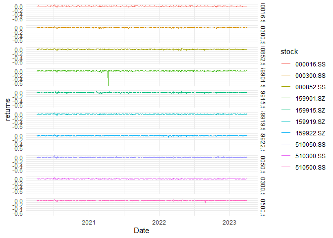

Untitled
================
roywei

# 调用要使用的R包

``` r
require(pedquant)
require(tidytable)
require(purrr)
require(ggplot2)
```

\#获取数据整理数据

    ##  1/10 510050.ss
    ##  2/10 510300.ss
    ##  3/10 159919.sz
    ##  4/10 000300.ss
    ##  5/10 000852.ss
    ##  6/10 510500.ss
    ##  7/10 159915.sz
    ##  8/10 159922.sz
    ##  9/10 159901.sz
    ## 10/10 000016.ss

    ## Warning: `select.()` was deprecated in tidytable v0.10.0.
    ## ℹ Please use `select()` instead.
    ## ℹ Please note that all `verb.()` syntax has now been deprecated.
    ## This warning is displayed once every 8 hours.
    ## Call `lifecycle::last_lifecycle_warnings()` to see where this warning was
    ## generated.

    ## Registered S3 method overwritten by 'quantmod':
    ##   method            from
    ##   as.zoo.data.frame zoo

|       Period       | 510050.SS  | 510300.SS | 159919.SZ | 000300.SS | 000852.SS | 510500.SS | 159915.SZ | 159922.SZ | 159901.SZ | 000016.SS  |
|:------------------:|:----------:|:---------:|:---------:|:---------:|:---------:|:---------:|:---------:|:---------:|:---------:|:----------:|
| 2020/04/07 0:00:00 |     0      |     0     |     0     |     0     |     0     |     0     |     0     |     0     |     0     |     0      |
| 2020/04/08 0:00:00 | -0.004751  | -0.003976 | -0.003912 | -0.004666 | 0.004023  | 0.002985  | -0.002114 | 0.002693  | -0.00493  | -0.004915  |
| 2020/04/09 0:00:00 |  0.003291  | 0.002917  | 0.004432  | 0.003293  |  0.01236  |  0.00925  |  0.01627  | 0.009812  | 0.003355  |  0.003166  |
| 2020/04/10 0:00:00 | -0.0003652 | -0.003183 | -0.004955 | -0.00625  | -0.02656  | -0.01823  | -0.02317  |  -0.019   | -0.005533 | -0.0009959 |
| 2020/04/13 0:00:00 | -0.004392  | -0.005595 | -0.005505 | -0.004233 | -0.01046  | -0.01031  | -0.01287  | -0.009818 | -0.004568 | -0.003891  |
| 2020/04/14 0:00:00 |  0.01637   |  0.01643  |  0.01643  |  0.01912  |  0.02008  |  0.02122  |  0.02977  |  0.02079  |  0.01893  |  0.01685   |

数据整理宽数据变长数据，并绘制图 \## 数据描述统计

``` r
ret1 %>% 
  psych::describe()
```

    ##           vars   n mean   sd median trimmed  mad   min  max range   skew
    ## 510050.SS    1 728    0 0.01      0       0 0.01 -0.05 0.08  0.14   0.29
    ## 510300.SS    2 728    0 0.01      0       0 0.01 -0.05 0.07  0.12  -0.01
    ## 159919.SZ    3 728    0 0.01      0       0 0.01 -0.05 0.07  0.12   0.07
    ## 000300.SS    4 728    0 0.01      0       0 0.01 -0.05 0.06  0.11  -0.19
    ## 000852.SS    5 728    0 0.01      0       0 0.01 -0.08 0.05  0.13  -0.60
    ## 510500.SS    6 728    0 0.01      0       0 0.01 -0.14 0.05  0.18  -2.13
    ## 159915.SZ    7 727    0 0.02      0       0 0.02 -0.06 0.05  0.12  -0.12
    ## 159922.SZ    8 728    0 0.01      0       0 0.01 -0.10 0.05  0.15  -1.32
    ## 159901.SZ    9 727    0 0.03      0       0 0.01 -0.71 0.05  0.76 -18.10
    ## 000016.SS   10 728    0 0.01      0       0 0.01 -0.05 0.07  0.12   0.03
    ##           kurtosis se
    ## 510050.SS     4.19  0
    ## 510300.SS     2.93  0
    ## 159919.SZ     3.19  0
    ## 000300.SS     1.89  0
    ## 000852.SS     2.32  0
    ## 510500.SS    19.20  0
    ## 159915.SZ     0.70  0
    ## 159922.SZ     8.89  0
    ## 159901.SZ   424.21  0
    ## 000016.SS     2.58  0

``` r
ret1 %>% 
  summarytools::descr()
```

    ## Descriptive Statistics  
    ## 
    ##                     000016.SS   000300.SS   000852.SS   159901.SZ   159915.SZ   159919.SZ
    ## ----------------- ----------- ----------- ----------- ----------- ----------- -----------
    ##              Mean        0.00        0.00        0.00        0.00        0.00        0.00
    ##           Std.Dev        0.01        0.01        0.01        0.03        0.02        0.01
    ##               Min       -0.05       -0.05       -0.08       -0.71       -0.06       -0.05
    ##                Q1       -0.01       -0.01       -0.01       -0.01       -0.01       -0.01
    ##            Median        0.00        0.00        0.00        0.00        0.00        0.00
    ##                Q3        0.01        0.01        0.01        0.01        0.01        0.01
    ##               Max        0.07        0.06        0.05        0.05        0.05        0.07
    ##               MAD        0.01        0.01        0.01        0.01        0.02        0.01
    ##               IQR        0.01        0.01        0.02        0.02        0.02        0.01
    ##                CV     -297.96      113.29       50.75      -43.94       57.71      106.47
    ##          Skewness        0.03       -0.19       -0.60      -18.10       -0.12        0.07
    ##       SE.Skewness        0.09        0.09        0.09        0.09        0.09        0.09
    ##          Kurtosis        2.58        1.89        2.32      424.21        0.70        3.19
    ##           N.Valid      728.00      728.00      728.00      727.00      727.00      728.00
    ##         Pct.Valid      100.00      100.00      100.00       99.86       99.86      100.00
    ## 
    ## Table: Table continues below
    ## 
    ##  
    ## 
    ##                     159922.SZ   510050.SS   510300.SS   510500.SS
    ## ----------------- ----------- ----------- ----------- -----------
    ##              Mean        0.00        0.00        0.00        0.00
    ##           Std.Dev        0.01        0.01        0.01        0.01
    ##               Min       -0.10       -0.05       -0.05       -0.14
    ##                Q1       -0.01       -0.01       -0.01       -0.01
    ##            Median        0.00        0.00        0.00        0.00
    ##                Q3        0.01        0.01        0.01        0.01
    ##               Max        0.05        0.08        0.07        0.05
    ##               MAD        0.01        0.01        0.01        0.01
    ##               IQR        0.01        0.01        0.01        0.01
    ##                CV       54.55     -401.91      108.16       76.25
    ##          Skewness       -1.32        0.29       -0.01       -2.13
    ##       SE.Skewness        0.09        0.09        0.09        0.09
    ##          Kurtosis        8.89        4.19        2.93       19.20
    ##           N.Valid      728.00      728.00      728.00      728.00
    ##         Pct.Valid      100.00      100.00      100.00      100.00

``` r
ret1 %>% 
  summarytools::dfSummary()
```

    ## . was converted to a data frame

    ## Data Frame Summary  
    ## .  
    ## Dimensions: 728 x 10  
    ## Duplicates: 0  
    ## 
    ## ---------------------------------------------------------------------------------------------------------
    ## No   Variable    Stats / Values          Freqs (% of Valid)    Graph                 Valid      Missing  
    ## ---- ----------- ----------------------- --------------------- --------------------- ---------- ---------
    ## 1    510050.SS   Mean (sd) : 0 (0)       716 distinct values         :               728        0        
    ##      [numeric]   min < med < max:                                    : .             (100.0%)   (0.0%)   
    ##                  -0.1 < 0 < 0.1                                      : :                                 
    ##                  IQR (CV) : 0 (-401.9)                               : :                                 
    ##                                                                    : : : .                               
    ## 
    ## 2    510300.SS   Mean (sd) : 0 (0)       722 distinct values         . :             728        0        
    ##      [numeric]   min < med < max:                                    : :             (100.0%)   (0.0%)   
    ##                  0 < 0 < 0.1                                         : :                                 
    ##                  IQR (CV) : 0 (108.2)                                : : .                               
    ##                                                                    : : : : .                             
    ## 
    ## 3    159919.SZ   Mean (sd) : 0 (0)       716 distinct values         . :             728        0        
    ##      [numeric]   min < med < max:                                    : :             (100.0%)   (0.0%)   
    ##                  0 < 0 < 0.1                                         : :                                 
    ##                  IQR (CV) : 0 (106.5)                                : :                                 
    ##                                                                    : : : :                               
    ## 
    ## 4    000300.SS   Mean (sd) : 0 (0)       728 distinct values           :             728        0        
    ##      [numeric]   min < med < max:                                      : .           (100.0%)   (0.0%)   
    ##                  -0.1 < 0 < 0.1                                        : :                               
    ##                  IQR (CV) : 0 (113.3)                                : : :                               
    ##                                                                    . : : : : .                           
    ## 
    ## 5    000852.SS   Mean (sd) : 0 (0)       728 distinct values               :         728        0        
    ##      [numeric]   min < med < max:                                          :         (100.0%)   (0.0%)   
    ##                  -0.1 < 0 < 0.1                                          : :                             
    ##                  IQR (CV) : 0 (50.8)                                     : : :                           
    ##                                                                      . : : : : .                         
    ## 
    ## 6    510500.SS   Mean (sd) : 0 (0)       723 distinct values                 :       728        0        
    ##      [numeric]   min < med < max:                                            :       (100.0%)   (0.0%)   
    ##                  -0.1 < 0 < 0                                                :                           
    ##                  IQR (CV) : 0 (76.2)                                         :                           
    ##                                                                            : : :                         
    ## 
    ## 7    159915.SZ   Mean (sd) : 0 (0)       720 distinct values             :           727        1        
    ##      [numeric]   min < med < max:                                      : : .         (99.9%)    (0.1%)   
    ##                  -0.1 < 0 < 0.1                                        : : :                             
    ##                  IQR (CV) : 0 (57.7)                                 . : : : :                           
    ##                                                                    . : : : : : .                         
    ## 
    ## 8    159922.SZ   Mean (sd) : 0 (0)       719 distinct values               . :       728        0        
    ##      [numeric]   min < med < max:                                          : :       (100.0%)   (0.0%)   
    ##                  -0.1 < 0 < 0                                              : :                           
    ##                  IQR (CV) : 0 (54.6)                                       : :                           
    ##                                                                          : : : :                         
    ## 
    ## 9    159901.SZ   Mean (sd) : 0 (0)       720 distinct values                     :   727        1        
    ##      [numeric]   min < med < max:                                                :   (99.9%)    (0.1%)   
    ##                  -0.7 < 0 < 0                                                    :                       
    ##                  IQR (CV) : 0 (-43.9)                                            :                       
    ##                                                                                  :                       
    ## 
    ## 10   000016.SS   Mean (sd) : 0 (0)       728 distinct values           :             728        0        
    ##      [numeric]   min < med < max:                                      :             (100.0%)   (0.0%)   
    ##                  -0.1 < 0 < 0.1                                      . : .                               
    ##                  IQR (CV) : 0 (-298)                                 : : :                               
    ##                                                                    . : : : .                             
    ## ---------------------------------------------------------------------------------------------------------

``` r
ret1 %>% 
  skimr::skim()
```

|                                                  |            |
|:-------------------------------------------------|:-----------|
| Name                                             | Piped data |
| Number of rows                                   | 728        |
| Number of columns                                | 10         |
| \_\_\_\_\_\_\_\_\_\_\_\_\_\_\_\_\_\_\_\_\_\_\_   |            |
| Column type frequency:                           |            |
| numeric                                          | 10         |
| \_\_\_\_\_\_\_\_\_\_\_\_\_\_\_\_\_\_\_\_\_\_\_\_ |            |
| Group variables                                  | None       |

Data summary

**Variable type: numeric**

| skim_variable | n_missing | complete_rate | mean |   sd |    p0 |   p25 | p50 |  p75 | p100 | hist  |
|:--------------|----------:|--------------:|-----:|-----:|------:|------:|----:|-----:|-----:|:------|
| 510050.SS     |         0 |             1 |    0 | 0.01 | -0.05 | -0.01 |   0 | 0.01 | 0.08 | ▁▇▆▁▁ |
| 510300.SS     |         0 |             1 |    0 | 0.01 | -0.05 | -0.01 |   0 | 0.01 | 0.07 | ▁▆▇▁▁ |
| 159919.SZ     |         0 |             1 |    0 | 0.01 | -0.05 | -0.01 |   0 | 0.01 | 0.07 | ▁▇▇▁▁ |
| 000300.SS     |         0 |             1 |    0 | 0.01 | -0.05 | -0.01 |   0 | 0.01 | 0.06 | ▁▂▇▂▁ |
| 000852.SS     |         0 |             1 |    0 | 0.01 | -0.08 | -0.01 |   0 | 0.01 | 0.05 | ▁▁▅▇▁ |
| 510500.SS     |         0 |             1 |    0 | 0.01 | -0.14 | -0.01 |   0 | 0.01 | 0.05 | ▁▁▁▇▂ |
| 159915.SZ     |         1 |             1 |    0 | 0.02 | -0.06 | -0.01 |   0 | 0.01 | 0.05 | ▁▂▇▅▁ |
| 159922.SZ     |         0 |             1 |    0 | 0.01 | -0.10 | -0.01 |   0 | 0.01 | 0.05 | ▁▁▁▇▁ |
| 159901.SZ     |         1 |             1 |    0 | 0.03 | -0.71 | -0.01 |   0 | 0.01 | 0.05 | ▁▁▁▁▇ |
| 000016.SS     |         0 |             1 |    0 | 0.01 | -0.05 | -0.01 |   0 | 0.01 | 0.07 | ▁▃▇▁▁ |

``` r
ret1 %>% 
  pastecs::stat.desc(norm = T)
```

    ##                  510050.SS     510300.SS     159919.SZ     000300.SS
    ## nbr.val       7.280000e+02  7.280000e+02  7.280000e+02  7.280000e+02
    ## nbr.null      1.000000e+01  7.000000e+00  1.000000e+01  1.000000e+00
    ## nbr.na        0.000000e+00  0.000000e+00  0.000000e+00  0.000000e+00
    ## min          -5.255785e-02 -4.937696e-02 -4.978692e-02 -5.068431e-02
    ## max           8.478633e-02  7.080112e-02  7.448666e-02  5.512915e-02
    ## range         1.373442e-01  1.201781e-01  1.242736e-01  1.058135e-01
    ## sum          -2.248943e-02  8.126296e-02  8.192297e-02  7.726534e-02
    ## median        0.000000e+00  0.000000e+00  2.041037e-04  2.348117e-04
    ## mean         -3.089207e-05  1.116250e-04  1.125316e-04  1.061337e-04
    ## SE.mean       4.601628e-04  4.474809e-04  4.440463e-04  4.456344e-04
    ## CI.mean.0.95  9.034066e-04  8.785090e-04  8.717662e-04  8.748839e-04
    ## var           1.541539e-04  1.457741e-04  1.435450e-04  1.445735e-04
    ## std.dev       1.241587e-02  1.207369e-02  1.198103e-02  1.202387e-02
    ## coef.var     -4.019113e+02  1.081630e+02  1.064681e+02  1.132899e+02
    ## skewness      2.947560e-01 -7.364071e-03  6.907461e-02 -1.940789e-01
    ## skew.2SE      1.626728e+00 -4.064155e-02  3.812156e-01 -1.071101e+00
    ## kurtosis      4.189660e+00  2.929364e+00  3.188576e+00  1.886044e+00
    ## kurt.2SE      1.157687e+01  8.094418e+00  8.810673e+00  5.211515e+00
    ## normtest.W    9.623622e-01  9.699960e-01  9.697291e-01  9.803345e-01
    ## normtest.p    1.002531e-12  4.580695e-11  3.967789e-11  2.550417e-08
    ##                  000852.SS     510500.SS     159915.SZ     159922.SZ
    ## nbr.val       7.280000e+02  7.280000e+02  7.270000e+02  7.280000e+02
    ## nbr.null      1.000000e+00  5.000000e+00  5.000000e+00  9.000000e+00
    ## nbr.na        0.000000e+00  0.000000e+00  1.000000e+00  0.000000e+00
    ## min          -8.132766e-02 -1.363053e-01 -6.448925e-02 -1.023826e-01
    ## max           5.074896e-02  4.644455e-02  5.352141e-02  4.506149e-02
    ## range         1.320766e-01  1.827499e-01  1.180107e-01  1.474441e-01
    ## sum           1.996065e-01  1.225009e-01  2.157243e-01  1.630221e-01
    ## median        1.145565e-03  8.632768e-04 -3.669052e-04  9.948805e-04
    ## mean          2.741848e-04  1.682704e-04  2.967322e-04  2.239315e-04
    ## SE.mean       5.157277e-04  4.755150e-04  6.350645e-04  4.527600e-04
    ## CI.mean.0.95  1.012493e-03  9.335465e-04  1.246782e-03  8.888730e-04
    ## var           1.936298e-04  1.646114e-04  2.932041e-04  1.492339e-04
    ## std.dev       1.391509e-02  1.283010e-02  1.712320e-02  1.221613e-02
    ## coef.var      5.075078e+01  7.624690e+01  5.770591e+01  5.455299e+01
    ## skewness     -6.026873e-01 -2.128324e+00 -1.174837e-01 -1.316797e+00
    ## skew.2SE     -3.326169e+00 -1.174600e+01 -6.479368e-01 -7.267267e+00
    ## kurtosis      2.324962e+00  1.920499e+01  7.004449e-01  8.887326e+00
    ## kurt.2SE      6.424334e+00  5.306722e+01  1.934148e+00  2.455746e+01
    ## normtest.W    9.736253e-01  8.819846e-01  9.933844e-01  9.228234e-01
    ## normtest.p    3.521709e-10  4.311004e-23  2.699818e-03  7.545511e-19
    ##                  159901.SZ     000016.SS
    ## nbr.val       7.270000e+02  7.280000e+02
    ## nbr.null      7.000000e+00  1.000000e+00
    ## nbr.na        1.000000e+00  0.000000e+00
    ## min          -7.140083e-01 -5.367165e-02
    ## max           4.599049e-02  6.583431e-02
    ## range         7.599987e-01  1.195060e-01
    ## sum          -4.999985e-01 -2.999859e-02
    ## median       -2.493455e-04  1.743727e-05
    ## mean         -6.877558e-04 -4.120685e-05
    ## SE.mean       1.120815e-03  4.550520e-04
    ## CI.mean.0.95  2.200426e-03  8.933729e-04
    ## var           9.132766e-04  1.507487e-04
    ## std.dev       3.022047e-02  1.227797e-02
    ## coef.var     -4.394069e+01 -2.979596e+02
    ## skewness     -1.809841e+01  2.709624e-02
    ## skew.2SE     -9.981491e+01  1.495413e-01
    ## kurtosis      4.242081e+02  2.581013e+00
    ## kurt.2SE      1.171372e+03  7.131855e+00
    ## normtest.W    3.387740e-01  9.736936e-01
    ## normtest.p    4.801377e-45  3.665486e-10

## 数据变化及展示

### 宽变长

``` r
ret1 %>%timetk::tk_tbl(rename_index = 'Date') %>% 
    tidytable::pivot_longer(cols = -Date,names_to = 'stock',values_to = 'return')->ret_long
ggplot2::ggplot(ret_long,mapping = aes(x=Date,y=return,color=stock))+geom_path(stat = "identity") +
    facet_grid(stock ~ .) + theme_minimal() + labs(x = "Date", y = "returns")
```

<!-- -->

## GitHub Documents

This is an R Markdown format used for publishing markdown documents to
GitHub. When you click the **Knit** button all R code chunks are run and
a markdown file (.md) suitable for publishing to GitHub is generated.

## Including Code

You can include R code in the document as follows:

``` r
summary(cars)
```

    ##      speed           dist       
    ##  Min.   : 4.0   Min.   :  2.00  
    ##  1st Qu.:12.0   1st Qu.: 26.00  
    ##  Median :15.0   Median : 36.00  
    ##  Mean   :15.4   Mean   : 42.98  
    ##  3rd Qu.:19.0   3rd Qu.: 56.00  
    ##  Max.   :25.0   Max.   :120.00

## Including Plots

You can also embed plots, for example:

<!-- -->

Note that the `echo = FALSE` parameter was added to the code chunk to
prevent printing of the R code that generated the plot.

数据清理，生成变量以便于机器学习使用

``` r
require(tidytable)
require(tidyquant)
```

    ## 载入需要的程辑包：tidyquant

    ## 载入需要的程辑包：lubridate

    ## 
    ## 载入程辑包：'lubridate'

    ## The following objects are masked from 'package:base':
    ## 
    ##     date, intersect, setdiff, union

    ## 载入需要的程辑包：PerformanceAnalytics

    ## 载入需要的程辑包：xts

    ## 载入需要的程辑包：zoo

    ## 
    ## 载入程辑包：'zoo'

    ## The following objects are masked from 'package:base':
    ## 
    ##     as.Date, as.Date.numeric

    ## 
    ## ################################### WARNING ###################################
    ## # We noticed you have dplyr installed. The dplyr lag() function breaks how    #
    ## # base R's lag() function is supposed to work, which breaks lag(my_xts).      #
    ## #                                                                             #
    ## # If you call library(dplyr) later in this session, then calls to lag(my_xts) #
    ## # that you enter or source() into this session won't work correctly.          #
    ## #                                                                             #
    ## # All package code is unaffected because it is protected by the R namespace   #
    ## # mechanism.                                                                  #
    ## #                                                                             #
    ## # Set `options(xts.warn_dplyr_breaks_lag = FALSE)` to suppress this warning.  #
    ## #                                                                             #
    ## # You can use stats::lag() to make sure you're not using dplyr::lag(), or you #
    ## # can add conflictRules('dplyr', exclude = 'lag') to your .Rprofile to stop   #
    ## # dplyr from breaking base R's lag() function.                                #
    ## ################################### WARNING ###################################

    ## 
    ## 载入程辑包：'xts'

    ## The following objects are masked from 'package:tidytable':
    ## 
    ##     first, last

    ## 
    ## 载入程辑包：'PerformanceAnalytics'

    ## The following object is masked from 'package:graphics':
    ## 
    ##     legend

    ## 载入需要的程辑包：quantmod

    ## 载入需要的程辑包：TTR

``` r
require(pedquant)
test <- md_stock("510500.ss", date_range = "10y") %>% bind_rows()
```

    ## 1/1 510500.ss

``` r
test %>%
  tq_mutate(
    select = close_adj,
    mutate_fun = SMA,
    n = 5,
    col_rename = "sma5"
  ) %>%
  tq_mutate(
    select = close_adj,
    mutate_fun = EMA,
    n = 5,
    col_rename = "ema5"
  ) %>%
  tq_mutate(
    select = close_adj,
    mutate_fun = RSI,
    n = 5,
    col_rename = "rsi"
  ) %>%
  tq_mutate(
    select = close_adj,
    mutate_fun = dailyReturn,
    type = "log",
    col_rename = "ret1"
  ) -> test1
test %>%
  tq_mutate(
    select = close_adj,
    mutate_fun = SMA,
    n = 5,
    col_rename = "sma5"
  ) %>%
  tq_mutate(
    select = close_adj,
    mutate_fun = EMA,
    n = 5,
    col_rename = "ema5"
  ) %>%
  tq_mutate(
    select = close_adj,
    mutate_fun = RSI,
    n = 5,
    col_rename = "rsi"
  ) %>%
  tq_mutate(
    select = close_adj,
    mutate_fun = dailyReturn,
    type = "log",
    col_rename = "ret1"
  ) -> test1

test1 %>%
  tq_mutate(
    select = close_adj,
    mutate_fun = MACD,
  ) %>%
  mutate(Direction = ifelse(close_adj >= lag(close_adj, 5), 1, 0)) %>%
  select(9:ncol(.)) %>%
  mutate(sma5 = lag(sma5), ema5 = lag(ema5), rsi = lag(rsi), ret1 = lag(ret1), sigal = lag(signal), macd = lag(macd)) %>%
  select(Direction, ret1, sma5, ema5, macd, signal, rsi) %>%
  drop_na() %>%
  `colnames<-`(c(
    "Direction", "Ret", "SMA", "EMA", "MACD", "Signal",
    "RSI"
  )) -> d_ex1

# 使用逻辑斯蒂回归进行分类预测
# remove NAs
d_ex1 <- na.omit(d_ex1)
# convert to data frame
d_ex1 <- as.data.frame(d_ex1)
# convert direction to a factor for classification

d_ex1$Direction <- as.factor(d_ex1$Direction)

idx1 <- c(1:round(nrow(d_ex1) * 0.7)) # create index for first 70% values to be in the testing set
d_train1 <- d_ex1[idx1, ] # training set
d_test1 <- d_ex1[-idx1, ] # testing set
library(caret)
```

    ## Warning: 程辑包'caret'是用R版本4.2.3 来建造的

    ## 载入需要的程辑包：lattice

    ## 
    ## 载入程辑包：'caret'

    ## The following object is masked from 'package:purrr':
    ## 
    ##     lift

``` r
set.seed(999)
# control
cntrl1 <- trainControl(
  method = "timeslice", initialWindow = 250, horizon = 30,
  fixedWindow = TRUE
)
# preprocesing
prep1 <- c("center", "scale")
# logistic regression
logit_ex1 <- train(Direction ~ .,
  data = d_train1, method = "glm", family = "binomial",
  trControl = cntrl1, preProcess = prep1
)
logit_ex1 # final model accuracy
```

    ## Generalized Linear Model 
    ## 
    ## 1678 samples
    ##    6 predictor
    ##    2 classes: '0', '1' 
    ## 
    ## Pre-processing: centered (6), scaled (6) 
    ## Resampling: Rolling Forecasting Origin Resampling (30 held-out with a fixed window) 
    ## Summary of sample sizes: 250, 250, 250, 250, 250, 250, ... 
    ## Resampling results:
    ## 
    ##   Accuracy   Kappa    
    ##   0.7983798  0.5313487

``` r
summary(logit_ex1$finalModel) # summary of the final model
```

    ## 
    ## Call:
    ## NULL
    ## 
    ## Deviance Residuals: 
    ##     Min       1Q   Median       3Q      Max  
    ## -3.3464  -0.5509   0.2589   0.6135   2.6190  
    ## 
    ## Coefficients:
    ##              Estimate Std. Error z value Pr(>|z|)    
    ## (Intercept)   0.45055    0.06864   6.564 5.23e-11 ***
    ## Ret          -0.15775    0.09132  -1.727   0.0841 .  
    ## SMA         -33.08997    4.76512  -6.944 3.81e-12 ***
    ## EMA          32.98627    4.76204   6.927 4.30e-12 ***
    ## MACD         -0.31932    0.49670  -0.643   0.5203    
    ## Signal        0.19310    0.44862   0.430   0.6669    
    ## RSI           1.97588    0.14794  13.356  < 2e-16 ***
    ## ---
    ## Signif. codes:  0 '***' 0.001 '**' 0.01 '*' 0.05 '.' 0.1 ' ' 1
    ## 
    ## (Dispersion parameter for binomial family taken to be 1)
    ## 
    ##     Null deviance: 2288.8  on 1677  degrees of freedom
    ## Residual deviance: 1367.2  on 1671  degrees of freedom
    ## AIC: 1381.2
    ## 
    ## Number of Fisher Scoring iterations: 5

``` r
# 预测变量重要图示
library(vip)
```

    ## 
    ## 载入程辑包：'vip'

    ## The following object is masked from 'package:utils':
    ## 
    ##     vi

``` r
vip(logit_ex1, geom = "point") + theme_minimal()
```

<!-- -->

``` r
# 使用混淆矩阵分析预测精度
pred1 <- predict(logit_ex1, newdata = d_test1) # prediction on the test data
confusionMatrix(data = pred1, reference = d_test1$Direction)
```

    ## Confusion Matrix and Statistics
    ## 
    ##           Reference
    ## Prediction   0   1
    ##          0 245  45
    ##          1  78 351
    ##                                           
    ##                Accuracy : 0.8289          
    ##                  95% CI : (0.7994, 0.8558)
    ##     No Information Rate : 0.5508          
    ##     P-Value [Acc > NIR] : < 2e-16         
    ##                                           
    ##                   Kappa : 0.651           
    ##                                           
    ##  Mcnemar's Test P-Value : 0.00391         
    ##                                           
    ##             Sensitivity : 0.7585          
    ##             Specificity : 0.8864          
    ##          Pos Pred Value : 0.8448          
    ##          Neg Pred Value : 0.8182          
    ##              Prevalence : 0.4492          
    ##          Detection Rate : 0.3408          
    ##    Detection Prevalence : 0.4033          
    ##       Balanced Accuracy : 0.8224          
    ##                                           
    ##        'Positive' Class : 0               
    ## 
